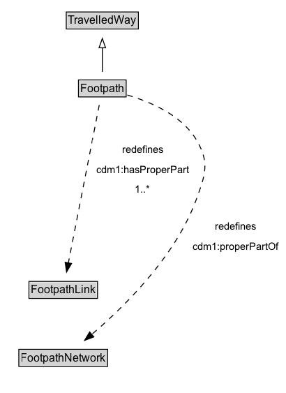

# Footpath

A Footpath is a type of TravelledWay that is made up of FootpathLinks.

## Diagram

=== "SVG (interactive)"

    <!-- Generated by graphviz version 14.1.3 (20260303.0454)
     -->
    <!-- Pages: 1 -->
    <svg width="307pt" height="423pt"
     viewBox="0.00 0.00 307.00 423.00" xmlns="http://www.w3.org/2000/svg" xmlns:xlink="http://www.w3.org/1999/xlink">
    <g id="graph0" class="graph" transform="scale(1 1) rotate(0) translate(4 418.5)">
    <polygon fill="white" stroke="none" points="-4,4 -4,-418.5 303.21,-418.5 303.21,4 -4,4"/>
    <g id="clust3" class="cluster">
    <title>cluster_associated</title>
    </g>
    <!-- TravelledWay -->
    <g id="node1" class="node">
    <title>TravelledWay</title>
    <g id="a_node1"><a xlink:href="../TravelledWay" xlink:title="&lt;TABLE&gt;">
    <polygon fill="lightgray" stroke="none" points="68.25,-388.38 68.25,-404.62 143.75,-404.62 143.75,-388.38 68.25,-388.38"/>
    <text xml:space="preserve" text-anchor="start" x="69.25" y="-392.38" font-family="Arial" font-size="12.00">TravelledWay</text>
    <polygon fill="none" stroke="black" points="67.25,-387.38 67.25,-405.62 144.75,-405.62 144.75,-387.38 67.25,-387.38"/>
    </a>
    </g>
    </g>
    <!-- Footpath -->
    <g id="node2" class="node">
    <title>Footpath</title>
    <g id="a_node2"><a xlink:href="../Footpath" xlink:title="&lt;TABLE&gt;">
    <polygon fill="lightgray" stroke="none" points="81.38,-315.38 81.38,-331.62 130.62,-331.62 130.62,-315.38 81.38,-315.38"/>
    <text xml:space="preserve" text-anchor="start" x="82.38" y="-319.38" font-family="Arial" font-size="12.00">Footpath</text>
    <polygon fill="none" stroke="black" points="80.38,-314.38 80.38,-332.62 131.62,-332.62 131.62,-314.38 80.38,-314.38"/>
    </a>
    </g>
    </g>
    <!-- Footpath&#45;&gt;TravelledWay -->
    <g id="edge1" class="edge">
    <title>Footpath&#45;&gt;TravelledWay</title>
    <path fill="none" stroke="black" d="M106,-341.21C106,-348.97 106,-358.42 106,-367.24"/>
    <polygon fill="none" stroke="black" points="102.5,-367.16 106,-377.16 109.5,-367.16 102.5,-367.16"/>
    </g>
    <!-- Invis -->
    <!-- Footpath&#45;&gt;Invis -->
    <!-- FootpathLink -->
    <g id="node4" class="node">
    <title>FootpathLink</title>
    <g id="a_node4"><a xlink:href="../FootpathLink" xlink:title="&lt;TABLE&gt;">
    <polygon fill="lightgray" stroke="none" points="28.12,-98.88 28.12,-115.12 99.88,-115.12 99.88,-98.88 28.12,-98.88"/>
    <text xml:space="preserve" text-anchor="start" x="29.12" y="-102.88" font-family="Arial" font-size="12.00">FootpathLink</text>
    <polygon fill="none" stroke="black" points="27.12,-97.88 27.12,-116.12 100.88,-116.12 100.88,-97.88 27.12,-97.88"/>
    </a>
    </g>
    </g>
    <!-- Footpath&#45;&gt;FootpathLink -->
    <g id="edge5" class="edge">
    <title>Footpath&#45;&gt;FootpathLink</title>
    <path fill="none" stroke="black" stroke-dasharray="5,2" d="M102.7,-305.67C95.51,-268.94 78.35,-181.27 69.49,-136.05"/>
    <polygon fill="black" stroke="black" points="72.93,-135.38 67.57,-126.24 66.06,-136.72 72.93,-135.38"/>
    <polygon fill="white" stroke="none" points="95.42,-204 95.42,-268.5 203.17,-268.5 203.17,-204 95.42,-204"/>
    <text xml:space="preserve" text-anchor="start" x="127.17" y="-254" font-family="Arial" font-size="11.00">redefines</text>
    <text xml:space="preserve" text-anchor="start" x="99.42" y="-232.5" font-family="Arial" font-size="11.00">cdm1:hasProperPart</text>
    <text xml:space="preserve" text-anchor="start" x="141.05" y="-211" font-family="Arial" font-size="11.00">1..&#42;</text>
    </g>
    <!-- FootpathNetwork -->
    <g id="node5" class="node">
    <title>FootpathNetwork</title>
    <g id="a_node5"><a xlink:href="../FootpathNetwork" xlink:title="&lt;TABLE&gt;">
    <polygon fill="lightgray" stroke="none" points="17.25,-25.88 17.25,-42.12 110.75,-42.12 110.75,-25.88 17.25,-25.88"/>
    <text xml:space="preserve" text-anchor="start" x="18.25" y="-29.88" font-family="Arial" font-size="12.00">FootpathNetwork</text>
    <polygon fill="none" stroke="black" points="16.25,-24.88 16.25,-43.12 111.75,-43.12 111.75,-24.88 16.25,-24.88"/>
    </a>
    </g>
    </g>
    <!-- Footpath&#45;&gt;FootpathNetwork -->
    <g id="edge6" class="edge">
    <title>Footpath&#45;&gt;FootpathNetwork</title>
    <path fill="none" stroke="black" stroke-dasharray="5,2" d="M132.89,-316.4C157.04,-309.34 191.05,-295.11 207,-268.5 221.74,-243.91 216.84,-230.93 207,-204 184.62,-142.77 129.12,-88.48 94.21,-58.82"/>
    <polygon fill="black" stroke="black" points="96.9,-56.5 86.97,-52.79 92.42,-61.88 96.9,-56.5"/>
    <polygon fill="white" stroke="none" points="198.96,-143 198.96,-186 299.21,-186 299.21,-143 198.96,-143"/>
    <text xml:space="preserve" text-anchor="start" x="226.96" y="-171.5" font-family="Arial" font-size="11.00">redefines</text>
    <text xml:space="preserve" text-anchor="start" x="202.96" y="-150" font-family="Arial" font-size="11.00">cdm1:properPartOf</text>
    </g>
    <!-- Invis&#45;&gt;FootpathLink -->
    <!-- FootpathLink&#45;&gt;FootpathNetwork -->
    </g>
    </svg>

=== "PNG"

    

## Formalization for Footpath

| Property | Constraint |
|----------|------------|
| [cdm1:hasProperPart](https://w3id.org/citydata/part1/v1/hasProperPart) | min 1 |
| [cdm1:hasProperPart](https://w3id.org/citydata/part1/v1/hasProperPart) | min 1 [FootpathLink](https://w3id.org/citydata/part3/v1/FootpathLink) |
| [cdm1:properPartOf](https://w3id.org/citydata/part1/v1/properPartOf) | only [FootpathNetwork](https://w3id.org/citydata/part3/v1/FootpathNetwork) |
| subClassOf | [TravelledWay](TravelledWay.md) |

## Other annotations

| Property | Value |
|----------|-------|
| [xsd:pattern](https://w3id.org/citydata/imported/xsd/pattern) | PedestrianNetworkPattern |

