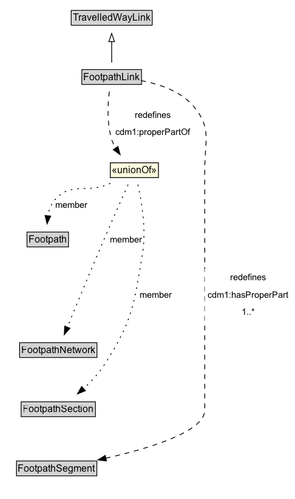

# FootpathLink

A Footpath Link is a type of TravelledWayLink designed for pedestrians.

## Diagram

=== "SVG (interactive)"

    <!-- Generated by graphviz version 14.1.3 (20260303.0454)
     -->
    <!-- Pages: 1 -->
    <svg width="365pt" height="616pt"
     viewBox="0.00 0.00 365.00 616.00" xmlns="http://www.w3.org/2000/svg" xmlns:xlink="http://www.w3.org/1999/xlink">
    <g id="graph0" class="graph" transform="scale(1 1) rotate(0) translate(4 612)">
    <polygon fill="white" stroke="none" points="-4,4 -4,-612 360.75,-612 360.75,4 -4,4"/>
    <g id="clust3" class="cluster">
    <title>cluster_associated</title>
    </g>
    <!-- TravelledWayLink -->
    <g id="node1" class="node">
    <title>TravelledWayLink</title>
    <g id="a_node1"><a xlink:href="../TravelledWayLink" xlink:title="&lt;TABLE&gt;">
    <polygon fill="lightgray" stroke="none" points="85,-581.88 85,-598.12 183,-598.12 183,-581.88 85,-581.88"/>
    <text xml:space="preserve" text-anchor="start" x="86" y="-585.88" font-family="Arial" font-size="12.00">TravelledWayLink</text>
    <polygon fill="none" stroke="black" points="84,-580.88 84,-599.12 184,-599.12 184,-580.88 84,-580.88"/>
    </a>
    </g>
    </g>
    <!-- FootpathLink -->
    <g id="node2" class="node">
    <title>FootpathLink</title>
    <g id="a_node2"><a xlink:href="../FootpathLink" xlink:title="&lt;TABLE&gt;">
    <polygon fill="lightgray" stroke="none" points="98.12,-508.88 98.12,-525.12 169.88,-525.12 169.88,-508.88 98.12,-508.88"/>
    <text xml:space="preserve" text-anchor="start" x="99.12" y="-512.88" font-family="Arial" font-size="12.00">FootpathLink</text>
    <polygon fill="none" stroke="black" points="97.12,-507.88 97.12,-526.12 170.88,-526.12 170.88,-507.88 97.12,-507.88"/>
    </a>
    </g>
    </g>
    <!-- FootpathLink&#45;&gt;TravelledWayLink -->
    <g id="edge1" class="edge">
    <title>FootpathLink&#45;&gt;TravelledWayLink</title>
    <path fill="none" stroke="black" d="M134,-534.71C134,-542.47 134,-551.92 134,-560.74"/>
    <polygon fill="none" stroke="black" points="130.5,-560.66 134,-570.66 137.5,-560.66 130.5,-560.66"/>
    </g>
    <!-- Invis -->
    <!-- FootpathLink&#45;&gt;Invis -->
    <!-- FootpathSegment -->
    <g id="node7" class="node">
    <title>FootpathSegment</title>
    <g id="a_node7"><a xlink:href="../FootpathSegment" xlink:title="&lt;TABLE&gt;">
    <polygon fill="lightgray" stroke="none" points="17.38,-25.88 17.38,-42.12 114.62,-42.12 114.62,-25.88 17.38,-25.88"/>
    <text xml:space="preserve" text-anchor="start" x="18.38" y="-29.88" font-family="Arial" font-size="12.00">FootpathSegment</text>
    <polygon fill="none" stroke="black" points="16.38,-24.88 16.38,-43.12 115.62,-43.12 115.62,-24.88 16.38,-24.88"/>
    </a>
    </g>
    </g>
    <!-- FootpathLink&#45;&gt;FootpathSegment -->
    <g id="edge7" class="edge">
    <title>FootpathLink&#45;&gt;FootpathSegment</title>
    <path fill="none" stroke="black" stroke-dasharray="5,2" d="M170.43,-512.52C192.33,-508.47 218.96,-499.76 235,-481 257.89,-454.23 249,-438.22 249,-403 249,-403 249,-403 249,-106 249,-79.2 179.9,-58.52 126.62,-46.57"/>
    <polygon fill="black" stroke="black" points="127.52,-43.18 117,-44.47 126.03,-50.02 127.52,-43.18"/>
    <polygon fill="white" stroke="none" points="249,-216 249,-280.5 356.75,-280.5 356.75,-216 249,-216"/>
    <text xml:space="preserve" text-anchor="start" x="280.75" y="-266" font-family="Arial" font-size="11.00">redefines</text>
    <text xml:space="preserve" text-anchor="start" x="253" y="-244.5" font-family="Arial" font-size="11.00">cdm1:hasProperPart</text>
    <text xml:space="preserve" text-anchor="start" x="294.62" y="-223" font-family="Arial" font-size="11.00">1..&#42;</text>
    </g>
    <!-- nc63d9aeea9c24785938b813312b70530b8 -->
    <g id="node8" class="node">
    <title>nc63d9aeea9c24785938b813312b70530b8</title>
    <polygon fill="lightyellow" stroke="none" points="132.25,-392.88 132.25,-411.12 191.75,-411.12 191.75,-392.88 132.25,-392.88"/>
    <text xml:space="preserve" text-anchor="start" x="134.25" y="-397.88" font-family="Arial" font-size="12.00">«unionOf»</text>
    <polygon fill="none" stroke="black" points="132.25,-392.88 132.25,-411.12 191.75,-411.12 191.75,-392.88 132.25,-392.88"/>
    </g>
    <!-- FootpathLink&#45;&gt;nc63d9aeea9c24785938b813312b70530b8 -->
    <g id="edge11" class="edge">
    <title>FootpathLink&#45;&gt;nc63d9aeea9c24785938b813312b70530b8</title>
    <path fill="none" stroke="black" stroke-dasharray="5,2" d="M131.11,-499.03C129.05,-482.86 127.75,-458.08 134.75,-438 135.82,-434.93 137.28,-431.93 138.97,-429.04"/>
    <polygon fill="black" stroke="black" points="141.68,-431.27 144.5,-421.05 135.93,-427.28 141.68,-431.27"/>
    <polygon fill="white" stroke="none" points="134.75,-438 134.75,-481 235,-481 235,-438 134.75,-438"/>
    <text xml:space="preserve" text-anchor="start" x="162.75" y="-466.5" font-family="Arial" font-size="11.00">redefines</text>
    <text xml:space="preserve" text-anchor="start" x="138.75" y="-445" font-family="Arial" font-size="11.00">cdm1:properPartOf</text>
    </g>
    <!-- Footpath -->
    <g id="node4" class="node">
    <title>Footpath</title>
    <g id="a_node4"><a xlink:href="../Footpath" xlink:title="&lt;TABLE&gt;">
    <polygon fill="lightgray" stroke="none" points="30.38,-308.38 30.38,-324.62 79.62,-324.62 79.62,-308.38 30.38,-308.38"/>
    <text xml:space="preserve" text-anchor="start" x="31.38" y="-312.38" font-family="Arial" font-size="12.00">Footpath</text>
    <polygon fill="none" stroke="black" points="29.38,-307.38 29.38,-325.62 80.62,-325.62 80.62,-307.38 29.38,-307.38"/>
    </a>
    </g>
    </g>
    <!-- Invis&#45;&gt;Footpath -->
    <!-- FootpathNetwork -->
    <g id="node5" class="node">
    <title>FootpathNetwork</title>
    <g id="a_node5"><a xlink:href="../FootpathNetwork" xlink:title="&lt;TABLE&gt;">
    <polygon fill="lightgray" stroke="none" points="21.25,-171.88 21.25,-188.12 114.75,-188.12 114.75,-171.88 21.25,-171.88"/>
    <text xml:space="preserve" text-anchor="start" x="22.25" y="-175.88" font-family="Arial" font-size="12.00">FootpathNetwork</text>
    <polygon fill="none" stroke="black" points="20.25,-170.88 20.25,-189.12 115.75,-189.12 115.75,-170.88 20.25,-170.88"/>
    </a>
    </g>
    </g>
    <!-- Footpath&#45;&gt;FootpathNetwork -->
    <!-- FootpathSection -->
    <g id="node6" class="node">
    <title>FootpathSection</title>
    <g id="a_node6"><a xlink:href="../FootpathSection" xlink:title="&lt;TABLE&gt;">
    <polygon fill="lightgray" stroke="none" points="23.12,-98.88 23.12,-115.12 112.88,-115.12 112.88,-98.88 23.12,-98.88"/>
    <text xml:space="preserve" text-anchor="start" x="24.12" y="-102.88" font-family="Arial" font-size="12.00">FootpathSection</text>
    <polygon fill="none" stroke="black" points="22.12,-97.88 22.12,-116.12 113.88,-116.12 113.88,-97.88 22.12,-97.88"/>
    </a>
    </g>
    </g>
    <!-- FootpathNetwork&#45;&gt;FootpathSection -->
    <!-- FootpathSection&#45;&gt;FootpathSegment -->
    <!-- nc63d9aeea9c24785938b813312b70530b8&#45;&gt;Footpath -->
    <g id="edge8" class="edge">
    <title>nc63d9aeea9c24785938b813312b70530b8&#45;&gt;Footpath</title>
    <path fill="none" stroke="black" stroke-dasharray="1,5" d="M132.48,-385.83C130.98,-385.19 129.48,-384.57 128,-384 100.55,-373.37 84.15,-387.7 64.25,-366 59.16,-360.44 56.47,-352.98 55.14,-345.58"/>
    <polygon fill="black" stroke="black" points="58.64,-345.39 54.16,-335.78 51.67,-346.08 58.64,-345.39"/>
    <text xml:space="preserve" text-anchor="middle" x="84.12" y="-355.55" font-family="Arial" font-size="11.00">member</text>
    </g>
    <!-- nc63d9aeea9c24785938b813312b70530b8&#45;&gt;FootpathNetwork -->
    <g id="edge9" class="edge">
    <title>nc63d9aeea9c24785938b813312b70530b8&#45;&gt;FootpathNetwork</title>
    <path fill="none" stroke="black" stroke-dasharray="1,5" d="M154.31,-384.1C148.23,-370.69 139.59,-351.45 132.25,-334.5 113.14,-290.34 91.7,-238.67 79.05,-207.95"/>
    <polygon fill="black" stroke="black" points="82.42,-206.96 75.38,-199.04 75.95,-209.62 82.42,-206.96"/>
    <text xml:space="preserve" text-anchor="middle" x="152.12" y="-312.8" font-family="Arial" font-size="11.00">member</text>
    </g>
    <!-- nc63d9aeea9c24785938b813312b70530b8&#45;&gt;FootpathSection -->
    <g id="edge10" class="edge">
    <title>nc63d9aeea9c24785938b813312b70530b8&#45;&gt;FootpathSection</title>
    <path fill="none" stroke="black" stroke-dasharray="1,5" d="M166.33,-384.22C170.96,-363.84 177.02,-328.48 172,-298.5 161.41,-235.22 159.73,-215.95 125,-162 117.99,-151.12 108.35,-140.88 98.98,-132.31"/>
    <polygon fill="black" stroke="black" points="101.51,-129.87 91.68,-125.93 96.9,-135.14 101.51,-129.87"/>
    <text xml:space="preserve" text-anchor="middle" x="188.71" y="-244.55" font-family="Arial" font-size="11.00">member</text>
    </g>
    </g>
    </svg>

=== "PNG"

    

## Formalization for FootpathLink

| Property | Constraint |
|----------|------------|
| [cdm1:hasProperPart](https://w3id.org/citydata/part1/v1/hasProperPart) | min 1 |
| [cdm1:hasProperPart](https://w3id.org/citydata/part1/v1/hasProperPart) | min 1 [FootpathSegment](https://w3id.org/citydata/part3/v1/FootpathSegment) |
| subClassOf | [TravelledWayLink](TravelledWayLink.md) |

## Other annotations

| Property | Value |
|----------|-------|
| [xsd:pattern](https://w3id.org/citydata/imported/xsd/pattern) | PedestrianNetworkPattern |

