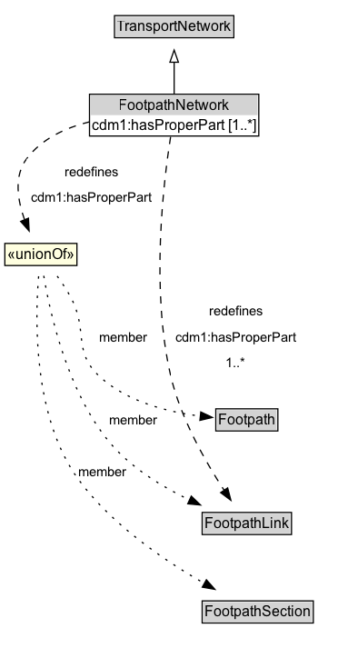

# FootpathNetwork

A FootpathNetwork is a type of TransportNetwork designed for the use of pedestrians but may be used by others as well.

**IRI**: `https://w3id.org/citydata/part3/v1/FootpathNetwork`

## Diagram

=== "SVG (interactive)"

    <!-- Generated by graphviz version 14.1.3 (20260303.0454)
     -->
    <!-- Pages: 1 -->
    <svg width="279pt" height="543pt"
     viewBox="0.00 0.00 279.00 543.00" xmlns="http://www.w3.org/2000/svg" xmlns:xlink="http://www.w3.org/1999/xlink">
    <g id="graph0" class="graph" transform="scale(1 1) rotate(0) translate(4 539)">
    <polygon fill="white" stroke="none" points="-4,4 -4,-539 274.75,-539 274.75,4 -4,4"/>
    <g id="clust3" class="cluster">
    <title>cluster_associated</title>
    </g>
    <!-- TransportNetwork -->
    <g id="node1" class="node">
    <title>TransportNetwork</title>
    <g id="a_node1"><a xlink:href="../TransportNetwork" xlink:title="&lt;TABLE&gt;">
    <polygon fill="lightgray" stroke="none" points="91.5,-508.88 91.5,-525.12 188,-525.12 188,-508.88 91.5,-508.88"/>
    <text xml:space="preserve" text-anchor="start" x="92.5" y="-512.88" font-family="Arial" font-size="12.00">TransportNetwork</text>
    <polygon fill="none" stroke="black" points="90.5,-507.88 90.5,-526.12 189,-526.12 189,-507.88 90.5,-507.88"/>
    </a>
    </g>
    </g>
    <!-- FootpathNetwork -->
    <g id="node2" class="node">
    <title>FootpathNetwork</title>
    <g id="a_node2"><a xlink:href="../FootpathNetwork" xlink:title="&lt;TABLE&gt;">
    <polygon fill="lightgray" stroke="none" points="70.88,-444 70.88,-460.25 208.62,-460.25 208.62,-444 70.88,-444"/>
    <text xml:space="preserve" text-anchor="start" x="94" y="-448" font-family="Arial" font-size="12.00">FootpathNetwork</text>
    <text xml:space="preserve" text-anchor="start" x="71.88" y="-431.75" font-family="Arial" font-size="12.00">cdm1:hasProperPart [1..&#42;]</text>
    <polygon fill="none" stroke="black" points="69.88,-426.75 69.88,-461.25 209.62,-461.25 209.62,-426.75 69.88,-426.75"/>
    </a>
    </g>
    </g>
    <!-- FootpathNetwork&#45;&gt;TransportNetwork -->
    <g id="edge1" class="edge">
    <title>FootpathNetwork&#45;&gt;TransportNetwork</title>
    <path fill="none" stroke="black" d="M139.75,-461.71C139.75,-469.47 139.75,-478.92 139.75,-487.74"/>
    <polygon fill="none" stroke="black" points="136.25,-487.66 139.75,-497.66 143.25,-487.66 136.25,-487.66"/>
    </g>
    <!-- Invis -->
    <!-- FootpathNetwork&#45;&gt;Invis -->
    <!-- FootpathLink -->
    <g id="node5" class="node">
    <title>FootpathLink</title>
    <g id="a_node5"><a xlink:href="../FootpathLink" xlink:title="&lt;TABLE&gt;">
    <polygon fill="lightgray" stroke="none" points="163.88,-98.88 163.88,-115.12 235.62,-115.12 235.62,-98.88 163.88,-98.88"/>
    <text xml:space="preserve" text-anchor="start" x="164.88" y="-102.88" font-family="Arial" font-size="12.00">FootpathLink</text>
    <polygon fill="none" stroke="black" points="162.88,-97.88 162.88,-116.12 236.62,-116.12 236.62,-97.88 162.88,-97.88"/>
    </a>
    </g>
    </g>
    <!-- FootpathNetwork&#45;&gt;FootpathLink -->
    <g id="edge10" class="edge">
    <title>FootpathNetwork&#45;&gt;FootpathLink</title>
    <path fill="none" stroke="black" stroke-dasharray="5,2" d="M136.8,-426.01C131.03,-389.35 120.19,-300.3 137,-228.5 145.15,-193.69 165.65,-157.86 181.01,-134.42"/>
    <polygon fill="black" stroke="black" points="183.91,-136.38 186.59,-126.13 178.11,-132.47 183.91,-136.38"/>
    <polygon fill="white" stroke="none" points="137,-228.5 137,-293 244.75,-293 244.75,-228.5 137,-228.5"/>
    <text xml:space="preserve" text-anchor="start" x="168.75" y="-278.5" font-family="Arial" font-size="11.00">redefines</text>
    <text xml:space="preserve" text-anchor="start" x="141" y="-257" font-family="Arial" font-size="11.00">cdm1:hasProperPart</text>
    <text xml:space="preserve" text-anchor="start" x="182.62" y="-235.5" font-family="Arial" font-size="11.00">1..&#42;</text>
    </g>
    <!-- n66601a8392594191afae18867b22fe37b14 -->
    <g id="node7" class="node">
    <title>n66601a8392594191afae18867b22fe37b14</title>
    <polygon fill="lightyellow" stroke="none" points="0,-319.88 0,-338.12 59.5,-338.12 59.5,-319.88 0,-319.88"/>
    <text xml:space="preserve" text-anchor="start" x="2" y="-324.88" font-family="Arial" font-size="12.00">«unionOf»</text>
    <polygon fill="none" stroke="black" points="0,-319.88 0,-338.12 59.5,-338.12 59.5,-319.88 0,-319.88"/>
    </g>
    <!-- FootpathNetwork&#45;&gt;n66601a8392594191afae18867b22fe37b14 -->
    <g id="edge9" class="edge">
    <title>FootpathNetwork&#45;&gt;n66601a8392594191afae18867b22fe37b14</title>
    <path fill="none" stroke="black" stroke-dasharray="5,2" d="M70.13,-438.53C50.15,-433.62 30.44,-424.51 18,-408 7.22,-393.69 10.53,-373.64 16.34,-357.45"/>
    <polygon fill="black" stroke="black" points="19.5,-358.96 20.04,-348.38 13.02,-356.31 19.5,-358.96"/>
    <polygon fill="white" stroke="none" points="18,-365 18,-408 125.75,-408 125.75,-365 18,-365"/>
    <text xml:space="preserve" text-anchor="start" x="49.75" y="-393.5" font-family="Arial" font-size="11.00">redefines</text>
    <text xml:space="preserve" text-anchor="start" x="22" y="-372" font-family="Arial" font-size="11.00">cdm1:hasProperPart</text>
    </g>
    <!-- Footpath -->
    <g id="node4" class="node">
    <title>Footpath</title>
    <g id="a_node4"><a xlink:href="../Footpath" xlink:title="&lt;TABLE&gt;">
    <polygon fill="lightgray" stroke="none" points="175.12,-184.38 175.12,-200.62 224.38,-200.62 224.38,-184.38 175.12,-184.38"/>
    <text xml:space="preserve" text-anchor="start" x="176.12" y="-188.38" font-family="Arial" font-size="12.00">Footpath</text>
    <polygon fill="none" stroke="black" points="174.12,-183.38 174.12,-201.62 225.38,-201.62 225.38,-183.38 174.12,-183.38"/>
    </a>
    </g>
    </g>
    <!-- Invis&#45;&gt;Footpath -->
    <!-- Footpath&#45;&gt;FootpathLink -->
    <!-- FootpathSection -->
    <g id="node6" class="node">
    <title>FootpathSection</title>
    <g id="a_node6"><a xlink:href="../FootpathSection" xlink:title="&lt;TABLE&gt;">
    <polygon fill="lightgray" stroke="none" points="163.88,-25.88 163.88,-42.12 253.62,-42.12 253.62,-25.88 163.88,-25.88"/>
    <text xml:space="preserve" text-anchor="start" x="164.88" y="-29.88" font-family="Arial" font-size="12.00">FootpathSection</text>
    <polygon fill="none" stroke="black" points="162.88,-24.88 162.88,-43.12 254.62,-43.12 254.62,-24.88 162.88,-24.88"/>
    </a>
    </g>
    </g>
    <!-- FootpathLink&#45;&gt;FootpathSection -->
    <!-- n66601a8392594191afae18867b22fe37b14&#45;&gt;Footpath -->
    <g id="edge6" class="edge">
    <title>n66601a8392594191afae18867b22fe37b14&#45;&gt;Footpath</title>
    <path fill="none" stroke="black" stroke-dasharray="1,5" d="M43.2,-311.16C47.25,-305.59 51.49,-299.22 54.75,-293 68.91,-266.02 55.75,-249.32 78,-228.5 100.59,-207.36 135.12,-198.88 161.64,-195.54"/>
    <polygon fill="black" stroke="black" points="161.74,-199.05 171.32,-194.52 161.01,-192.08 161.74,-199.05"/>
    <text xml:space="preserve" text-anchor="middle" x="97.88" y="-257.05" font-family="Arial" font-size="11.00">member</text>
    </g>
    <!-- n66601a8392594191afae18867b22fe37b14&#45;&gt;FootpathLink -->
    <g id="edge7" class="edge">
    <title>n66601a8392594191afae18867b22fe37b14&#45;&gt;FootpathLink</title>
    <path fill="none" stroke="black" stroke-dasharray="1,5" d="M32.1,-311.41C37.14,-281.15 51.44,-216.26 86,-174.5 103.58,-153.26 129.82,-137.28 152.67,-126.31"/>
    <polygon fill="black" stroke="black" points="153.89,-129.61 161.52,-122.26 150.97,-123.24 153.89,-129.61"/>
    <text xml:space="preserve" text-anchor="middle" x="105.88" y="-188.8" font-family="Arial" font-size="11.00">member</text>
    </g>
    <!-- n66601a8392594191afae18867b22fe37b14&#45;&gt;FootpathSection -->
    <g id="edge8" class="edge">
    <title>n66601a8392594191afae18867b22fe37b14&#45;&gt;FootpathSection</title>
    <path fill="none" stroke="black" stroke-dasharray="1,5" d="M27.88,-311.02C24.95,-275.96 23.05,-194.54 61,-143 88.31,-105.9 132.09,-76.18 164.91,-57.38"/>
    <polygon fill="black" stroke="black" points="166.37,-60.57 173.39,-52.64 162.96,-54.46 166.37,-60.57"/>
    <text xml:space="preserve" text-anchor="middle" x="80.88" y="-146.05" font-family="Arial" font-size="11.00">member</text>
    </g>
    </g>
    </svg>

=== "PNG"

    

## Formalization for FootpathNetwork

| Property | Constraint |
|----------|------------|
| [cdm1:hasProperPart](https://w3id.org/citydata/part1/v1/hasProperPart) | only [FootpathLink](FootpathLink.md) or [FootpathSection](FootpathSection.md) or [Footpath](Footpath.md) |
| [cdm1:hasProperPart](https://w3id.org/citydata/part1/v1/hasProperPart) | min 1 |
| [cdm1:hasProperPart](https://w3id.org/citydata/part1/v1/hasProperPart) | min 1 |
| subClassOf | [TransportNetwork](TransportNetwork.md) |

## Used by classes

| Class | Property |
|-------|----------|
| [Footpath (cdm1)](Footpath.md) | [cdm1:properPartOf](https://w3id.org/citydata/part1/v1/properPartOf) |
| [Footpath Section (cdm1)](FootpathSection.md) | [cdm1:properPartOf](https://w3id.org/citydata/part1/v1/properPartOf) |

## Other annotations

| Property | Value |
|----------|-------|
| [xsd:pattern](https://w3id.org/citydata/imported/xsd/pattern) | PedestrianNetworkPattern |

