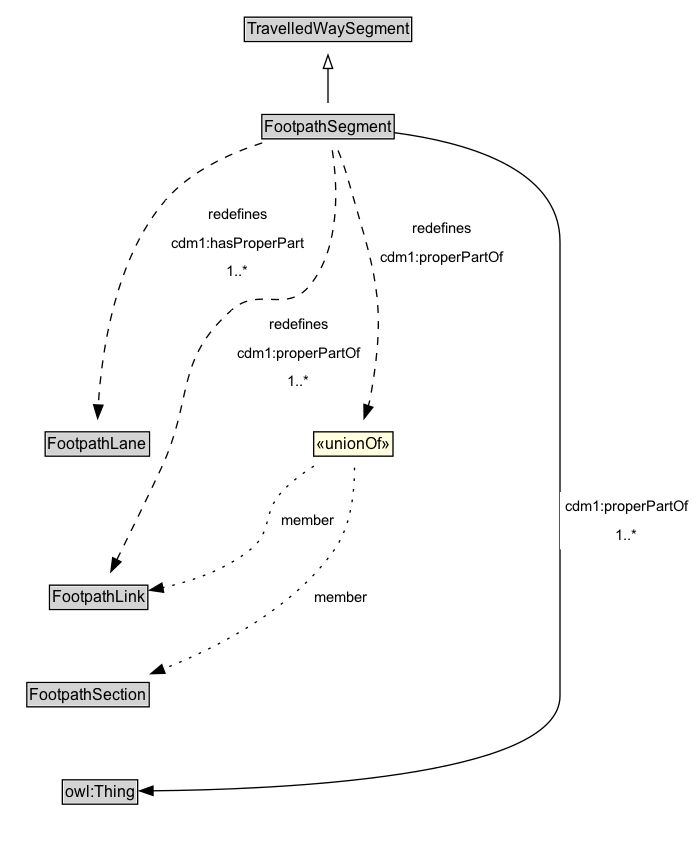

# FootpathSegment

A FootpathSegment can be defined to be a part of a FootpathSection, especially when the FootpathSection does not span an entire FootpathLink.

## Diagram

=== "SVG (interactive)"

    <!-- Generated by graphviz version 14.1.3 (20260303.0454)
     -->
    <!-- Pages: 1 -->
    <svg width="524pt" height="632pt"
     viewBox="0.00 0.00 524.00 632.00" xmlns="http://www.w3.org/2000/svg" xmlns:xlink="http://www.w3.org/1999/xlink">
    <g id="graph0" class="graph" transform="scale(1 1) rotate(0) translate(4 628)">
    <polygon fill="white" stroke="none" points="-4,4 -4,-628 520.25,-628 520.25,4 -4,4"/>
    <g id="clust3" class="cluster">
    <title>cluster_associated</title>
    </g>
    <!-- TravelledWaySegment -->
    <g id="node1" class="node">
    <title>TravelledWaySegment</title>
    <g id="a_node1"><a xlink:href="../TravelledWaySegment" xlink:title="&lt;TABLE&gt;">
    <polygon fill="lightgray" stroke="none" points="180.25,-597.88 180.25,-614.12 303.75,-614.12 303.75,-597.88 180.25,-597.88"/>
    <text xml:space="preserve" text-anchor="start" x="181.25" y="-601.88" font-family="Arial" font-size="12.00">TravelledWaySegment</text>
    <polygon fill="none" stroke="black" points="179.25,-596.88 179.25,-615.12 304.75,-615.12 304.75,-596.88 179.25,-596.88"/>
    </a>
    </g>
    </g>
    <!-- FootpathSegment -->
    <g id="node2" class="node">
    <title>FootpathSegment</title>
    <g id="a_node2"><a xlink:href="../FootpathSegment" xlink:title="&lt;TABLE&gt;">
    <polygon fill="lightgray" stroke="none" points="193.38,-524.88 193.38,-541.12 290.62,-541.12 290.62,-524.88 193.38,-524.88"/>
    <text xml:space="preserve" text-anchor="start" x="194.38" y="-528.88" font-family="Arial" font-size="12.00">FootpathSegment</text>
    <polygon fill="none" stroke="black" points="192.38,-523.88 192.38,-542.12 291.62,-542.12 291.62,-523.88 192.38,-523.88"/>
    </a>
    </g>
    </g>
    <!-- FootpathSegment&#45;&gt;TravelledWaySegment -->
    <g id="edge1" class="edge">
    <title>FootpathSegment&#45;&gt;TravelledWaySegment</title>
    <path fill="none" stroke="black" d="M242,-550.71C242,-558.47 242,-567.92 242,-576.74"/>
    <polygon fill="none" stroke="black" points="238.5,-576.66 242,-586.66 245.5,-576.66 238.5,-576.66"/>
    </g>
    <!-- Invis -->
    <!-- FootpathSegment&#45;&gt;Invis -->
    <!-- FootpathLane -->
    <g id="node4" class="node">
    <title>FootpathLane</title>
    <g id="a_node4"><a xlink:href="../FootpathLane" xlink:title="&lt;TABLE&gt;">
    <polygon fill="lightgray" stroke="none" points="30.88,-286.88 30.88,-303.12 107.12,-303.12 107.12,-286.88 30.88,-286.88"/>
    <text xml:space="preserve" text-anchor="start" x="31.88" y="-290.88" font-family="Arial" font-size="12.00">FootpathLane</text>
    <polygon fill="none" stroke="black" points="29.88,-285.88 29.88,-304.12 108.12,-304.12 108.12,-285.88 29.88,-285.88"/>
    </a>
    </g>
    </g>
    <!-- FootpathSegment&#45;&gt;FootpathLane -->
    <g id="edge11" class="edge">
    <title>FootpathSegment&#45;&gt;FootpathLane</title>
    <path fill="none" stroke="black" stroke-dasharray="5,2" d="M192.64,-520.82C167.71,-512.8 138.87,-499.5 120.25,-478 82.04,-433.9 72.18,-363.29 69.73,-324.25"/>
    <polygon fill="black" stroke="black" points="73.22,-324.09 69.24,-314.27 66.23,-324.43 73.22,-324.09"/>
    <polygon fill="white" stroke="none" points="120.25,-413.5 120.25,-478 228,-478 228,-413.5 120.25,-413.5"/>
    <text xml:space="preserve" text-anchor="start" x="152" y="-463.5" font-family="Arial" font-size="11.00">redefines</text>
    <text xml:space="preserve" text-anchor="start" x="124.25" y="-442" font-family="Arial" font-size="11.00">cdm1:hasProperPart</text>
    <text xml:space="preserve" text-anchor="start" x="165.88" y="-420.5" font-family="Arial" font-size="11.00">1..&#42;</text>
    </g>
    <!-- FootpathLink -->
    <g id="node5" class="node">
    <title>FootpathLink</title>
    <g id="a_node5"><a xlink:href="../FootpathLink" xlink:title="&lt;TABLE&gt;">
    <polygon fill="lightgray" stroke="none" points="34.12,-171.88 34.12,-188.12 105.88,-188.12 105.88,-171.88 34.12,-171.88"/>
    <text xml:space="preserve" text-anchor="start" x="35.12" y="-175.88" font-family="Arial" font-size="12.00">FootpathLink</text>
    <polygon fill="none" stroke="black" points="33.12,-170.88 33.12,-189.12 106.88,-189.12 106.88,-170.88 33.12,-170.88"/>
    </a>
    </g>
    </g>
    <!-- FootpathSegment&#45;&gt;FootpathLink -->
    <g id="edge10" class="edge">
    <title>FootpathSegment&#45;&gt;FootpathLink</title>
    <path fill="none" stroke="black" stroke-dasharray="5,2" d="M245.21,-515.28C249.02,-490.14 252.13,-442.47 228,-413.5 210.66,-392.68 190.02,-413.49 169.75,-395.5 126.63,-357.23 141.4,-329.23 117,-277 106.05,-253.56 93.09,-227.18 83.55,-208.01"/>
    <polygon fill="black" stroke="black" points="86.78,-206.64 79.18,-199.26 80.52,-209.77 86.78,-206.64"/>
    <polygon fill="white" stroke="none" points="169.75,-331 169.75,-395.5 270,-395.5 270,-331 169.75,-331"/>
    <text xml:space="preserve" text-anchor="start" x="197.75" y="-381" font-family="Arial" font-size="11.00">redefines</text>
    <text xml:space="preserve" text-anchor="start" x="173.75" y="-359.5" font-family="Arial" font-size="11.00">cdm1:properPartOf</text>
    <text xml:space="preserve" text-anchor="start" x="211.62" y="-338" font-family="Arial" font-size="11.00">1..&#42;</text>
    </g>
    <!-- owl_Thing -->
    <g id="node7" class="node">
    <title>owl_Thing</title>
    <g id="a_node7"><a xlink:href="https://w3id.org/citydata/imported/owl/latest/Thing" xlink:title="&lt;TABLE&gt;">
    <polygon fill="lightgray" stroke="none" points="43.75,-25.88 43.75,-42.12 98.25,-42.12 98.25,-25.88 43.75,-25.88"/>
    <text xml:space="preserve" text-anchor="start" x="44.75" y="-29.88" font-family="Arial" font-size="12.00">owl:Thing</text>
    <polygon fill="none" stroke="black" points="42.75,-24.88 42.75,-43.12 99.25,-43.12 99.25,-24.88 42.75,-24.88"/>
    </a>
    </g>
    </g>
    <!-- FootpathSegment&#45;&gt;owl_Thing -->
    <g id="edge12" class="edge">
    <title>FootpathSegment&#45;&gt;owl_Thing</title>
    <path fill="none" stroke="black" d="M291.4,-528.5C342.84,-521.86 416,-502.59 416,-446.75 416,-446.75 416,-446.75 416,-106 416,-44.26 201.34,-35.74 110.67,-34.9"/>
    <polygon fill="black" stroke="black" points="110.77,-31.4 100.75,-34.84 110.72,-38.4 110.77,-31.4"/>
    <polygon fill="white" stroke="none" points="416,-216 416,-259 516.25,-259 516.25,-216 416,-216"/>
    <text xml:space="preserve" text-anchor="start" x="420" y="-244.5" font-family="Arial" font-size="11.00">cdm1:properPartOf</text>
    <text xml:space="preserve" text-anchor="start" x="457.88" y="-223" font-family="Arial" font-size="11.00">1..&#42;</text>
    </g>
    <!-- nc63d9aeea9c24785938b813312b70530b25 -->
    <g id="node8" class="node">
    <title>nc63d9aeea9c24785938b813312b70530b25</title>
    <polygon fill="lightyellow" stroke="none" points="231.25,-285.88 231.25,-304.12 290.75,-304.12 290.75,-285.88 231.25,-285.88"/>
    <text xml:space="preserve" text-anchor="start" x="233.25" y="-290.88" font-family="Arial" font-size="12.00">«unionOf»</text>
    <polygon fill="none" stroke="black" points="231.25,-285.88 231.25,-304.12 290.75,-304.12 290.75,-285.88 231.25,-285.88"/>
    </g>
    <!-- FootpathSegment&#45;&gt;nc63d9aeea9c24785938b813312b70530b25 -->
    <g id="edge9" class="edge">
    <title>FootpathSegment&#45;&gt;nc63d9aeea9c24785938b813312b70530b25</title>
    <path fill="none" stroke="black" stroke-dasharray="5,2" d="M249.55,-515.15C251.88,-509.47 254.28,-503.04 256,-497 276.37,-425.64 287.13,-404.04 274,-331 273.55,-328.51 272.94,-325.97 272.22,-323.45"/>
    <polygon fill="black" stroke="black" points="275.61,-322.53 269.08,-314.18 268.98,-324.78 275.61,-322.53"/>
    <polygon fill="white" stroke="none" points="277.56,-424.25 277.56,-467.25 377.81,-467.25 377.81,-424.25 277.56,-424.25"/>
    <text xml:space="preserve" text-anchor="start" x="305.56" y="-452.75" font-family="Arial" font-size="11.00">redefines</text>
    <text xml:space="preserve" text-anchor="start" x="281.56" y="-431.25" font-family="Arial" font-size="11.00">cdm1:properPartOf</text>
    </g>
    <!-- Invis&#45;&gt;FootpathLane -->
    <!-- FootpathLane&#45;&gt;FootpathLink -->
    <!-- FootpathSection -->
    <g id="node6" class="node">
    <title>FootpathSection</title>
    <g id="a_node6"><a xlink:href="../FootpathSection" xlink:title="&lt;TABLE&gt;">
    <polygon fill="lightgray" stroke="none" points="17.12,-98.88 17.12,-115.12 106.88,-115.12 106.88,-98.88 17.12,-98.88"/>
    <text xml:space="preserve" text-anchor="start" x="18.12" y="-102.88" font-family="Arial" font-size="12.00">FootpathSection</text>
    <polygon fill="none" stroke="black" points="16.12,-97.88 16.12,-116.12 107.88,-116.12 107.88,-97.88 16.12,-97.88"/>
    </a>
    </g>
    </g>
    <!-- FootpathLink&#45;&gt;FootpathSection -->
    <!-- FootpathSection&#45;&gt;owl_Thing -->
    <!-- nc63d9aeea9c24785938b813312b70530b25&#45;&gt;FootpathLink -->
    <g id="edge7" class="edge">
    <title>nc63d9aeea9c24785938b813312b70530b25&#45;&gt;FootpathLink</title>
    <path fill="none" stroke="black" stroke-dasharray="1,5" d="M231.36,-278.41C222.89,-273.03 214.12,-266.45 207.25,-259 192.53,-243.02 200.8,-229.77 184,-216 165.32,-200.69 139.99,-192.07 117.95,-187.21"/>
    <polygon fill="black" stroke="black" points="118.75,-183.8 108.26,-185.3 117.39,-190.67 118.75,-183.8"/>
    <text xml:space="preserve" text-anchor="middle" x="227.12" y="-233.8" font-family="Arial" font-size="11.00">member</text>
    </g>
    <!-- nc63d9aeea9c24785938b813312b70530b25&#45;&gt;FootpathSection -->
    <g id="edge8" class="edge">
    <title>nc63d9aeea9c24785938b813312b70530b25&#45;&gt;FootpathSection</title>
    <path fill="none" stroke="black" stroke-dasharray="1,5" d="M261.89,-277.25C261.96,-260.33 259.69,-234.16 247,-216 216.03,-171.69 160.59,-142.88 118.45,-126.26"/>
    <polygon fill="black" stroke="black" points="119.78,-123.02 109.19,-122.73 117.29,-129.56 119.78,-123.02"/>
    <text xml:space="preserve" text-anchor="middle" x="251.78" y="-176.3" font-family="Arial" font-size="11.00">member</text>
    </g>
    </g>
    </svg>

=== "PNG"

    

## Formalization for FootpathSegment

| Property | Constraint |
|----------|------------|
| [cdm1:hasProperPart](https://w3id.org/citydata/part1/v1/hasProperPart) | min 1 |
| [cdm1:hasProperPart](https://w3id.org/citydata/part1/v1/hasProperPart) | min 1 [FootpathLane](https://w3id.org/citydata/part3/v1/FootpathLane) |
| [cdm1:properPartOf](https://w3id.org/citydata/part1/v1/properPartOf) | min 1 |
| [cdm1:properPartOf](https://w3id.org/citydata/part1/v1/properPartOf) | min 1 |
| subClassOf | [TravelledWaySegment](TravelledWaySegment.md) |

## Other annotations

| Property | Value |
|----------|-------|
| [xsd:pattern](https://w3id.org/citydata/imported/xsd/pattern) | PedestrianNetworkPattern |

