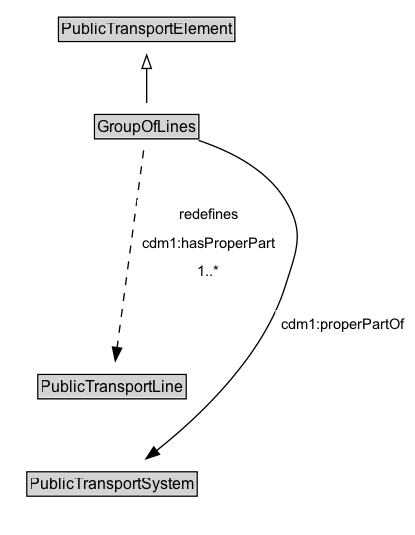

# GroupOfLines

A GroupOfLines is a logical grouping of PublicTransportLines for any useful purpose.

## Diagram

=== "SVG (interactive)"

    <!-- Generated by graphviz version 14.1.3 (20260303.0454)
     -->
    <!-- Pages: 1 -->
    <svg width="311pt" height="401pt"
     viewBox="0.00 0.00 311.00 401.00" xmlns="http://www.w3.org/2000/svg" xmlns:xlink="http://www.w3.org/1999/xlink">
    <g id="graph0" class="graph" transform="scale(1 1) rotate(0) translate(4 397)">
    <polygon fill="white" stroke="none" points="-4,4 -4,-397 306.92,-397 306.92,4 -4,4"/>
    <g id="clust3" class="cluster">
    <title>cluster_associated</title>
    </g>
    <!-- PublicTransportElement -->
    <g id="node1" class="node">
    <title>PublicTransportElement</title>
    <g id="a_node1"><a xlink:href="../PublicTransportElement" xlink:title="&lt;TABLE&gt;">
    <polygon fill="lightgray" stroke="none" points="40.88,-366.88 40.88,-383.12 171.12,-383.12 171.12,-366.88 40.88,-366.88"/>
    <text xml:space="preserve" text-anchor="start" x="41.88" y="-370.88" font-family="Arial" font-size="12.00">PublicTransportElement</text>
    <polygon fill="none" stroke="black" points="39.88,-365.88 39.88,-384.12 172.12,-384.12 172.12,-365.88 39.88,-365.88"/>
    </a>
    </g>
    </g>
    <!-- GroupOfLines -->
    <g id="node2" class="node">
    <title>GroupOfLines</title>
    <g id="a_node2"><a xlink:href="../GroupOfLines" xlink:title="&lt;TABLE&gt;">
    <polygon fill="lightgray" stroke="none" points="67.88,-293.88 67.88,-310.12 144.12,-310.12 144.12,-293.88 67.88,-293.88"/>
    <text xml:space="preserve" text-anchor="start" x="68.88" y="-297.88" font-family="Arial" font-size="12.00">GroupOfLines</text>
    <polygon fill="none" stroke="black" points="66.88,-292.88 66.88,-311.12 145.12,-311.12 145.12,-292.88 66.88,-292.88"/>
    </a>
    </g>
    </g>
    <!-- GroupOfLines&#45;&gt;PublicTransportElement -->
    <g id="edge1" class="edge">
    <title>GroupOfLines&#45;&gt;PublicTransportElement</title>
    <path fill="none" stroke="black" d="M106,-319.71C106,-327.47 106,-336.92 106,-345.74"/>
    <polygon fill="none" stroke="black" points="102.5,-345.66 106,-355.66 109.5,-345.66 102.5,-345.66"/>
    </g>
    <!-- Invis -->
    <!-- GroupOfLines&#45;&gt;Invis -->
    <!-- PublicTransportLine -->
    <g id="node4" class="node">
    <title>PublicTransportLine</title>
    <g id="a_node4"><a xlink:href="../PublicTransportLine" xlink:title="&lt;TABLE&gt;">
    <polygon fill="lightgray" stroke="none" points="25.38,-98.88 25.38,-115.12 134.62,-115.12 134.62,-98.88 25.38,-98.88"/>
    <text xml:space="preserve" text-anchor="start" x="26.38" y="-102.88" font-family="Arial" font-size="12.00">PublicTransportLine</text>
    <polygon fill="none" stroke="black" points="24.38,-97.88 24.38,-116.12 135.62,-116.12 135.62,-97.88 24.38,-97.88"/>
    </a>
    </g>
    </g>
    <!-- GroupOfLines&#45;&gt;PublicTransportLine -->
    <g id="edge5" class="edge">
    <title>GroupOfLines&#45;&gt;PublicTransportLine</title>
    <path fill="none" stroke="black" stroke-dasharray="5,2" d="M103.74,-284.21C99.27,-251.06 89.28,-176.89 83.79,-136.14"/>
    <polygon fill="black" stroke="black" points="87.28,-135.83 82.48,-126.39 80.34,-136.77 87.28,-135.83"/>
    <polygon fill="white" stroke="none" points="98.67,-182.5 98.67,-247 206.42,-247 206.42,-182.5 98.67,-182.5"/>
    <text xml:space="preserve" text-anchor="start" x="130.42" y="-232.5" font-family="Arial" font-size="11.00">redefines</text>
    <text xml:space="preserve" text-anchor="start" x="102.67" y="-211" font-family="Arial" font-size="11.00">cdm1:hasProperPart</text>
    <text xml:space="preserve" text-anchor="start" x="144.3" y="-189.5" font-family="Arial" font-size="11.00">1..&#42;</text>
    </g>
    <!-- PublicTransportSystem -->
    <g id="node5" class="node">
    <title>PublicTransportSystem</title>
    <g id="a_node5"><a xlink:href="../PublicTransportSystem" xlink:title="&lt;TABLE&gt;">
    <polygon fill="lightgray" stroke="none" points="17.12,-25.88 17.12,-42.12 142.88,-42.12 142.88,-25.88 17.12,-25.88"/>
    <text xml:space="preserve" text-anchor="start" x="18.12" y="-29.88" font-family="Arial" font-size="12.00">PublicTransportSystem</text>
    <polygon fill="none" stroke="black" points="16.12,-24.88 16.12,-43.12 143.88,-43.12 143.88,-24.88 16.12,-24.88"/>
    </a>
    </g>
    </g>
    <!-- GroupOfLines&#45;&gt;PublicTransportSystem -->
    <g id="edge6" class="edge">
    <title>GroupOfLines&#45;&gt;PublicTransportSystem</title>
    <path fill="none" stroke="black" d="M144.96,-291.68C168.22,-283.9 195.9,-270.21 210,-247 224.88,-222.5 218.57,-209.85 210,-182.5 193.48,-129.8 145.92,-84.8 113.15,-58.82"/>
    <polygon fill="black" stroke="black" points="115.59,-56.27 105.53,-52.93 111.3,-61.81 115.59,-56.27"/>
    <polygon fill="white" stroke="none" points="202.67,-143 202.67,-164.5 302.92,-164.5 302.92,-143 202.67,-143"/>
    <text xml:space="preserve" text-anchor="start" x="206.67" y="-150" font-family="Arial" font-size="11.00">cdm1:properPartOf</text>
    </g>
    <!-- Invis&#45;&gt;PublicTransportLine -->
    <!-- PublicTransportLine&#45;&gt;PublicTransportSystem -->
    </g>
    </svg>

=== "PNG"

    

## Formalization for GroupOfLines

| Property | Constraint |
|----------|------------|
| [cdm1:hasProperPart](https://w3id.org/citydata/part1/v1/hasProperPart) | min 1 |
| [cdm1:hasProperPart](https://w3id.org/citydata/part1/v1/hasProperPart) | min 1 [PublicTransportLine](https://w3id.org/citydata/part3/v1/PublicTransportLine) |
| [cdm1:properPartOf](https://w3id.org/citydata/part1/v1/properPartOf) | only [PublicTransportSystem](https://w3id.org/citydata/part3/v1/PublicTransportSystem) |
| subClassOf | [PublicTransportElement](PublicTransportElement.md) |

