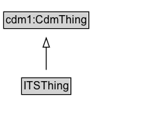

# ITSThing

Added for organizational purposes, to identify all classes defined for the transport service of the City Data Model.

**IRI**: `https://w3id.org/citydata/part3/v1/ITSThing`

## Diagram

=== "SVG (interactive)"

    <!-- Generated by graphviz version 14.1.3 (20260303.0454)
     -->
    <!-- Pages: 1 -->
    <svg width="169pt" height="132pt"
     viewBox="0.00 0.00 169.00 132.00" xmlns="http://www.w3.org/2000/svg" xmlns:xlink="http://www.w3.org/1999/xlink">
    <g id="graph0" class="graph" transform="scale(1 1) rotate(0) translate(4 128)">
    <polygon fill="white" stroke="none" points="-4,4 -4,-128 165.25,-128 165.25,4 -4,4"/>
    <g id="clust3" class="cluster">
    <title>cluster_associated</title>
    </g>
    <!-- cdm1_CdmThing -->
    <g id="node1" class="node">
    <title>cdm1_CdmThing</title>
    <g id="a_node1"><a xlink:href="https://w3id.org/citydata/part1/v1/CdmThing" xlink:title="&lt;TABLE&gt;">
    <polygon fill="lightgray" stroke="none" points="1,-97.88 1,-114.12 91.5,-114.12 91.5,-97.88 1,-97.88"/>
    <text xml:space="preserve" text-anchor="start" x="2" y="-101.88" font-family="Arial" font-size="12.00">cdm1:CdmThing</text>
    <polygon fill="none" stroke="black" points="0,-96.88 0,-115.12 92.5,-115.12 92.5,-96.88 0,-96.88"/>
    </a>
    </g>
    </g>
    <!-- ITSThing -->
    <g id="node2" class="node">
    <title>ITSThing</title>
    <g id="a_node2"><a xlink:href="../ITSThing" xlink:title="&lt;TABLE&gt;">
    <polygon fill="lightgray" stroke="none" points="20.5,-25.88 20.5,-42.12 72,-42.12 72,-25.88 20.5,-25.88"/>
    <text xml:space="preserve" text-anchor="start" x="21.5" y="-29.88" font-family="Arial" font-size="12.00">ITSThing</text>
    <polygon fill="none" stroke="black" points="19.5,-24.88 19.5,-43.12 73,-43.12 73,-24.88 19.5,-24.88"/>
    </a>
    </g>
    </g>
    <!-- ITSThing&#45;&gt;cdm1_CdmThing -->
    <g id="edge1" class="edge">
    <title>ITSThing&#45;&gt;cdm1_CdmThing</title>
    <path fill="none" stroke="black" d="M46.25,-51.79C46.25,-59.25 46.25,-68.24 46.25,-76.69"/>
    <polygon fill="none" stroke="black" points="42.75,-76.54 46.25,-86.54 49.75,-76.54 42.75,-76.54"/>
    </g>
    <!-- Invis -->
    </g>
    </svg>

=== "PNG"

    

## Specializations of ITSThing

| Class | Description |
|-------|-------------|
| [Footpath](Footpath.md) | A Footpath is a type of TravelledWay that is made up of FootpathLinks. |
| [Footpath Lane](FootpathLane.md) | A FootpathLane is a type of TravelledWayLane that forms part of a FootpathSegment. |
| [Footpath Link](FootpathLink.md) | A Footpath Link is a type of TravelledWayLink designed for pedestrians. |
| [Footpath Network](FootpathNetwork.md) | A FootpathNetwork is a type of TransportNetwork designed for the use of pedestrians but may be used by others as well. |
| [Footpath Section](FootpathSection.md) | A FootpathSection is a type of TravelledWaySection that groups FootpathLinks and FootpathSegments for a useful operational purpose. |
| [Footpath Segment](FootpathSegment.md) | A FootpathSegment can be defined to be a part of a FootpathSection, especially when the FootpathSection does not span an entire FootpathLink. |
| [Group Of Lines](GroupOfLines.md) | A GroupOfLines is a logical grouping of PublicTransportLines for any useful purpose. |
| [Junction](Junction.md) | A Junction is a TransportNode that allows a traveller to connect from one TravelledWayLink to another. |
| [Micromobility Lane](MicromobilityLane.md) | A MicromobilityLane is a type of RoadLane that forms part of a MicromobilityPathSegment. |
| [Micromobility Link](MicromobilityLink.md) | A MicromobilityLink is a type of RoadLink designed for micromobility vehicles. |
| [Micromobility Network](MicromobilityNetwork.md) | A MicromobilityNetwork is a type of RoadNetwork designed for the use of micromobility vehicles, which have more limited performance characteristics than motor vehicles. |
| [Micromobility Path](MicromobilityPath.md) | A MicromobilityPath is a type of Road that is made up of MicromobilityPathLinks. |
| [Micromobility Path Section](MicromobilityPathSection.md) | A MicromobilityPathSections is a type of RoadSection that groups MicromobilityLinks and MicromobilityPathSegments for a useful operational purpose (e.g., assigning a speed limit, designating areas of shared use). |
| [Micromobility Path Segment](MicromobilityPathSegment.md) | A MicromobilityPathSegment can be defined to be a part of a MicromobilityPathSection, especially when the MicromobilityPathSection does not span an entire MicromobilityLink. |
| [Network Element](NetworkElement.md) | A NetworkElement represents any element of a transport network. It can be a part of another NetworkElement and can be decomposed into smaller NetworkElements. |
| [Point On Route](PointOnRoute.md) | A PointOnRoute represents an ordered RoutePoint for a PublicTransportRoute. |
| [Public Transport Element](PublicTransportElement.md) | A PublicTransportElement represents any element of a public transport system. It can be a part of another PublicTransportElement and can be decomposed into smaller PublicTransportElement. |
| [Public Transport Line](PublicTransportLine.md) | A PublicTransportLine is one or more routes used by public transport vehicles to transport passengers to and from designated locations. |
| [Public Transport Route](PublicTransportRoute.md) | A PublicTransportRoute represents one specific path used by a public transport vehicle to transport passengers to and from designated locations. |
| [Public Transport System](PublicTransportSystem.md) | A PublicTransportSystem provides transport services to members of the public. |
| [Public Transport System Thing](PublicTransportSystemThing.md) | Added for organizational purposes, to identify classes defined in the Public Transport System Pattern ontology. |
| [Rail Corridor](RailCorridor.md) | A RailCorridor is a type of TravelledWay that is made up of TrackLinks. |
| [Rail Network](RailNetwork.md) | A RailNetwork is a type of TransportNetwork using rails on a stabilized base. |
| [Rail Section](RailSection.md) | A RailSection is a type of TravelledWaySection that groups TrackLinks and TrackSegments for a useful operational purpose (e.g., assigning a speed limit, designating a traffic control scheme). |
| [Road](Road.md) | A Road is a type of TravelledWay and cdm2:Road that is made up of RoadLinks. Roads form a proper part of RoadNetworks. |
| [Road Lane](RoadLane.md) | A RoadLane is a type of TravelledWayLane that forms part of a RoadSegment. |
| [Road Link](RoadLink.md) | A RoadLink is a type of TravelledWayLink and cdm2:RoadLink using a stabilized base designed for the movement of vehicles that conform to a specified set of requirements but may be used by others as well. |
| [Road Link User Type](RoadLinkUserType.md) | A RoadLinkUserType represents the unique combination of a RoadLink and a UserType such that speed limits and other characteristics can be defined to apply to specific user types when operating along a particular road link. |
| [Road Network](RoadNetwork.md) | Roads are most commonly associated with motor vehicles, but can be designed for other types of vehicles (e.g., micromobility vehicles). |
| [Road Section](RoadSection.md) | A RoadSection is a type of TravelledWaySection that groups RoadLinks and RoadSegments for a useful operational purpose (e.g., assigning a speed limit, designating a traffic control scheme). |
| [Road Segment](RoadSegment.md) | A RoadSegment can be defined to be a part of a RoadSection, for example, when the RoadSection does not span an entire RoadLink. |
| [Route Point](RoutePoint.md) | A RoutePoint represents a point of interest along a PublicTransportRoute. |
| [Route Point](RoutePoint.md) | A RoutePoint represents a point of interest along a PublicTransportRoute. |
| [Scheduled Code](ScheduledCode.md) | The operational status of an entity, e.g., open or closed. |
| [Track Link](TrackLink.md) | Due to the nature of rail, each TrackLink consists of a single lane, but multiple TrackLinks can exist along the same RailCorridor. |
| [Track Segment](TrackSegment.md) | A TrackSegment is a type of TravelledWaySegment that represents a portion of a TrackLink with common physical characteristics. |
| [Transport Alert Thing](TransportAlertThing.md) | The transport alert pattern addresses the need for public agencies to alert groups to unusual transport-related conditions. Most of the features of the transport alert pattern can also be used for other types of alerts (e.g., meteorological events) and as such, its design includes the definition of a generalized alert. |
| [Transport Network](TransportNetwork.md) | A TransportNetwork is a NetworkElement that is a collection of other network elements that jointly represent a network of paths along which entities (e.g., vehicles, pedestrians) of a specified mode can operate. |
| [Transport Network Thing](TransportNetworkThing.md) | The Transport Network Pattern models the core concepts involved in describing a transport network. This includes an identification of both physical and administrative characteristics. The most general class is that of the NetworkElement, which can be further classified as one of several types of NetworkElements. A key feature of this pattern is the formalization of the hasProperPart relationship from a NetworkElement to another NetworkElement. This allows for a representation of networks at multiple levels of detail. For example, at one level, a motorway interchange can be modelled as a single Node. But that node is a NetworkElement that can be defined to consist of an entire TransportNetwork that has a node for each junction within the interchange. |
| [Transport Node](TransportNode.md) | A TransportNode is a NetworkElement that represents a node on the transport network that can be used to designate an end to a link or to join links. |
| [Travel Corridor](TravelCorridor.md) | A TravelCorridor is a type of TravelledWay that is made up of TravelCorridorLinks. |
| [Travel Corridor Link](TravelCorridorLink.md) | A TravelCorridorLink is a type of TravelledWayLink that is made up of TravelCorridorSegments. |
| [Travel Corridor Segment](TravelCorridorSegment.md) | A TravelCorridorSegment is a type of TravelledWaySegment that logically groups multiple TravelledWaySegments together as being co-located or side-by-side. |
| [Travelled Way](TravelledWay.md) | A TravelledWay is a type of NetworkElement and transinfras:TravelledWay that represents the curvilinear length of a transport route that is identified by a specific designator. |
| [Travelled Way Lane](TravelledWayLane.md) | A TravelledWayLane is a NetworkElement that is a portion of TravelledWaySegment intended to accommodate a single line of moving material entities (e.g., vehicles) along its length. |
| [Travelled Way Link](TravelledWayLink.md) | A TravelledWayLink is a type of NetworkElement and transinfras:TravelledWayLink. It represents a contiguous length of a TravelledWay between two TransportNodes of operational or managerial significance. |
| [Travelled Way Section](TravelledWaySection.md) | A TravelledWaySection is a type of NetworkElement that represents an aggregation of TravelledWayLinks and TravelledWaySegments that jointly represent a contiguous length of a path that shares the same management and operational strategies (within the scope of interest of the implementation). |
| [Travelled Way Segment](TravelledWaySegment.md) | A TravelledWaySegment is a type of a transinfras:TravelledWaySegment and NetworkElement that represents a contiguous length of a TravelledWayLink characterized by the same physical characteristics. |

## Formalization for ITSThing

| Property | Constraint |
|----------|------------|
| subClassOf | [cdm1:CdmThing](https://w3id.org/citydata/part1/v1/CdmThing) |

