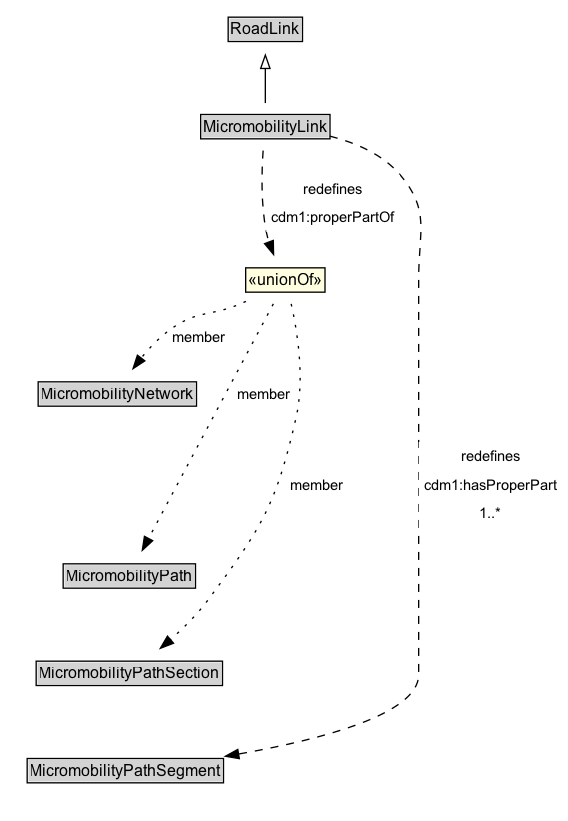

# MicromobilityLink

A MicromobilityLink is a type of RoadLink designed for micromobility vehicles.

## Diagram

=== "SVG (interactive)"

    <!-- Generated by graphviz version 14.1.3 (20260303.0454)
     -->
    <!-- Pages: 1 -->
    <svg width="426pt" height="616pt"
     viewBox="0.00 0.00 426.00 616.00" xmlns="http://www.w3.org/2000/svg" xmlns:xlink="http://www.w3.org/1999/xlink">
    <g id="graph0" class="graph" transform="scale(1 1) rotate(0) translate(4 612)">
    <polygon fill="white" stroke="none" points="-4,4 -4,-612 421.75,-612 421.75,4 -4,4"/>
    <g id="clust3" class="cluster">
    <title>cluster_associated</title>
    </g>
    <!-- RoadLink -->
    <g id="node1" class="node">
    <title>RoadLink</title>
    <g id="a_node1"><a xlink:href="../RoadLink" xlink:title="&lt;TABLE&gt;">
    <polygon fill="lightgray" stroke="none" points="168.12,-581.88 168.12,-598.12 221.88,-598.12 221.88,-581.88 168.12,-581.88"/>
    <text xml:space="preserve" text-anchor="start" x="169.12" y="-585.88" font-family="Arial" font-size="12.00">RoadLink</text>
    <polygon fill="none" stroke="black" points="167.12,-580.88 167.12,-599.12 222.88,-599.12 222.88,-580.88 167.12,-580.88"/>
    </a>
    </g>
    </g>
    <!-- MicromobilityLink -->
    <g id="node2" class="node">
    <title>MicromobilityLink</title>
    <g id="a_node2"><a xlink:href="../MicromobilityLink" xlink:title="&lt;TABLE&gt;">
    <polygon fill="lightgray" stroke="none" points="147.5,-508.88 147.5,-525.12 242.5,-525.12 242.5,-508.88 147.5,-508.88"/>
    <text xml:space="preserve" text-anchor="start" x="148.5" y="-512.88" font-family="Arial" font-size="12.00">MicromobilityLink</text>
    <polygon fill="none" stroke="black" points="146.5,-507.88 146.5,-526.12 243.5,-526.12 243.5,-507.88 146.5,-507.88"/>
    </a>
    </g>
    </g>
    <!-- MicromobilityLink&#45;&gt;RoadLink -->
    <g id="edge1" class="edge">
    <title>MicromobilityLink&#45;&gt;RoadLink</title>
    <path fill="none" stroke="black" d="M195,-534.71C195,-542.47 195,-551.92 195,-560.74"/>
    <polygon fill="none" stroke="black" points="191.5,-560.66 195,-570.66 198.5,-560.66 191.5,-560.66"/>
    </g>
    <!-- Invis -->
    <!-- MicromobilityLink&#45;&gt;Invis -->
    <!-- MicromobilityPathSegment -->
    <g id="node7" class="node">
    <title>MicromobilityPathSegment</title>
    <g id="a_node7"><a xlink:href="../MicromobilityPathSegment" xlink:title="&lt;TABLE&gt;">
    <polygon fill="lightgray" stroke="none" points="17.38,-25.88 17.38,-42.12 162.62,-42.12 162.62,-25.88 17.38,-25.88"/>
    <text xml:space="preserve" text-anchor="start" x="18.38" y="-29.88" font-family="Arial" font-size="12.00">MicromobilityPathSegment</text>
    <polygon fill="none" stroke="black" points="16.38,-24.88 16.38,-43.12 163.62,-43.12 163.62,-24.88 16.38,-24.88"/>
    </a>
    </g>
    </g>
    <!-- MicromobilityLink&#45;&gt;MicromobilityPathSegment -->
    <g id="edge11" class="edge">
    <title>MicromobilityLink&#45;&gt;MicromobilityPathSegment</title>
    <path fill="none" stroke="black" stroke-dasharray="5,2" d="M243.4,-509.91C262.41,-505.08 282.79,-496.44 296,-481 318.89,-454.23 310,-438.22 310,-403 310,-403 310,-403 310,-106 310,-76.33 236.6,-57.24 174.59,-46.42"/>
    <polygon fill="black" stroke="black" points="175.5,-43.02 165.06,-44.81 174.33,-49.92 175.5,-43.02"/>
    <polygon fill="white" stroke="none" points="310,-216 310,-280.5 417.75,-280.5 417.75,-216 310,-216"/>
    <text xml:space="preserve" text-anchor="start" x="341.75" y="-266" font-family="Arial" font-size="11.00">redefines</text>
    <text xml:space="preserve" text-anchor="start" x="314" y="-244.5" font-family="Arial" font-size="11.00">cdm1:hasProperPart</text>
    <text xml:space="preserve" text-anchor="start" x="355.62" y="-223" font-family="Arial" font-size="11.00">1..&#42;</text>
    </g>
    <!-- n357fc98d4b3b4002a740b57da5623563b4 -->
    <g id="node8" class="node">
    <title>n357fc98d4b3b4002a740b57da5623563b4</title>
    <polygon fill="lightyellow" stroke="none" points="180.25,-392.88 180.25,-411.12 239.75,-411.12 239.75,-392.88 180.25,-392.88"/>
    <text xml:space="preserve" text-anchor="start" x="182.25" y="-397.88" font-family="Arial" font-size="12.00">«unionOf»</text>
    <polygon fill="none" stroke="black" points="180.25,-392.88 180.25,-411.12 239.75,-411.12 239.75,-392.88 180.25,-392.88"/>
    </g>
    <!-- MicromobilityLink&#45;&gt;n357fc98d4b3b4002a740b57da5623563b4 -->
    <g id="edge10" class="edge">
    <title>MicromobilityLink&#45;&gt;n357fc98d4b3b4002a740b57da5623563b4</title>
    <path fill="none" stroke="black" stroke-dasharray="5,2" d="M193.35,-499.07C192.22,-483.15 191.59,-458.71 195.75,-438 196.25,-435.49 196.93,-432.93 197.73,-430.4"/>
    <polygon fill="black" stroke="black" points="200.98,-431.7 201.18,-421.11 194.42,-429.26 200.98,-431.7"/>
    <polygon fill="white" stroke="none" points="195.75,-438 195.75,-481 296,-481 296,-438 195.75,-438"/>
    <text xml:space="preserve" text-anchor="start" x="223.75" y="-466.5" font-family="Arial" font-size="11.00">redefines</text>
    <text xml:space="preserve" text-anchor="start" x="199.75" y="-445" font-family="Arial" font-size="11.00">cdm1:properPartOf</text>
    </g>
    <!-- MicromobilityNetwork -->
    <g id="node4" class="node">
    <title>MicromobilityNetwork</title>
    <g id="a_node4"><a xlink:href="../MicromobilityNetwork" xlink:title="&lt;TABLE&gt;">
    <polygon fill="lightgray" stroke="none" points="25.62,-308.38 25.62,-324.62 142.38,-324.62 142.38,-308.38 25.62,-308.38"/>
    <text xml:space="preserve" text-anchor="start" x="26.62" y="-312.38" font-family="Arial" font-size="12.00">MicromobilityNetwork</text>
    <polygon fill="none" stroke="black" points="24.62,-307.38 24.62,-325.62 143.38,-325.62 143.38,-307.38 24.62,-307.38"/>
    </a>
    </g>
    </g>
    <!-- Invis&#45;&gt;MicromobilityNetwork -->
    <!-- MicromobilityPath -->
    <g id="node5" class="node">
    <title>MicromobilityPath</title>
    <g id="a_node5"><a xlink:href="../MicromobilityPath" xlink:title="&lt;TABLE&gt;">
    <polygon fill="lightgray" stroke="none" points="44.38,-171.88 44.38,-188.12 141.62,-188.12 141.62,-171.88 44.38,-171.88"/>
    <text xml:space="preserve" text-anchor="start" x="45.38" y="-175.88" font-family="Arial" font-size="12.00">MicromobilityPath</text>
    <polygon fill="none" stroke="black" points="43.38,-170.88 43.38,-189.12 142.62,-189.12 142.62,-170.88 43.38,-170.88"/>
    </a>
    </g>
    </g>
    <!-- MicromobilityNetwork&#45;&gt;MicromobilityPath -->
    <!-- MicromobilityPathSection -->
    <g id="node6" class="node">
    <title>MicromobilityPathSection</title>
    <g id="a_node6"><a xlink:href="../MicromobilityPathSection" xlink:title="&lt;TABLE&gt;">
    <polygon fill="lightgray" stroke="none" points="24.12,-98.88 24.12,-115.12 161.88,-115.12 161.88,-98.88 24.12,-98.88"/>
    <text xml:space="preserve" text-anchor="start" x="25.12" y="-102.88" font-family="Arial" font-size="12.00">MicromobilityPathSection</text>
    <polygon fill="none" stroke="black" points="23.12,-97.88 23.12,-116.12 162.88,-116.12 162.88,-97.88 23.12,-97.88"/>
    </a>
    </g>
    </g>
    <!-- MicromobilityPath&#45;&gt;MicromobilityPathSection -->
    <!-- MicromobilityPathSection&#45;&gt;MicromobilityPathSegment -->
    <!-- n357fc98d4b3b4002a740b57da5623563b4&#45;&gt;MicromobilityNetwork -->
    <g id="edge7" class="edge">
    <title>n357fc98d4b3b4002a740b57da5623563b4&#45;&gt;MicromobilityNetwork</title>
    <path fill="none" stroke="black" stroke-dasharray="1,5" d="M180.43,-385.95C178.94,-385.27 177.46,-384.62 176,-384 153.98,-374.63 144.96,-379.58 125.25,-366 116.39,-359.89 108.3,-351.42 101.68,-343.26"/>
    <polygon fill="black" stroke="black" points="104.63,-341.35 95.78,-335.52 99.06,-345.6 104.63,-341.35"/>
    <text xml:space="preserve" text-anchor="middle" x="145.12" y="-355.55" font-family="Arial" font-size="11.00">member</text>
    </g>
    <!-- n357fc98d4b3b4002a740b57da5623563b4&#45;&gt;MicromobilityPath -->
    <g id="edge8" class="edge">
    <title>n357fc98d4b3b4002a740b57da5623563b4&#45;&gt;MicromobilityPath</title>
    <path fill="none" stroke="black" stroke-dasharray="1,5" d="M201.01,-384.1C180.85,-346.19 131.87,-254.08 107.4,-208.08"/>
    <polygon fill="black" stroke="black" points="110.51,-206.48 102.73,-199.29 104.33,-209.76 110.51,-206.48"/>
    <text xml:space="preserve" text-anchor="middle" x="194.22" y="-312.8" font-family="Arial" font-size="11.00">member</text>
    </g>
    <!-- n357fc98d4b3b4002a740b57da5623563b4&#45;&gt;MicromobilityPathSection -->
    <g id="edge9" class="edge">
    <title>n357fc98d4b3b4002a740b57da5623563b4&#45;&gt;MicromobilityPathSection</title>
    <path fill="none" stroke="black" stroke-dasharray="1,5" d="M214.4,-384.08C219.02,-363.57 224.78,-328.08 218,-298.5 202.95,-232.82 192.24,-216.05 152,-162 143.92,-151.15 133.44,-140.73 123.56,-131.99"/>
    <polygon fill="black" stroke="black" points="126.14,-129.59 116.26,-125.76 121.59,-134.91 126.14,-129.59"/>
    <text xml:space="preserve" text-anchor="middle" x="233.46" y="-244.55" font-family="Arial" font-size="11.00">member</text>
    </g>
    </g>
    </svg>

=== "PNG"

    

## Formalization for MicromobilityLink

| Property | Constraint |
|----------|------------|
| [cdm1:hasProperPart](https://w3id.org/citydata/part1/v1/hasProperPart) | min 1 |
| [cdm1:hasProperPart](https://w3id.org/citydata/part1/v1/hasProperPart) | min 1 [MicromobilityPathSegment](https://w3id.org/citydata/part3/v1/MicromobilityPathSegment) |
| subClassOf | [RoadLink](RoadLink.md) |

## Other annotations

| Property | Value |
|----------|-------|
| [xsd:pattern](https://w3id.org/citydata/imported/xsd/pattern) | MicromobilityNetworkPattern |

