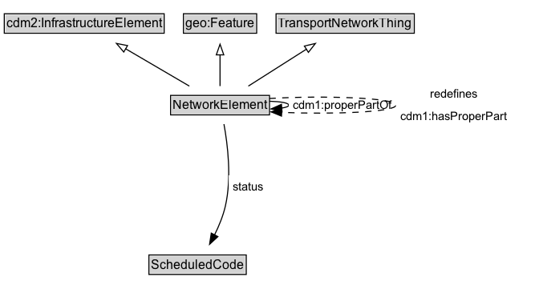

# NetworkElement

A NetworkElement represents any element of a transport network. It can be a part of another NetworkElement and can be decomposed into smaller NetworkElements.

## Diagram

=== "SVG (interactive)"

    <!-- Generated by graphviz version 14.1.3 (20260303.0454)
     -->
    <!-- Pages: 1 -->
    <svg width="500pt" height="286pt"
     viewBox="0.00 0.00 500.00 286.00" xmlns="http://www.w3.org/2000/svg" xmlns:xlink="http://www.w3.org/1999/xlink">
    <g id="graph0" class="graph" transform="scale(1 1) rotate(0) translate(4 282)">
    <polygon fill="white" stroke="none" points="-4,4 -4,-282 496,-282 496,4 -4,4"/>
    <g id="clust3" class="cluster">
    <title>cluster_associated</title>
    </g>
    <!-- cdm2_InfrastructureElement -->
    <g id="node1" class="node">
    <title>cdm2_InfrastructureElement</title>
    <g id="a_node1"><a xlink:href="https://w3id.org/citydata/part2/v1/InfrastructureElement" xlink:title="&lt;TABLE&gt;">
    <polygon fill="lightgray" stroke="none" points="1,-251.88 1,-268.12 148.5,-268.12 148.5,-251.88 1,-251.88"/>
    <text xml:space="preserve" text-anchor="start" x="2" y="-255.88" font-family="Arial" font-size="12.00">cdm2:InfrastructureElement</text>
    <polygon fill="none" stroke="black" points="0,-250.88 0,-269.12 149.5,-269.12 149.5,-250.88 0,-250.88"/>
    </a>
    </g>
    </g>
    <!-- geo_Feature -->
    <g id="node2" class="node">
    <title>geo_Feature</title>
    <g id="a_node2"><a xlink:href="https://w3id.org/citydata/imported/geo/latest/Feature" xlink:title="&lt;TABLE&gt;">
    <polygon fill="lightgray" stroke="none" points="168.5,-251.88 168.5,-268.12 235,-268.12 235,-251.88 168.5,-251.88"/>
    <text xml:space="preserve" text-anchor="start" x="169.5" y="-255.88" font-family="Arial" font-size="12.00">geo:Feature</text>
    <polygon fill="none" stroke="black" points="167.5,-250.88 167.5,-269.12 236,-269.12 236,-250.88 167.5,-250.88"/>
    </a>
    </g>
    </g>
    <!-- TransportNetworkThing -->
    <g id="node3" class="node">
    <title>TransportNetworkThing</title>
    <g id="a_node3"><a xlink:href="../TransportNetworkThing" xlink:title="&lt;TABLE&gt;">
    <polygon fill="lightgray" stroke="none" points="255.12,-251.88 255.12,-268.12 382.38,-268.12 382.38,-251.88 255.12,-251.88"/>
    <text xml:space="preserve" text-anchor="start" x="256.12" y="-255.88" font-family="Arial" font-size="12.00">TransportNetworkThing</text>
    <polygon fill="none" stroke="black" points="254.12,-250.88 254.12,-269.12 383.38,-269.12 383.38,-250.88 254.12,-250.88"/>
    </a>
    </g>
    </g>
    <!-- NetworkElement -->
    <g id="node4" class="node">
    <title>NetworkElement</title>
    <g id="a_node4"><a xlink:href="../NetworkElement" xlink:title="&lt;TABLE&gt;">
    <polygon fill="lightgray" stroke="none" points="156.5,-175.38 156.5,-191.62 247,-191.62 247,-175.38 156.5,-175.38"/>
    <text xml:space="preserve" text-anchor="start" x="157.5" y="-179.38" font-family="Arial" font-size="12.00">NetworkElement</text>
    <polygon fill="none" stroke="black" points="155.5,-174.38 155.5,-192.62 248,-192.62 248,-174.38 155.5,-174.38"/>
    </a>
    </g>
    </g>
    <!-- NetworkElement&#45;&gt;cdm2_InfrastructureElement -->
    <g id="edge1" class="edge">
    <title>NetworkElement&#45;&gt;cdm2_InfrastructureElement</title>
    <path fill="none" stroke="black" d="M173.05,-201.34C155.37,-211.71 132.49,-225.13 113.25,-236.42"/>
    <polygon fill="none" stroke="black" points="111.73,-233.25 104.87,-241.33 115.27,-239.29 111.73,-233.25"/>
    </g>
    <!-- NetworkElement&#45;&gt;geo_Feature -->
    <g id="edge2" class="edge">
    <title>NetworkElement&#45;&gt;geo_Feature</title>
    <path fill="none" stroke="black" d="M201.75,-201.34C201.75,-210 201.75,-220.78 201.75,-230.67"/>
    <polygon fill="none" stroke="black" points="198.25,-230.58 201.75,-240.58 205.25,-230.58 198.25,-230.58"/>
    </g>
    <!-- NetworkElement&#45;&gt;TransportNetworkThing -->
    <g id="edge3" class="edge">
    <title>NetworkElement&#45;&gt;TransportNetworkThing</title>
    <path fill="none" stroke="black" d="M228.19,-201.34C244.33,-211.61 265.17,-224.88 282.79,-236.1"/>
    <polygon fill="none" stroke="black" points="280.61,-238.86 290.92,-241.28 284.37,-232.96 280.61,-238.86"/>
    </g>
    <!-- NetworkElement&#45;&gt;NetworkElement -->
    <g id="edge7" class="edge">
    <title>NetworkElement&#45;&gt;NetworkElement</title>
    <path fill="none" stroke="black" d="M247.95,-187.16C258.38,-186.83 266,-185.61 266,-183.5 266,-182.28 263.45,-181.36 259.29,-180.73"/>
    <polygon fill="black" stroke="black" points="259.71,-177.26 249.46,-179.96 259.16,-184.23 259.71,-177.26"/>
    <polygon fill="white" stroke="none" points="266,-172.75 266,-194.25 366.25,-194.25 366.25,-172.75 266,-172.75"/>
    <text xml:space="preserve" text-anchor="start" x="270" y="-179.75" font-family="Arial" font-size="11.00">cdm1:properPartOf</text>
    </g>
    <!-- NetworkElement&#45;&gt;NetworkElement -->
    <g id="edge8" class="edge">
    <title>NetworkElement&#45;&gt;NetworkElement</title>
    <path fill="none" stroke="black" stroke-dasharray="5,2" d="M247.88,-189.71C297.72,-192.64 366.25,-190.57 366.25,-183.5 366.25,-176.95 307.52,-174.69 259.25,-176.72"/>
    <polygon fill="black" stroke="black" points="259.2,-173.21 249.39,-177.21 259.55,-180.21 259.2,-173.21"/>
    <polygon fill="white" stroke="none" points="366.25,-162 366.25,-205 474,-205 474,-162 366.25,-162"/>
    <text xml:space="preserve" text-anchor="start" x="398" y="-190.5" font-family="Arial" font-size="11.00">redefines</text>
    <text xml:space="preserve" text-anchor="start" x="370.25" y="-169" font-family="Arial" font-size="11.00">cdm1:hasProperPart</text>
    </g>
    <!-- Invis -->
    <!-- NetworkElement&#45;&gt;Invis -->
    <!-- ScheduledCode -->
    <g id="node6" class="node">
    <title>ScheduledCode</title>
    <g id="a_node6"><a xlink:href="../ScheduledCode" xlink:title="&lt;TABLE&gt;">
    <polygon fill="lightgray" stroke="none" points="136.25,-25.88 136.25,-42.12 225.25,-42.12 225.25,-25.88 136.25,-25.88"/>
    <text xml:space="preserve" text-anchor="start" x="137.25" y="-29.88" font-family="Arial" font-size="12.00">ScheduledCode</text>
    <polygon fill="none" stroke="black" points="135.25,-24.88 135.25,-43.12 226.25,-43.12 226.25,-24.88 135.25,-24.88"/>
    </a>
    </g>
    </g>
    <!-- NetworkElement&#45;&gt;ScheduledCode -->
    <g id="edge6" class="edge">
    <title>NetworkElement&#45;&gt;ScheduledCode</title>
    <path fill="none" stroke="black" d="M205.4,-165.71C208.87,-146.81 212.75,-115.31 206.75,-89 204.63,-79.73 200.71,-70.19 196.55,-61.76"/>
    <polygon fill="black" stroke="black" points="199.74,-60.32 191.97,-53.12 193.56,-63.6 199.74,-60.32"/>
    <polygon fill="white" stroke="none" points="209.88,-96.25 209.88,-117.75 246.38,-117.75 246.38,-96.25 209.88,-96.25"/>
    <text xml:space="preserve" text-anchor="start" x="213.88" y="-103.25" font-family="Arial" font-size="11.00">status</text>
    </g>
    <!-- Invis&#45;&gt;ScheduledCode -->
    </g>
    </svg>

=== "PNG"

    

## Specializations of NetworkElement

| Class | Description |
|-------|-------------|
| [Footpath](Footpath.md) | A Footpath is a type of TravelledWay that is made up of FootpathLinks. |
| [Footpath Lane](FootpathLane.md) | A FootpathLane is a type of TravelledWayLane that forms part of a FootpathSegment. |
| [Footpath Link](FootpathLink.md) | A Footpath Link is a type of TravelledWayLink designed for pedestrians. |
| [Footpath Network](FootpathNetwork.md) | A FootpathNetwork is a type of TransportNetwork designed for the use of pedestrians but may be used by others as well. |
| [Footpath Section](FootpathSection.md) | A FootpathSection is a type of TravelledWaySection that groups FootpathLinks and FootpathSegments for a useful operational purpose. |
| [Footpath Segment](FootpathSegment.md) | A FootpathSegment can be defined to be a part of a FootpathSection, especially when the FootpathSection does not span an entire FootpathLink. |
| [Junction](Junction.md) | A Junction is a TransportNode that allows a traveller to connect from one TravelledWayLink to another. |
| [Micromobility Lane](MicromobilityLane.md) | A MicromobilityLane is a type of RoadLane that forms part of a MicromobilityPathSegment. |
| [Micromobility Link](MicromobilityLink.md) | A MicromobilityLink is a type of RoadLink designed for micromobility vehicles. |
| [Micromobility Network](MicromobilityNetwork.md) | A MicromobilityNetwork is a type of RoadNetwork designed for the use of micromobility vehicles, which have more limited performance characteristics than motor vehicles. |
| [Micromobility Path](MicromobilityPath.md) | A MicromobilityPath is a type of Road that is made up of MicromobilityPathLinks. |
| [Micromobility Path Section](MicromobilityPathSection.md) | A MicromobilityPathSections is a type of RoadSection that groups MicromobilityLinks and MicromobilityPathSegments for a useful operational purpose (e.g., assigning a speed limit, designating areas of shared use). |
| [Micromobility Path Segment](MicromobilityPathSegment.md) | A MicromobilityPathSegment can be defined to be a part of a MicromobilityPathSection, especially when the MicromobilityPathSection does not span an entire MicromobilityLink. |
| [Rail Corridor](RailCorridor.md) | A RailCorridor is a type of TravelledWay that is made up of TrackLinks. |
| [Rail Network](RailNetwork.md) | A RailNetwork is a type of TransportNetwork using rails on a stabilized base. |
| [Rail Section](RailSection.md) | A RailSection is a type of TravelledWaySection that groups TrackLinks and TrackSegments for a useful operational purpose (e.g., assigning a speed limit, designating a traffic control scheme). |
| [Road](Road.md) | A Road is a type of TravelledWay and cdm2:Road that is made up of RoadLinks. Roads form a proper part of RoadNetworks. |
| [Road Lane](RoadLane.md) | A RoadLane is a type of TravelledWayLane that forms part of a RoadSegment. |
| [Road Link](RoadLink.md) | A RoadLink is a type of TravelledWayLink and cdm2:RoadLink using a stabilized base designed for the movement of vehicles that conform to a specified set of requirements but may be used by others as well. |
| [Road Network](RoadNetwork.md) | Roads are most commonly associated with motor vehicles, but can be designed for other types of vehicles (e.g., micromobility vehicles). |
| [Road Section](RoadSection.md) | A RoadSection is a type of TravelledWaySection that groups RoadLinks and RoadSegments for a useful operational purpose (e.g., assigning a speed limit, designating a traffic control scheme). |
| [Road Segment](RoadSegment.md) | A RoadSegment can be defined to be a part of a RoadSection, for example, when the RoadSection does not span an entire RoadLink. |
| [Route Point](RoutePoint.md) | A RoutePoint represents a point of interest along a PublicTransportRoute. |
| [Track Link](TrackLink.md) | Due to the nature of rail, each TrackLink consists of a single lane, but multiple TrackLinks can exist along the same RailCorridor. |
| [Track Segment](TrackSegment.md) | A TrackSegment is a type of TravelledWaySegment that represents a portion of a TrackLink with common physical characteristics. |
| [Transport Network](TransportNetwork.md) | A TransportNetwork is a NetworkElement that is a collection of other network elements that jointly represent a network of paths along which entities (e.g., vehicles, pedestrians) of a specified mode can operate. |
| [Transport Node](TransportNode.md) | A TransportNode is a NetworkElement that represents a node on the transport network that can be used to designate an end to a link or to join links. |
| [Travel Corridor](TravelCorridor.md) | A TravelCorridor is a type of TravelledWay that is made up of TravelCorridorLinks. |
| [Travel Corridor Link](TravelCorridorLink.md) | A TravelCorridorLink is a type of TravelledWayLink that is made up of TravelCorridorSegments. |
| [Travel Corridor Segment](TravelCorridorSegment.md) | A TravelCorridorSegment is a type of TravelledWaySegment that logically groups multiple TravelledWaySegments together as being co-located or side-by-side. |
| [Travelled Way](TravelledWay.md) | A TravelledWay is a type of NetworkElement and transinfras:TravelledWay that represents the curvilinear length of a transport route that is identified by a specific designator. |
| [Travelled Way Lane](TravelledWayLane.md) | A TravelledWayLane is a NetworkElement that is a portion of TravelledWaySegment intended to accommodate a single line of moving material entities (e.g., vehicles) along its length. |
| [Travelled Way Link](TravelledWayLink.md) | A TravelledWayLink is a type of NetworkElement and transinfras:TravelledWayLink. It represents a contiguous length of a TravelledWay between two TransportNodes of operational or managerial significance. |
| [Travelled Way Section](TravelledWaySection.md) | A TravelledWaySection is a type of NetworkElement that represents an aggregation of TravelledWayLinks and TravelledWaySegments that jointly represent a contiguous length of a path that shares the same management and operational strategies (within the scope of interest of the implementation). |
| [Travelled Way Segment](TravelledWaySegment.md) | A TravelledWaySegment is a type of a transinfras:TravelledWaySegment and NetworkElement that represents a contiguous length of a TravelledWayLink characterized by the same physical characteristics. |

## Formalization for NetworkElement

| Property | Constraint |
|----------|------------|
| [cdm1:hasIdentifier](https://w3id.org/citydata/part1/v1/hasIdentifier) | only [xsd:string](https://w3id.org/citydata/imported/xsd/string) |
| [cdm1:hasIdentifier](https://w3id.org/citydata/part1/v1/hasIdentifier) | exactly 1 |
| [cdm1:hasIdentifier](https://w3id.org/citydata/part1/v1/hasIdentifier) | exactly 1 xsd:string |
| [cdm1:hasProperPart](https://w3id.org/citydata/part1/v1/hasProperPart) | only [NetworkElement](https://w3id.org/citydata/part3/v1/NetworkElement) |
| [cdm1:properPartOf](https://w3id.org/citydata/part1/v1/properPartOf) | only [NetworkElement](https://w3id.org/citydata/part3/v1/NetworkElement) |
| [status](../properties/status.md) | only [ScheduledCode](https://w3id.org/citydata/part3/v1/ScheduledCode) |
| subClassOf | [geo:Feature](https://w3id.org/citydata/imported/geo/Feature) |
| subClassOf | [cdm2:InfrastructureElement](https://w3id.org/citydata/part2/v1/InfrastructureElement) |
| subClassOf | [TransportNetworkThing](TransportNetworkThing.md) |

## Other annotations

| Property | Value |
|----------|-------|
| [dash:abstract](https://w3id.org/citydata/imported/dash/abstract) | true |
| [xsd:pattern](https://w3id.org/citydata/imported/xsd/pattern) | TransportNetworkPattern |

