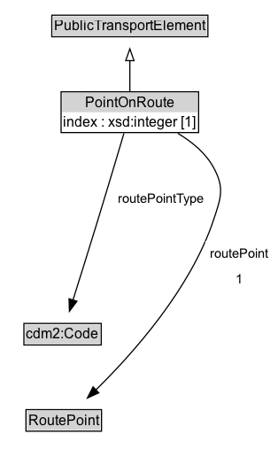

# PointOnRoute

A PointOnRoute represents an ordered RoutePoint for a PublicTransportRoute.

**IRI**: `https://w3id.org/citydata/part3/v1/PointOnRoute`

## Diagram

=== "SVG (interactive)"

    <!-- Generated by graphviz version 14.1.3 (20260303.0454)
     -->
    <!-- Pages: 1 -->
    <svg width="235pt" height="394pt"
     viewBox="0.00 0.00 235.00 394.00" xmlns="http://www.w3.org/2000/svg" xmlns:xlink="http://www.w3.org/1999/xlink">
    <g id="graph0" class="graph" transform="scale(1 1) rotate(0) translate(4 390)">
    <polygon fill="white" stroke="none" points="-4,4 -4,-390 231.42,-390 231.42,4 -4,4"/>
    <g id="clust3" class="cluster">
    <title>cluster_associated</title>
    </g>
    <!-- PublicTransportElement -->
    <g id="node1" class="node">
    <title>PublicTransportElement</title>
    <g id="a_node1"><a xlink:href="../PublicTransportElement" xlink:title="&lt;TABLE&gt;">
    <polygon fill="lightgray" stroke="none" points="40.88,-359.88 40.88,-376.12 171.12,-376.12 171.12,-359.88 40.88,-359.88"/>
    <text xml:space="preserve" text-anchor="start" x="41.88" y="-363.88" font-family="Arial" font-size="12.00">PublicTransportElement</text>
    <polygon fill="none" stroke="black" points="39.88,-358.88 39.88,-377.12 172.12,-377.12 172.12,-358.88 39.88,-358.88"/>
    </a>
    </g>
    </g>
    <!-- PointOnRoute -->
    <g id="node2" class="node">
    <title>PointOnRoute</title>
    <g id="a_node2"><a xlink:href="../PointOnRoute" xlink:title="&lt;TABLE&gt;">
    <polygon fill="lightgray" stroke="none" points="48.75,-295 48.75,-311.25 163.25,-311.25 163.25,-295 48.75,-295"/>
    <text xml:space="preserve" text-anchor="start" x="68.12" y="-299" font-family="Arial" font-size="12.00">PointOnRoute</text>
    <text xml:space="preserve" text-anchor="start" x="49.75" y="-282.75" font-family="Arial" font-size="12.00">index : xsd:integer [1]</text>
    <polygon fill="none" stroke="black" points="47.75,-277.75 47.75,-312.25 164.25,-312.25 164.25,-277.75 47.75,-277.75"/>
    </a>
    </g>
    </g>
    <!-- PointOnRoute&#45;&gt;PublicTransportElement -->
    <g id="edge1" class="edge">
    <title>PointOnRoute&#45;&gt;PublicTransportElement</title>
    <path fill="none" stroke="black" d="M106,-312.71C106,-320.47 106,-329.92 106,-338.74"/>
    <polygon fill="none" stroke="black" points="102.5,-338.66 106,-348.66 109.5,-338.66 102.5,-338.66"/>
    </g>
    <!-- Invis -->
    <!-- PointOnRoute&#45;&gt;Invis -->
    <!-- cdm2_Code -->
    <g id="node4" class="node">
    <title>cdm2_Code</title>
    <g id="a_node4"><a xlink:href="https://w3id.org/citydata/part2/v1/Code" xlink:title="&lt;TABLE&gt;">
    <polygon fill="lightgray" stroke="none" points="17.25,-98.88 17.25,-115.12 80.75,-115.12 80.75,-98.88 17.25,-98.88"/>
    <text xml:space="preserve" text-anchor="start" x="18.25" y="-102.88" font-family="Arial" font-size="12.00">cdm2:Code</text>
    <polygon fill="none" stroke="black" points="16.25,-97.88 16.25,-116.12 81.75,-116.12 81.75,-97.88 16.25,-97.88"/>
    </a>
    </g>
    </g>
    <!-- PointOnRoute&#45;&gt;cdm2_Code -->
    <g id="edge5" class="edge">
    <title>PointOnRoute&#45;&gt;cdm2_Code</title>
    <path fill="none" stroke="black" d="M100.98,-277.06C95.6,-258.96 86.79,-229.42 79,-204 71.97,-181.05 63.84,-155.06 57.82,-135.92"/>
    <polygon fill="black" stroke="black" points="61.17,-134.91 54.82,-126.42 54.49,-137.01 61.17,-134.91"/>
    <polygon fill="white" stroke="none" points="92.23,-211.25 92.23,-232.75 172.98,-232.75 172.98,-211.25 92.23,-211.25"/>
    <text xml:space="preserve" text-anchor="start" x="96.23" y="-218.25" font-family="Arial" font-size="11.00">routePointType</text>
    </g>
    <!-- RoutePoint -->
    <g id="node5" class="node">
    <title>RoutePoint</title>
    <g id="a_node5"><a xlink:href="../RoutePoint" xlink:title="&lt;TABLE&gt;">
    <polygon fill="lightgray" stroke="none" points="19,-25.88 19,-42.12 81,-42.12 81,-25.88 19,-25.88"/>
    <text xml:space="preserve" text-anchor="start" x="20" y="-29.88" font-family="Arial" font-size="12.00">RoutePoint</text>
    <polygon fill="none" stroke="black" points="18,-24.88 18,-43.12 82,-43.12 82,-24.88 18,-24.88"/>
    </a>
    </g>
    </g>
    <!-- PointOnRoute&#45;&gt;RoutePoint -->
    <g id="edge6" class="edge">
    <title>PointOnRoute&#45;&gt;RoutePoint</title>
    <path fill="none" stroke="black" d="M146.64,-277.07C158.6,-269.95 170.27,-260.39 177,-248 186.34,-230.82 183.17,-222.56 177,-204 157.42,-145.11 108.29,-90.28 77.2,-59.84"/>
    <polygon fill="black" stroke="black" points="79.67,-57.37 70.04,-52.97 74.83,-62.42 79.67,-57.37"/>
    <polygon fill="white" stroke="none" points="169.92,-143 169.92,-186 227.42,-186 227.42,-143 169.92,-143"/>
    <text xml:space="preserve" text-anchor="start" x="173.92" y="-171.5" font-family="Arial" font-size="11.00">routePoint</text>
    <text xml:space="preserve" text-anchor="start" x="195.67" y="-150" font-family="Arial" font-size="11.00">1</text>
    </g>
    <!-- Invis&#45;&gt;cdm2_Code -->
    <!-- cdm2_Code&#45;&gt;RoutePoint -->
    </g>
    </svg>

=== "PNG"

    

## Formalization for PointOnRoute

| Property | Constraint |
|----------|------------|
| [index](../properties/index.md) | exactly 1 |
| [index](../properties/index.md) | exactly 1 xsd:integer |
| [routePoint](../properties/routePoint.md) | exactly 1 |
| [routePoint](../properties/routePoint.md) | exactly 1 [RoutePoint](https://w3id.org/citydata/part3/v1/RoutePoint) |
| [routePointType](../properties/routePointType.md) | only [cdm2:Code](https://w3id.org/citydata/part2/v1/Code) |
| [routePointType](../properties/routePointType.md) | only [cdm2:Code](https://w3id.org/citydata/part2/v1/Code) |
| subClassOf | [PublicTransportElement](PublicTransportElement.md) |

