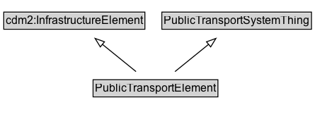

# PublicTransportElement

A PublicTransportElement represents any element of a public transport system. It can be a part of another PublicTransportElement and can be decomposed into smaller PublicTransportElement.

**IRI**: `https://w3id.org/citydata/part3/v1/PublicTransportElement`

## Diagram

=== "SVG (interactive)"

    <!-- Generated by graphviz version 14.1.3 (20260303.0454)
     -->
    <!-- Pages: 1 -->
    <svg width="334pt" height="132pt"
     viewBox="0.00 0.00 334.00 132.00" xmlns="http://www.w3.org/2000/svg" xmlns:xlink="http://www.w3.org/1999/xlink">
    <g id="graph0" class="graph" transform="scale(1 1) rotate(0) translate(4 128)">
    <polygon fill="white" stroke="none" points="-4,4 -4,-128 330,-128 330,4 -4,4"/>
    <g id="clust3" class="cluster">
    <title>cluster_associated</title>
    </g>
    <!-- cdm2_InfrastructureElement -->
    <g id="node1" class="node">
    <title>cdm2_InfrastructureElement</title>
    <g id="a_node1"><a xlink:href="https://w3id.org/citydata/part2/v1/InfrastructureElement" xlink:title="&lt;TABLE&gt;">
    <polygon fill="lightgray" stroke="none" points="1,-97.88 1,-114.12 148.5,-114.12 148.5,-97.88 1,-97.88"/>
    <text xml:space="preserve" text-anchor="start" x="2" y="-101.88" font-family="Arial" font-size="12.00">cdm2:InfrastructureElement</text>
    <polygon fill="none" stroke="black" points="0,-96.88 0,-115.12 149.5,-115.12 149.5,-96.88 0,-96.88"/>
    </a>
    </g>
    </g>
    <!-- PublicTransportSystemThing -->
    <g id="node2" class="node">
    <title>PublicTransportSystemThing</title>
    <g id="a_node2"><a xlink:href="../PublicTransportSystemThing" xlink:title="&lt;TABLE&gt;">
    <polygon fill="lightgray" stroke="none" points="168.5,-97.88 168.5,-114.12 325,-114.12 325,-97.88 168.5,-97.88"/>
    <text xml:space="preserve" text-anchor="start" x="169.5" y="-101.88" font-family="Arial" font-size="12.00">PublicTransportSystemThing</text>
    <polygon fill="none" stroke="black" points="167.5,-96.88 167.5,-115.12 326,-115.12 326,-96.88 167.5,-96.88"/>
    </a>
    </g>
    </g>
    <!-- PublicTransportElement -->
    <g id="node3" class="node">
    <title>PublicTransportElement</title>
    <g id="a_node3"><a xlink:href="../PublicTransportElement" xlink:title="&lt;TABLE&gt;">
    <polygon fill="lightgray" stroke="none" points="95.62,-25.88 95.62,-42.12 225.88,-42.12 225.88,-25.88 95.62,-25.88"/>
    <text xml:space="preserve" text-anchor="start" x="96.62" y="-29.88" font-family="Arial" font-size="12.00">PublicTransportElement</text>
    <polygon fill="none" stroke="black" points="94.62,-24.88 94.62,-43.12 226.88,-43.12 226.88,-24.88 94.62,-24.88"/>
    </a>
    </g>
    </g>
    <!-- PublicTransportElement&#45;&gt;cdm2_InfrastructureElement -->
    <g id="edge1" class="edge">
    <title>PublicTransportElement&#45;&gt;cdm2_InfrastructureElement</title>
    <path fill="none" stroke="black" d="M140.12,-51.79C129.38,-60.53 116.05,-71.38 104.24,-81"/>
    <polygon fill="none" stroke="black" points="102.29,-78.07 96.74,-87.1 106.71,-83.5 102.29,-78.07"/>
    </g>
    <!-- PublicTransportElement&#45;&gt;PublicTransportSystemThing -->
    <g id="edge2" class="edge">
    <title>PublicTransportElement&#45;&gt;PublicTransportSystemThing</title>
    <path fill="none" stroke="black" d="M181.38,-51.79C192.12,-60.53 205.45,-71.38 217.26,-81"/>
    <polygon fill="none" stroke="black" points="214.79,-83.5 224.76,-87.1 219.21,-78.07 214.79,-83.5"/>
    </g>
    <!-- Invis -->
    </g>
    </svg>

=== "PNG"

    

## Specializations of PublicTransportElement

| Class | Description |
|-------|-------------|
| [Group Of Lines](GroupOfLines.md) | A GroupOfLines is a logical grouping of PublicTransportLines for any useful purpose. |
| [Point On Route](PointOnRoute.md) | A PointOnRoute represents an ordered RoutePoint for a PublicTransportRoute. |
| [Public Transport Line](PublicTransportLine.md) | A PublicTransportLine is one or more routes used by public transport vehicles to transport passengers to and from designated locations. |
| [Public Transport Route](PublicTransportRoute.md) | A PublicTransportRoute represents one specific path used by a public transport vehicle to transport passengers to and from designated locations. |
| [Public Transport System](PublicTransportSystem.md) | A PublicTransportSystem provides transport services to members of the public. |
| [Route Point](RoutePoint.md) | A RoutePoint represents a point of interest along a PublicTransportRoute. |

## Formalization for PublicTransportElement

| Property | Constraint |
|----------|------------|
| subClassOf | [cdm2:InfrastructureElement](https://w3id.org/citydata/part2/v1/InfrastructureElement) |
| subClassOf | [PublicTransportSystemThing](PublicTransportSystemThing.md) |

