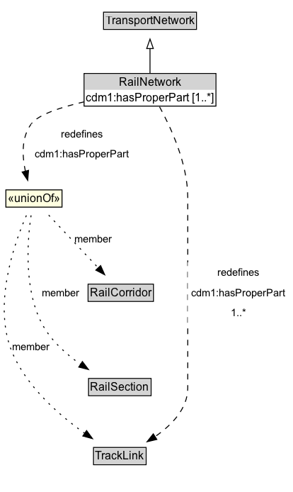

# RailNetwork

A RailNetwork is a type of TransportNetwork using rails on a stabilized base.

**IRI**: `https://w3id.org/citydata/part3/v1/RailNetwork`

## Diagram

=== "SVG (interactive)"

    <!-- Generated by graphviz version 14.1.3 (20260303.0454)
     -->
    <!-- Pages: 1 -->
    <svg width="311pt" height="521pt"
     viewBox="0.00 0.00 311.00 521.00" xmlns="http://www.w3.org/2000/svg" xmlns:xlink="http://www.w3.org/1999/xlink">
    <g id="graph0" class="graph" transform="scale(1 1) rotate(0) translate(4 516.5)">
    <polygon fill="white" stroke="none" points="-4,4 -4,-516.5 306.72,-516.5 306.72,4 -4,4"/>
    <g id="clust3" class="cluster">
    <title>cluster_associated</title>
    </g>
    <!-- TransportNetwork -->
    <g id="node1" class="node">
    <title>TransportNetwork</title>
    <g id="a_node1"><a xlink:href="../TransportNetwork" xlink:title="&lt;TABLE&gt;">
    <polygon fill="lightgray" stroke="none" points="106.72,-486.38 106.72,-502.62 203.22,-502.62 203.22,-486.38 106.72,-486.38"/>
    <text xml:space="preserve" text-anchor="start" x="107.72" y="-490.38" font-family="Arial" font-size="12.00">TransportNetwork</text>
    <polygon fill="none" stroke="black" points="105.72,-485.38 105.72,-503.62 204.22,-503.62 204.22,-485.38 105.72,-485.38"/>
    </a>
    </g>
    </g>
    <!-- RailNetwork -->
    <g id="node2" class="node">
    <title>RailNetwork</title>
    <g id="a_node2"><a xlink:href="../RailNetwork" xlink:title="&lt;TABLE&gt;">
    <polygon fill="lightgray" stroke="none" points="86.09,-421.5 86.09,-437.75 223.84,-437.75 223.84,-421.5 86.09,-421.5"/>
    <text xml:space="preserve" text-anchor="start" x="121.97" y="-425.5" font-family="Arial" font-size="12.00">RailNetwork</text>
    <text xml:space="preserve" text-anchor="start" x="87.09" y="-409.25" font-family="Arial" font-size="12.00">cdm1:hasProperPart [1..&#42;]</text>
    <polygon fill="none" stroke="black" points="85.09,-404.25 85.09,-438.75 224.84,-438.75 224.84,-404.25 85.09,-404.25"/>
    </a>
    </g>
    </g>
    <!-- RailNetwork&#45;&gt;TransportNetwork -->
    <g id="edge1" class="edge">
    <title>RailNetwork&#45;&gt;TransportNetwork</title>
    <path fill="none" stroke="black" d="M154.97,-439.21C154.97,-446.97 154.97,-456.42 154.97,-465.24"/>
    <polygon fill="none" stroke="black" points="151.47,-465.16 154.97,-475.16 158.47,-465.16 151.47,-465.16"/>
    </g>
    <!-- Invis -->
    <!-- RailNetwork&#45;&gt;Invis -->
    <!-- TrackLink -->
    <g id="node6" class="node">
    <title>TrackLink</title>
    <g id="a_node6"><a xlink:href="../TrackLink" xlink:title="&lt;TABLE&gt;">
    <polygon fill="lightgray" stroke="none" points="96.09,-25.88 96.09,-42.12 149.84,-42.12 149.84,-25.88 96.09,-25.88"/>
    <text xml:space="preserve" text-anchor="start" x="97.09" y="-29.88" font-family="Arial" font-size="12.00">TrackLink</text>
    <polygon fill="none" stroke="black" points="95.09,-24.88 95.09,-43.12 150.84,-43.12 150.84,-24.88 95.09,-24.88"/>
    </a>
    </g>
    </g>
    <!-- RailNetwork&#45;&gt;TrackLink -->
    <g id="edge10" class="edge">
    <title>RailNetwork&#45;&gt;TrackLink</title>
    <path fill="none" stroke="black" stroke-dasharray="5,2" d="M165.06,-403.55C176.91,-382 194.97,-343.29 194.97,-307.5 194.97,-307.5 194.97,-307.5 194.97,-106 194.97,-84.08 177.84,-66.65 160.29,-54.55"/>
    <polygon fill="black" stroke="black" points="162.19,-51.61 151.88,-49.19 158.43,-57.51 162.19,-51.61"/>
    <polygon fill="white" stroke="none" points="194.97,-174.5 194.97,-239 302.72,-239 302.72,-174.5 194.97,-174.5"/>
    <text xml:space="preserve" text-anchor="start" x="226.72" y="-224.5" font-family="Arial" font-size="11.00">redefines</text>
    <text xml:space="preserve" text-anchor="start" x="198.97" y="-203" font-family="Arial" font-size="11.00">cdm1:hasProperPart</text>
    <text xml:space="preserve" text-anchor="start" x="240.59" y="-181.5" font-family="Arial" font-size="11.00">1..&#42;</text>
    </g>
    <!-- n07c1fe2cc8ba44aab7f111e85edd4de9b5 -->
    <g id="node7" class="node">
    <title>n07c1fe2cc8ba44aab7f111e85edd4de9b5</title>
    <polygon fill="lightyellow" stroke="none" points="2.22,-297.38 2.22,-315.62 61.72,-315.62 61.72,-297.38 2.22,-297.38"/>
    <text xml:space="preserve" text-anchor="start" x="4.22" y="-302.38" font-family="Arial" font-size="12.00">«unionOf»</text>
    <polygon fill="none" stroke="black" points="2.22,-297.38 2.22,-315.62 61.72,-315.62 61.72,-297.38 2.22,-297.38"/>
    </g>
    <!-- RailNetwork&#45;&gt;n07c1fe2cc8ba44aab7f111e85edd4de9b5 -->
    <g id="edge9" class="edge">
    <title>RailNetwork&#45;&gt;n07c1fe2cc8ba44aab7f111e85edd4de9b5</title>
    <path fill="none" stroke="black" stroke-dasharray="5,2" d="M85.24,-408.78C60.38,-403.07 36.66,-395.29 29.22,-385.5 18.53,-371.43 19.44,-351.47 22.91,-335.26"/>
    <polygon fill="black" stroke="black" points="26.26,-336.28 25.38,-325.72 19.49,-334.53 26.26,-336.28"/>
    <polygon fill="white" stroke="none" points="29.22,-342.5 29.22,-385.5 136.97,-385.5 136.97,-342.5 29.22,-342.5"/>
    <text xml:space="preserve" text-anchor="start" x="60.97" y="-371" font-family="Arial" font-size="11.00">redefines</text>
    <text xml:space="preserve" text-anchor="start" x="33.22" y="-349.5" font-family="Arial" font-size="11.00">cdm1:hasProperPart</text>
    </g>
    <!-- RailCorridor -->
    <g id="node4" class="node">
    <title>RailCorridor</title>
    <g id="a_node4"><a xlink:href="../RailCorridor" xlink:title="&lt;TABLE&gt;">
    <polygon fill="lightgray" stroke="none" points="90.34,-198.62 90.34,-214.88 157.59,-214.88 157.59,-198.62 90.34,-198.62"/>
    <text xml:space="preserve" text-anchor="start" x="91.34" y="-202.62" font-family="Arial" font-size="12.00">RailCorridor</text>
    <polygon fill="none" stroke="black" points="89.34,-197.62 89.34,-215.88 158.59,-215.88 158.59,-197.62 89.34,-197.62"/>
    </a>
    </g>
    </g>
    <!-- Invis&#45;&gt;RailCorridor -->
    <!-- RailSection -->
    <g id="node5" class="node">
    <title>RailSection</title>
    <g id="a_node5"><a xlink:href="../RailSection" xlink:title="&lt;TABLE&gt;">
    <polygon fill="lightgray" stroke="none" points="90.84,-98.88 90.84,-115.12 155.09,-115.12 155.09,-98.88 90.84,-98.88"/>
    <text xml:space="preserve" text-anchor="start" x="91.84" y="-102.88" font-family="Arial" font-size="12.00">RailSection</text>
    <polygon fill="none" stroke="black" points="89.84,-97.88 89.84,-116.12 156.09,-116.12 156.09,-97.88 89.84,-97.88"/>
    </a>
    </g>
    </g>
    <!-- RailCorridor&#45;&gt;RailSection -->
    <!-- RailSection&#45;&gt;TrackLink -->
    <!-- n07c1fe2cc8ba44aab7f111e85edd4de9b5&#45;&gt;RailCorridor -->
    <g id="edge6" class="edge">
    <title>n07c1fe2cc8ba44aab7f111e85edd4de9b5&#45;&gt;RailCorridor</title>
    <path fill="none" stroke="black" stroke-dasharray="1,5" d="M47.58,-288.92C62.03,-273.56 83.72,-250.51 100.3,-232.9"/>
    <polygon fill="black" stroke="black" points="102.63,-235.52 106.94,-225.84 97.54,-230.73 102.63,-235.52"/>
    <text xml:space="preserve" text-anchor="middle" x="95.09" y="-260.05" font-family="Arial" font-size="11.00">member</text>
    </g>
    <!-- n07c1fe2cc8ba44aab7f111e85edd4de9b5&#45;&gt;RailSection -->
    <g id="edge7" class="edge">
    <title>n07c1fe2cc8ba44aab7f111e85edd4de9b5&#45;&gt;RailSection</title>
    <path fill="none" stroke="black" stroke-dasharray="1,5" d="M28.92,-288.65C25.06,-262.55 21.02,-211.52 40.22,-174.5 49.51,-156.58 65.99,-141.83 81.82,-130.8"/>
    <polygon fill="black" stroke="black" points="83.31,-134.01 89.73,-125.58 79.46,-128.17 83.31,-134.01"/>
    <text xml:space="preserve" text-anchor="middle" x="60.09" y="-203.05" font-family="Arial" font-size="11.00">member</text>
    </g>
    <!-- n07c1fe2cc8ba44aab7f111e85edd4de9b5&#45;&gt;TrackLink -->
    <g id="edge8" class="edge">
    <title>n07c1fe2cc8ba44aab7f111e85edd4de9b5&#45;&gt;TrackLink</title>
    <path fill="none" stroke="black" stroke-dasharray="1,5" d="M23.95,-288.58C10.74,-258.16 -12.14,-192.73 9.22,-143 24.79,-106.74 59.18,-76.92 86.1,-57.88"/>
    <polygon fill="black" stroke="black" points="87.75,-60.99 94.02,-52.45 83.79,-55.22 87.75,-60.99"/>
    <text xml:space="preserve" text-anchor="middle" x="29.09" y="-146.05" font-family="Arial" font-size="11.00">member</text>
    </g>
    </g>
    </svg>

=== "PNG"

    

## Formalization for RailNetwork

| Property | Constraint |
|----------|------------|
| [cdm1:hasProperPart](https://w3id.org/citydata/part1/v1/hasProperPart) | only [RailCorridor](RailCorridor.md) or [RailSection](RailSection.md) or [TrackLink](TrackLink.md) |
| [cdm1:hasProperPart](https://w3id.org/citydata/part1/v1/hasProperPart) | min 1 |
| [cdm1:hasProperPart](https://w3id.org/citydata/part1/v1/hasProperPart) | min 1 |
| subClassOf | [TransportNetwork](TransportNetwork.md) |

## Used by classes

| Class | Property |
|-------|----------|
| [Rail Corridor (cdm1)](RailCorridor.md) | [cdm1:properPartOf](https://w3id.org/citydata/part1/v1/properPartOf) |
| [Rail Section (cdm1)](RailSection.md) | [cdm1:properPartOf](https://w3id.org/citydata/part1/v1/properPartOf) |

## Other annotations

| Property | Value |
|----------|-------|
| [xsd:pattern](https://w3id.org/citydata/imported/xsd/pattern) | RailNetworkPattern |

