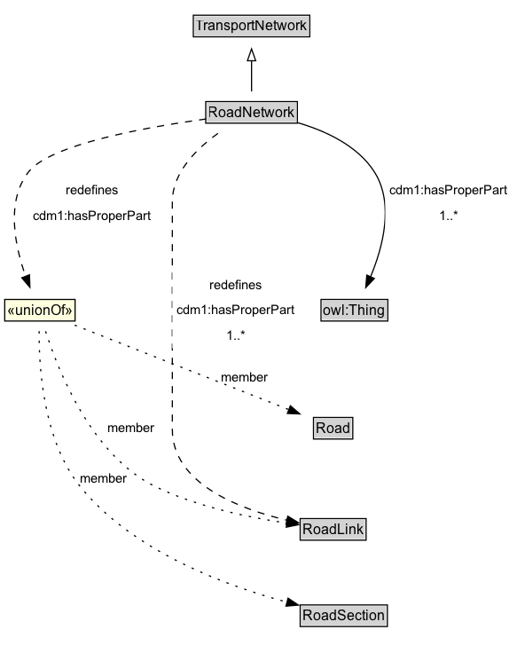

# RoadNetwork

Roads are most commonly associated with motor vehicles, but can be designed for other types of vehicles (e.g., micromobility vehicles).

## Diagram

=== "SVG (interactive)"

    <!-- Generated by graphviz version 14.1.3 (20260303.0454)
     -->
    <!-- Pages: 1 -->
    <svg width="438pt" height="559pt"
     viewBox="0.00 0.00 438.00 559.00" xmlns="http://www.w3.org/2000/svg" xmlns:xlink="http://www.w3.org/1999/xlink">
    <g id="graph0" class="graph" transform="scale(1 1) rotate(0) translate(4 554.5)">
    <polygon fill="white" stroke="none" points="-4,4 -4,-554.5 433.58,-554.5 433.58,4 -4,4"/>
    <g id="clust3" class="cluster">
    <title>cluster_associated</title>
    </g>
    <!-- TransportNetwork -->
    <g id="node1" class="node">
    <title>TransportNetwork</title>
    <g id="a_node1"><a xlink:href="../TransportNetwork" xlink:title="&lt;TABLE&gt;">
    <polygon fill="lightgray" stroke="none" points="160.5,-524.38 160.5,-540.62 257,-540.62 257,-524.38 160.5,-524.38"/>
    <text xml:space="preserve" text-anchor="start" x="161.5" y="-528.38" font-family="Arial" font-size="12.00">TransportNetwork</text>
    <polygon fill="none" stroke="black" points="159.5,-523.38 159.5,-541.62 258,-541.62 258,-523.38 159.5,-523.38"/>
    </a>
    </g>
    </g>
    <!-- RoadNetwork -->
    <g id="node2" class="node">
    <title>RoadNetwork</title>
    <g id="a_node2"><a xlink:href="../RoadNetwork" xlink:title="&lt;TABLE&gt;">
    <polygon fill="lightgray" stroke="none" points="171,-451.38 171,-467.62 246.5,-467.62 246.5,-451.38 171,-451.38"/>
    <text xml:space="preserve" text-anchor="start" x="172" y="-455.38" font-family="Arial" font-size="12.00">RoadNetwork</text>
    <polygon fill="none" stroke="black" points="170,-450.38 170,-468.62 247.5,-468.62 247.5,-450.38 170,-450.38"/>
    </a>
    </g>
    </g>
    <!-- RoadNetwork&#45;&gt;TransportNetwork -->
    <g id="edge1" class="edge">
    <title>RoadNetwork&#45;&gt;TransportNetwork</title>
    <path fill="none" stroke="black" d="M208.75,-477.21C208.75,-484.97 208.75,-494.42 208.75,-503.24"/>
    <polygon fill="none" stroke="black" points="205.25,-503.16 208.75,-513.16 212.25,-503.16 205.25,-503.16"/>
    </g>
    <!-- Invis -->
    <!-- RoadNetwork&#45;&gt;Invis -->
    <!-- owl_Thing -->
    <g id="node4" class="node">
    <title>owl_Thing</title>
    <g id="a_node4"><a xlink:href="https://w3id.org/citydata/imported/owl/latest/Thing" xlink:title="&lt;TABLE&gt;">
    <polygon fill="lightgray" stroke="none" points="268.5,-284.12 268.5,-300.38 323,-300.38 323,-284.12 268.5,-284.12"/>
    <text xml:space="preserve" text-anchor="start" x="269.5" y="-288.12" font-family="Arial" font-size="12.00">owl:Thing</text>
    <polygon fill="none" stroke="black" points="267.5,-283.12 267.5,-301.38 324,-301.38 324,-283.12 267.5,-283.12"/>
    </a>
    </g>
    </g>
    <!-- RoadNetwork&#45;&gt;owl_Thing -->
    <g id="edge12" class="edge">
    <title>RoadNetwork&#45;&gt;owl_Thing</title>
    <path fill="none" stroke="black" d="M247.35,-450.92C270.62,-444.16 298.44,-431.66 312.75,-409 329.66,-382.22 319.66,-345.12 309.27,-320.21"/>
    <polygon fill="black" stroke="black" points="312.6,-319.1 305.33,-311.4 306.21,-321.96 312.6,-319.1"/>
    <polygon fill="white" stroke="none" points="321.83,-361.5 321.83,-404.5 429.58,-404.5 429.58,-361.5 321.83,-361.5"/>
    <text xml:space="preserve" text-anchor="start" x="325.83" y="-390" font-family="Arial" font-size="11.00">cdm1:hasProperPart</text>
    <text xml:space="preserve" text-anchor="start" x="367.45" y="-368.5" font-family="Arial" font-size="11.00">1..&#42;</text>
    </g>
    <!-- RoadLink -->
    <g id="node6" class="node">
    <title>RoadLink</title>
    <g id="a_node6"><a xlink:href="../RoadLink" xlink:title="&lt;TABLE&gt;">
    <polygon fill="lightgray" stroke="none" points="250.88,-98.88 250.88,-115.12 304.62,-115.12 304.62,-98.88 250.88,-98.88"/>
    <text xml:space="preserve" text-anchor="start" x="251.88" y="-102.88" font-family="Arial" font-size="12.00">RoadLink</text>
    <polygon fill="none" stroke="black" points="249.88,-97.88 249.88,-116.12 305.62,-116.12 305.62,-97.88 249.88,-97.88"/>
    </a>
    </g>
    </g>
    <!-- RoadNetwork&#45;&gt;RoadLink -->
    <g id="edge11" class="edge">
    <title>RoadNetwork&#45;&gt;RoadLink</title>
    <path fill="none" stroke="black" stroke-dasharray="5,2" d="M180.34,-441.75C162.08,-428.64 141.75,-408.53 141.75,-384 141.75,-384 141.75,-384 141.75,-191.5 141.75,-145.63 198.62,-124.17 238.81,-114.73"/>
    <polygon fill="black" stroke="black" points="239.39,-118.18 248.42,-112.64 237.91,-111.34 239.39,-118.18"/>
    <polygon fill="white" stroke="none" points="141.75,-260 141.75,-324.5 249.5,-324.5 249.5,-260 141.75,-260"/>
    <text xml:space="preserve" text-anchor="start" x="173.5" y="-310" font-family="Arial" font-size="11.00">redefines</text>
    <text xml:space="preserve" text-anchor="start" x="145.75" y="-288.5" font-family="Arial" font-size="11.00">cdm1:hasProperPart</text>
    <text xml:space="preserve" text-anchor="start" x="187.38" y="-267" font-family="Arial" font-size="11.00">1..&#42;</text>
    </g>
    <!-- neeae970be7f1404abb59572b2a28fc09b25 -->
    <g id="node8" class="node">
    <title>neeae970be7f1404abb59572b2a28fc09b25</title>
    <polygon fill="lightyellow" stroke="none" points="0,-283.12 0,-301.38 59.5,-301.38 59.5,-283.12 0,-283.12"/>
    <text xml:space="preserve" text-anchor="start" x="2" y="-288.12" font-family="Arial" font-size="12.00">«unionOf»</text>
    <polygon fill="none" stroke="black" points="0,-283.12 0,-301.38 59.5,-301.38 59.5,-283.12 0,-283.12"/>
    </g>
    <!-- RoadNetwork&#45;&gt;neeae970be7f1404abb59572b2a28fc09b25 -->
    <g id="edge10" class="edge">
    <title>RoadNetwork&#45;&gt;neeae970be7f1404abb59572b2a28fc09b25</title>
    <path fill="none" stroke="black" stroke-dasharray="5,2" d="M170.31,-453.93C120.6,-447.15 38.21,-432.6 20,-409 0.68,-383.96 8.69,-346.17 17.79,-320.65"/>
    <polygon fill="black" stroke="black" points="20.94,-322.2 21.27,-311.61 14.41,-319.68 20.94,-322.2"/>
    <polygon fill="white" stroke="none" points="20,-361.5 20,-404.5 127.75,-404.5 127.75,-361.5 20,-361.5"/>
    <text xml:space="preserve" text-anchor="start" x="51.75" y="-390" font-family="Arial" font-size="11.00">redefines</text>
    <text xml:space="preserve" text-anchor="start" x="24" y="-368.5" font-family="Arial" font-size="11.00">cdm1:hasProperPart</text>
    </g>
    <!-- Invis&#45;&gt;owl_Thing -->
    <!-- Road -->
    <g id="node5" class="node">
    <title>Road</title>
    <g id="a_node5"><a xlink:href="../Road" xlink:title="&lt;TABLE&gt;">
    <polygon fill="lightgray" stroke="none" points="262.12,-184.38 262.12,-200.62 293.38,-200.62 293.38,-184.38 262.12,-184.38"/>
    <text xml:space="preserve" text-anchor="start" x="263.12" y="-188.38" font-family="Arial" font-size="12.00">Road</text>
    <polygon fill="none" stroke="black" points="261.12,-183.38 261.12,-201.62 294.38,-201.62 294.38,-183.38 261.12,-183.38"/>
    </a>
    </g>
    </g>
    <!-- owl_Thing&#45;&gt;Road -->
    <!-- Road&#45;&gt;RoadLink -->
    <!-- RoadSection -->
    <g id="node7" class="node">
    <title>RoadSection</title>
    <g id="a_node7"><a xlink:href="../RoadSection" xlink:title="&lt;TABLE&gt;">
    <polygon fill="lightgray" stroke="none" points="250.88,-25.88 250.88,-42.12 322.62,-42.12 322.62,-25.88 250.88,-25.88"/>
    <text xml:space="preserve" text-anchor="start" x="251.88" y="-29.88" font-family="Arial" font-size="12.00">RoadSection</text>
    <polygon fill="none" stroke="black" points="249.88,-24.88 249.88,-43.12 323.62,-43.12 323.62,-24.88 249.88,-24.88"/>
    </a>
    </g>
    </g>
    <!-- RoadLink&#45;&gt;RoadSection -->
    <!-- neeae970be7f1404abb59572b2a28fc09b25&#45;&gt;Road -->
    <g id="edge7" class="edge">
    <title>neeae970be7f1404abb59572b2a28fc09b25&#45;&gt;Road</title>
    <path fill="none" stroke="black" stroke-dasharray="1,5" d="M59.17,-279.65C104.38,-261.83 190.88,-227.74 240.43,-208.21"/>
    <polygon fill="black" stroke="black" points="241.58,-211.52 249.6,-204.6 239.01,-205.01 241.58,-211.52"/>
    <text xml:space="preserve" text-anchor="middle" x="203.13" y="-231.55" font-family="Arial" font-size="11.00">member</text>
    </g>
    <!-- neeae970be7f1404abb59572b2a28fc09b25&#45;&gt;RoadLink -->
    <g id="edge8" class="edge">
    <title>neeae970be7f1404abb59572b2a28fc09b25&#45;&gt;RoadLink</title>
    <path fill="none" stroke="black" stroke-dasharray="1,5" d="M34.56,-274.46C45.07,-241.48 73.57,-169.15 127.75,-143 163.2,-125.89 207.47,-116.89 238.7,-112.32"/>
    <polygon fill="black" stroke="black" points="239.06,-115.81 248.49,-110.99 238.11,-108.87 239.06,-115.81"/>
    <text xml:space="preserve" text-anchor="middle" x="106.57" y="-188.8" font-family="Arial" font-size="11.00">member</text>
    </g>
    <!-- neeae970be7f1404abb59572b2a28fc09b25&#45;&gt;RoadSection -->
    <g id="edge9" class="edge">
    <title>neeae970be7f1404abb59572b2a28fc09b25&#45;&gt;RoadSection</title>
    <path fill="none" stroke="black" stroke-dasharray="1,5" d="M29.1,-274.54C28.83,-244.76 32.38,-181.98 64,-143 108.55,-88.07 187.86,-59.14 238.84,-45.47"/>
    <polygon fill="black" stroke="black" points="239.62,-48.89 248.43,-43.01 237.87,-42.11 239.62,-48.89"/>
    <text xml:space="preserve" text-anchor="middle" x="83.88" y="-146.05" font-family="Arial" font-size="11.00">member</text>
    </g>
    </g>
    </svg>

=== "PNG"

    

## Specializations of RoadNetwork

| Class | Description |
|-------|-------------|
| [Micromobility Network](MicromobilityNetwork.md) | A MicromobilityNetwork is a type of RoadNetwork designed for the use of micromobility vehicles, which have more limited performance characteristics than motor vehicles. |

## Formalization for RoadNetwork

| Property | Constraint |
|----------|------------|
| [cdm1:hasProperPart](https://w3id.org/citydata/part1/v1/hasProperPart) | min 1 |
| [cdm1:hasProperPart](https://w3id.org/citydata/part1/v1/hasProperPart) | min 1 |
| subClassOf | [TransportNetwork](TransportNetwork.md) |

