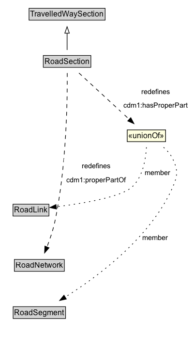

# RoadSection

A RoadSection is a type of TravelledWaySection that groups RoadLinks and RoadSegments for a useful operational purpose (e.g., assigning a speed limit, designating a traffic control scheme).

## Diagram

=== "SVG (interactive)"

    <!-- Generated by graphviz version 14.1.3 (20260303.0454)
     -->
    <!-- Pages: 1 -->
    <svg width="299pt" height="522pt"
     viewBox="0.00 0.00 299.00 522.00" xmlns="http://www.w3.org/2000/svg" xmlns:xlink="http://www.w3.org/1999/xlink">
    <g id="graph0" class="graph" transform="scale(1 1) rotate(0) translate(4 517.5)">
    <polygon fill="white" stroke="none" points="-4,4 -4,-517.5 294.96,-517.5 294.96,4 -4,4"/>
    <g id="clust3" class="cluster">
    <title>cluster_associated</title>
    </g>
    <!-- TravelledWaySection -->
    <g id="node1" class="node">
    <title>TravelledWaySection</title>
    <g id="a_node1"><a xlink:href="../TravelledWaySection" xlink:title="&lt;TABLE&gt;">
    <polygon fill="lightgray" stroke="none" points="42,-487.38 42,-503.62 158,-503.62 158,-487.38 42,-487.38"/>
    <text xml:space="preserve" text-anchor="start" x="43" y="-491.38" font-family="Arial" font-size="12.00">TravelledWaySection</text>
    <polygon fill="none" stroke="black" points="41,-486.38 41,-504.62 159,-504.62 159,-486.38 41,-486.38"/>
    </a>
    </g>
    </g>
    <!-- RoadSection -->
    <g id="node2" class="node">
    <title>RoadSection</title>
    <g id="a_node2"><a xlink:href="../RoadSection" xlink:title="&lt;TABLE&gt;">
    <polygon fill="lightgray" stroke="none" points="64.12,-414.38 64.12,-430.62 135.88,-430.62 135.88,-414.38 64.12,-414.38"/>
    <text xml:space="preserve" text-anchor="start" x="65.12" y="-418.38" font-family="Arial" font-size="12.00">RoadSection</text>
    <polygon fill="none" stroke="black" points="63.12,-413.38 63.12,-431.62 136.88,-431.62 136.88,-413.38 63.12,-413.38"/>
    </a>
    </g>
    </g>
    <!-- RoadSection&#45;&gt;TravelledWaySection -->
    <g id="edge1" class="edge">
    <title>RoadSection&#45;&gt;TravelledWaySection</title>
    <path fill="none" stroke="black" d="M100,-440.21C100,-447.97 100,-457.42 100,-466.24"/>
    <polygon fill="none" stroke="black" points="96.5,-466.16 100,-476.16 103.5,-466.16 96.5,-466.16"/>
    </g>
    <!-- Invis -->
    <!-- RoadSection&#45;&gt;Invis -->
    <!-- RoadNetwork -->
    <g id="node5" class="node">
    <title>RoadNetwork</title>
    <g id="a_node5"><a xlink:href="../RoadNetwork" xlink:title="&lt;TABLE&gt;">
    <polygon fill="lightgray" stroke="none" points="19.25,-98.88 19.25,-115.12 94.75,-115.12 94.75,-98.88 19.25,-98.88"/>
    <text xml:space="preserve" text-anchor="start" x="20.25" y="-102.88" font-family="Arial" font-size="12.00">RoadNetwork</text>
    <polygon fill="none" stroke="black" points="18.25,-97.88 18.25,-116.12 95.75,-116.12 95.75,-97.88 18.25,-97.88"/>
    </a>
    </g>
    </g>
    <!-- RoadSection&#45;&gt;RoadNetwork -->
    <g id="edge9" class="edge">
    <title>RoadSection&#45;&gt;RoadNetwork</title>
    <path fill="none" stroke="black" stroke-dasharray="5,2" d="M100.26,-404.5C100.53,-364.12 99.24,-259.44 81,-174.5 78.17,-161.31 73.35,-147.2 68.76,-135.37"/>
    <polygon fill="black" stroke="black" points="72.07,-134.22 65.08,-126.25 65.58,-136.84 72.07,-134.22"/>
    <polygon fill="white" stroke="none" points="94.84,-228.5 94.84,-271.5 195.09,-271.5 195.09,-228.5 94.84,-228.5"/>
    <text xml:space="preserve" text-anchor="start" x="122.84" y="-257" font-family="Arial" font-size="11.00">redefines</text>
    <text xml:space="preserve" text-anchor="start" x="98.84" y="-235.5" font-family="Arial" font-size="11.00">cdm1:properPartOf</text>
    </g>
    <!-- neeae970be7f1404abb59572b2a28fc09b31 -->
    <g id="node7" class="node">
    <title>neeae970be7f1404abb59572b2a28fc09b31</title>
    <polygon fill="lightyellow" stroke="none" points="193.25,-298.38 193.25,-316.62 252.75,-316.62 252.75,-298.38 193.25,-298.38"/>
    <text xml:space="preserve" text-anchor="start" x="195.25" y="-303.38" font-family="Arial" font-size="12.00">«unionOf»</text>
    <polygon fill="none" stroke="black" points="193.25,-298.38 193.25,-316.62 252.75,-316.62 252.75,-298.38 193.25,-298.38"/>
    </g>
    <!-- RoadSection&#45;&gt;neeae970be7f1404abb59572b2a28fc09b31 -->
    <g id="edge8" class="edge">
    <title>RoadSection&#45;&gt;neeae970be7f1404abb59572b2a28fc09b31</title>
    <path fill="none" stroke="black" stroke-dasharray="5,2" d="M118.41,-404.58C139.09,-385.58 172.84,-354.59 196.38,-332.95"/>
    <polygon fill="black" stroke="black" points="198.75,-335.53 203.75,-326.19 194.01,-330.38 198.75,-335.53"/>
    <polygon fill="white" stroke="none" points="183.21,-343.5 183.21,-386.5 290.96,-386.5 290.96,-343.5 183.21,-343.5"/>
    <text xml:space="preserve" text-anchor="start" x="214.96" y="-372" font-family="Arial" font-size="11.00">redefines</text>
    <text xml:space="preserve" text-anchor="start" x="187.21" y="-350.5" font-family="Arial" font-size="11.00">cdm1:hasProperPart</text>
    </g>
    <!-- RoadLink -->
    <g id="node4" class="node">
    <title>RoadLink</title>
    <g id="a_node4"><a xlink:href="../RoadLink" xlink:title="&lt;TABLE&gt;">
    <polygon fill="lightgray" stroke="none" points="17.12,-184.38 17.12,-200.62 70.88,-200.62 70.88,-184.38 17.12,-184.38"/>
    <text xml:space="preserve" text-anchor="start" x="18.12" y="-188.38" font-family="Arial" font-size="12.00">RoadLink</text>
    <polygon fill="none" stroke="black" points="16.12,-183.38 16.12,-201.62 71.88,-201.62 71.88,-183.38 16.12,-183.38"/>
    </a>
    </g>
    </g>
    <!-- Invis&#45;&gt;RoadLink -->
    <!-- RoadLink&#45;&gt;RoadNetwork -->
    <!-- RoadSegment -->
    <g id="node6" class="node">
    <title>RoadSegment</title>
    <g id="a_node6"><a xlink:href="../RoadSegment" xlink:title="&lt;TABLE&gt;">
    <polygon fill="lightgray" stroke="none" points="17.38,-25.88 17.38,-42.12 96.62,-42.12 96.62,-25.88 17.38,-25.88"/>
    <text xml:space="preserve" text-anchor="start" x="18.38" y="-29.88" font-family="Arial" font-size="12.00">RoadSegment</text>
    <polygon fill="none" stroke="black" points="16.38,-24.88 16.38,-43.12 97.62,-43.12 97.62,-24.88 16.38,-24.88"/>
    </a>
    </g>
    </g>
    <!-- RoadNetwork&#45;&gt;RoadSegment -->
    <!-- neeae970be7f1404abb59572b2a28fc09b31&#45;&gt;RoadLink -->
    <g id="edge6" class="edge">
    <title>neeae970be7f1404abb59572b2a28fc09b31&#45;&gt;RoadLink</title>
    <path fill="none" stroke="black" stroke-dasharray="1,5" d="M223.01,-289.66C222.08,-271.91 217.76,-244.36 201,-228.5 184.25,-212.66 123.81,-202.69 83,-197.61"/>
    <polygon fill="black" stroke="black" points="83.65,-194.17 73.31,-196.46 82.82,-201.12 83.65,-194.17"/>
    <text xml:space="preserve" text-anchor="middle" x="240.74" y="-246.3" font-family="Arial" font-size="11.00">member</text>
    </g>
    <!-- neeae970be7f1404abb59572b2a28fc09b31&#45;&gt;RoadSegment -->
    <g id="edge7" class="edge">
    <title>neeae970be7f1404abb59572b2a28fc09b31&#45;&gt;RoadSegment</title>
    <path fill="none" stroke="black" stroke-dasharray="1,5" d="M249.62,-289.63C255.42,-284.56 260.79,-278.47 264,-271.5 272,-254.15 271.61,-246.03 264,-228.5 229.93,-150.02 146.63,-88.87 96.7,-57.72"/>
    <polygon fill="black" stroke="black" points="98.83,-54.92 88.47,-52.69 95.17,-60.89 98.83,-54.92"/>
    <text xml:space="preserve" text-anchor="middle" x="236.33" y="-146.05" font-family="Arial" font-size="11.00">member</text>
    </g>
    </g>
    </svg>

=== "PNG"

    

## Specializations of RoadSection

| Class | Description |
|-------|-------------|
| [Micromobility Path Section](MicromobilityPathSection.md) | A MicromobilityPathSections is a type of RoadSection that groups MicromobilityLinks and MicromobilityPathSegments for a useful operational purpose (e.g., assigning a speed limit, designating areas of shared use). |

## Formalization for RoadSection

| Property | Constraint |
|----------|------------|
| [cdm1:properPartOf](https://w3id.org/citydata/part1/v1/properPartOf) | only [RoadNetwork](https://w3id.org/citydata/part3/v1/RoadNetwork) |
| subClassOf | [TravelledWaySection](TravelledWaySection.md) |

