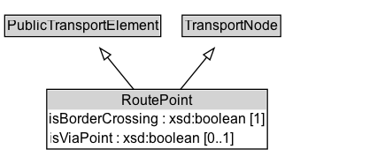

# RoutePoint

A RoutePoint represents a point of interest along a PublicTransportRoute.

**IRI**: `https://w3id.org/citydata/part3/v1/RoutePoint`

## Diagram

=== "SVG (interactive)"

    <!-- Generated by graphviz version 14.1.3 (20260303.0454)
     -->
    <!-- Pages: 1 -->
    <svg width="319pt" height="139pt"
     viewBox="0.00 0.00 319.00 139.00" xmlns="http://www.w3.org/2000/svg" xmlns:xlink="http://www.w3.org/1999/xlink">
    <g id="graph0" class="graph" transform="scale(1 1) rotate(0) translate(4 135.38)">
    <polygon fill="white" stroke="none" points="-4,4 -4,-135.38 315.12,-135.38 315.12,4 -4,4"/>
    <g id="clust3" class="cluster">
    <title>cluster_associated</title>
    </g>
    <!-- PublicTransportElement -->
    <g id="node1" class="node">
    <title>PublicTransportElement</title>
    <g id="a_node1"><a xlink:href="../PublicTransportElement" xlink:title="&lt;TABLE&gt;">
    <polygon fill="lightgray" stroke="none" points="1,-105.25 1,-121.5 131.25,-121.5 131.25,-105.25 1,-105.25"/>
    <text xml:space="preserve" text-anchor="start" x="2" y="-109.25" font-family="Arial" font-size="12.00">PublicTransportElement</text>
    <polygon fill="none" stroke="black" points="0,-104.25 0,-122.5 132.25,-122.5 132.25,-104.25 0,-104.25"/>
    </a>
    </g>
    </g>
    <!-- TransportNode -->
    <g id="node2" class="node">
    <title>TransportNode</title>
    <g id="a_node2"><a xlink:href="../TransportNode" xlink:title="&lt;TABLE&gt;">
    <polygon fill="lightgray" stroke="none" points="151.38,-105.25 151.38,-121.5 232.88,-121.5 232.88,-105.25 151.38,-105.25"/>
    <text xml:space="preserve" text-anchor="start" x="152.38" y="-109.25" font-family="Arial" font-size="12.00">TransportNode</text>
    <polygon fill="none" stroke="black" points="150.38,-104.25 150.38,-122.5 233.88,-122.5 233.88,-104.25 150.38,-104.25"/>
    </a>
    </g>
    </g>
    <!-- RoutePoint -->
    <g id="node3" class="node">
    <title>RoutePoint</title>
    <g id="a_node3"><a xlink:href="../RoutePoint" xlink:title="&lt;TABLE&gt;">
    <polygon fill="lightgray" stroke="none" points="36.62,-42.12 36.62,-58.38 221.62,-58.38 221.62,-42.12 36.62,-42.12"/>
    <text xml:space="preserve" text-anchor="start" x="99.12" y="-46.12" font-family="Arial" font-size="12.00">RoutePoint</text>
    <text xml:space="preserve" text-anchor="start" x="37.62" y="-29.88" font-family="Arial" font-size="12.00">isBorderCrossing : xsd:boolean [1]</text>
    <text xml:space="preserve" text-anchor="start" x="37.62" y="-13.62" font-family="Arial" font-size="12.00">isViaPoint : xsd:boolean [0..1]</text>
    <polygon fill="none" stroke="black" points="35.62,-8.62 35.62,-59.38 222.62,-59.38 222.62,-8.62 35.62,-8.62"/>
    </a>
    </g>
    </g>
    <!-- RoutePoint&#45;&gt;PublicTransportElement -->
    <g id="edge1" class="edge">
    <title>RoutePoint&#45;&gt;PublicTransportElement</title>
    <path fill="none" stroke="black" d="M109.5,-59.1C102.35,-67.89 94.23,-77.85 86.97,-86.77"/>
    <polygon fill="none" stroke="black" points="84.35,-84.45 80.75,-94.41 89.78,-88.87 84.35,-84.45"/>
    </g>
    <!-- RoutePoint&#45;&gt;TransportNode -->
    <g id="edge2" class="edge">
    <title>RoutePoint&#45;&gt;TransportNode</title>
    <path fill="none" stroke="black" d="M148.75,-59.1C155.9,-67.89 164.02,-77.85 171.28,-86.77"/>
    <polygon fill="none" stroke="black" points="168.47,-88.87 177.5,-94.41 173.9,-84.45 168.47,-88.87"/>
    </g>
    <!-- Invis -->
    </g>
    </svg>

=== "PNG"

    

## Formalization for RoutePoint

| Property | Constraint |
|----------|------------|
| [isBorderCrossing](../properties/isBorderCrossing.md) | exactly 1 |
| [isBorderCrossing](../properties/isBorderCrossing.md) | exactly 1 xsd:boolean |
| [isViaPoint](../properties/isViaPoint.md) | max 1 |
| [isViaPoint](../properties/isViaPoint.md) | max 1 xsd:boolean |
| subClassOf | [PublicTransportElement](PublicTransportElement.md) |
| subClassOf | [TransportNode](TransportNode.md) |

