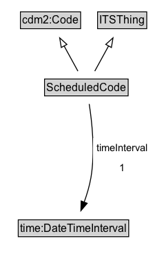

# ScheduledCode

The operational status of an entity, e.g., open or closed.

**IRI**: `https://w3id.org/citydata/part3/v1/ScheduledCode`

## Diagram

=== "SVG (interactive)"

    <!-- Generated by graphviz version 14.1.3 (20260303.0454)
     -->
    <!-- Pages: 1 -->
    <svg width="169pt" height="286pt"
     viewBox="0.00 0.00 169.00 286.00" xmlns="http://www.w3.org/2000/svg" xmlns:xlink="http://www.w3.org/1999/xlink">
    <g id="graph0" class="graph" transform="scale(1 1) rotate(0) translate(4 282)">
    <polygon fill="white" stroke="none" points="-4,4 -4,-282 164.8,-282 164.8,4 -4,4"/>
    <g id="clust3" class="cluster">
    <title>cluster_associated</title>
    </g>
    <!-- cdm2_Code -->
    <g id="node1" class="node">
    <title>cdm2_Code</title>
    <g id="a_node1"><a xlink:href="https://w3id.org/citydata/part2/v1/Code" xlink:title="&lt;TABLE&gt;">
    <polygon fill="lightgray" stroke="none" points="19.25,-251.88 19.25,-268.12 82.75,-268.12 82.75,-251.88 19.25,-251.88"/>
    <text xml:space="preserve" text-anchor="start" x="20.25" y="-255.88" font-family="Arial" font-size="12.00">cdm2:Code</text>
    <polygon fill="none" stroke="black" points="18.25,-250.88 18.25,-269.12 83.75,-269.12 83.75,-250.88 18.25,-250.88"/>
    </a>
    </g>
    </g>
    <!-- ITSThing -->
    <g id="node2" class="node">
    <title>ITSThing</title>
    <g id="a_node2"><a xlink:href="../ITSThing" xlink:title="&lt;TABLE&gt;">
    <polygon fill="lightgray" stroke="none" points="103.25,-251.88 103.25,-268.12 154.75,-268.12 154.75,-251.88 103.25,-251.88"/>
    <text xml:space="preserve" text-anchor="start" x="104.25" y="-255.88" font-family="Arial" font-size="12.00">ITSThing</text>
    <polygon fill="none" stroke="black" points="102.25,-250.88 102.25,-269.12 155.75,-269.12 155.75,-250.88 102.25,-250.88"/>
    </a>
    </g>
    </g>
    <!-- ScheduledCode -->
    <g id="node3" class="node">
    <title>ScheduledCode</title>
    <g id="a_node3"><a xlink:href="../ScheduledCode" xlink:title="&lt;TABLE&gt;">
    <polygon fill="lightgray" stroke="none" points="45.5,-178.88 45.5,-195.12 134.5,-195.12 134.5,-178.88 45.5,-178.88"/>
    <text xml:space="preserve" text-anchor="start" x="46.5" y="-182.88" font-family="Arial" font-size="12.00">ScheduledCode</text>
    <polygon fill="none" stroke="black" points="44.5,-177.88 44.5,-196.12 135.5,-196.12 135.5,-177.88 44.5,-177.88"/>
    </a>
    </g>
    </g>
    <!-- ScheduledCode&#45;&gt;cdm2_Code -->
    <g id="edge1" class="edge">
    <title>ScheduledCode&#45;&gt;cdm2_Code</title>
    <path fill="none" stroke="black" d="M80.82,-204.71C76.32,-212.91 70.78,-223 65.7,-232.24"/>
    <polygon fill="none" stroke="black" points="62.72,-230.4 60.97,-240.85 68.85,-233.77 62.72,-230.4"/>
    </g>
    <!-- ScheduledCode&#45;&gt;ITSThing -->
    <g id="edge2" class="edge">
    <title>ScheduledCode&#45;&gt;ITSThing</title>
    <path fill="none" stroke="black" d="M99.18,-204.71C103.68,-212.91 109.22,-223 114.3,-232.24"/>
    <polygon fill="none" stroke="black" points="111.15,-233.77 119.03,-240.85 117.28,-230.4 111.15,-233.77"/>
    </g>
    <!-- Invis -->
    <!-- ScheduledCode&#45;&gt;Invis -->
    <!-- time_DateTimeInterval -->
    <g id="node5" class="node">
    <title>time_DateTimeInterval</title>
    <g id="a_node5"><a xlink:href="https://w3id.org/citydata/imported/time/latest/DateTimeInterval" xlink:title="&lt;TABLE&gt;">
    <polygon fill="lightgray" stroke="none" points="16.88,-25.88 16.88,-42.12 135.12,-42.12 135.12,-25.88 16.88,-25.88"/>
    <text xml:space="preserve" text-anchor="start" x="17.88" y="-29.88" font-family="Arial" font-size="12.00">time:DateTimeInterval</text>
    <polygon fill="none" stroke="black" points="15.88,-24.88 15.88,-43.12 136.12,-43.12 136.12,-24.88 15.88,-24.88"/>
    </a>
    </g>
    </g>
    <!-- ScheduledCode&#45;&gt;time_DateTimeInterval -->
    <g id="edge5" class="edge">
    <title>ScheduledCode&#45;&gt;time_DateTimeInterval</title>
    <path fill="none" stroke="black" d="M93.11,-169.05C96.17,-149.58 99.74,-116.76 95,-89 93.48,-80.11 90.65,-70.74 87.63,-62.34"/>
    <polygon fill="black" stroke="black" points="90.91,-61.11 84.05,-53.04 84.38,-63.63 90.91,-61.11"/>
    <polygon fill="white" stroke="none" points="97.3,-89 97.3,-132 160.8,-132 160.8,-89 97.3,-89"/>
    <text xml:space="preserve" text-anchor="start" x="101.3" y="-117.5" font-family="Arial" font-size="11.00">timeInterval</text>
    <text xml:space="preserve" text-anchor="start" x="126.05" y="-96" font-family="Arial" font-size="11.00">1</text>
    </g>
    <!-- Invis&#45;&gt;time_DateTimeInterval -->
    </g>
    </svg>

=== "PNG"

    

## Formalization for ScheduledCode

| Property | Constraint |
|----------|------------|
| [timeInterval](../properties/timeInterval.md) | only [time:DateTimeInterval](https://w3id.org/citydata/imported/time/DateTimeInterval) |
| [timeInterval](../properties/timeInterval.md) | exactly 1 |
| [timeInterval](../properties/timeInterval.md) | exactly 1 [time:DateTimeInterval](http://www.w3.org/2006/time#DateTimeInterval) |
| subClassOf | [cdm2:Code](https://w3id.org/citydata/part2/v1/Code) |
| subClassOf | [ITSThing](ITSThing.md) |

## Used by classes

| Class | Property |
|-------|----------|
| [Network Element](NetworkElement.md) | [status](../properties/status.md) |

## Other annotations

| Property | Value |
|----------|-------|
| [xsd:pattern](https://w3id.org/citydata/imported/xsd/pattern) | TransportNetworkPattern |

