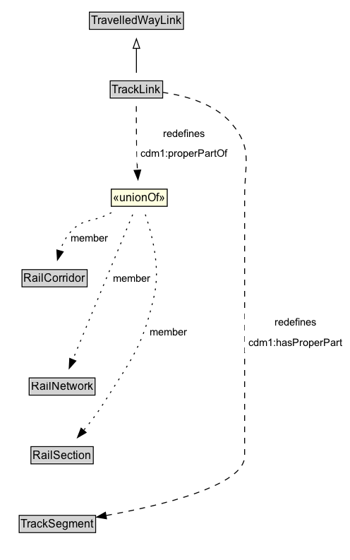

# TrackLink

Due to the nature of rail, each TrackLink consists of a single lane, but multiple TrackLinks can exist along the same RailCorridor.

## Diagram

=== "SVG (interactive)"

    <!-- Generated by graphviz version 14.1.3 (20260303.0454)
     -->
    <!-- Pages: 1 -->
    <svg width="372pt" height="595pt"
     viewBox="0.00 0.00 372.00 595.00" xmlns="http://www.w3.org/2000/svg" xmlns:xlink="http://www.w3.org/1999/xlink">
    <g id="graph0" class="graph" transform="scale(1 1) rotate(0) translate(4 590.5)">
    <polygon fill="white" stroke="none" points="-4,4 -4,-590.5 367.75,-590.5 367.75,4 -4,4"/>
    <g id="clust3" class="cluster">
    <title>cluster_associated</title>
    </g>
    <!-- TravelledWayLink -->
    <g id="node1" class="node">
    <title>TravelledWayLink</title>
    <g id="a_node1"><a xlink:href="../TravelledWayLink" xlink:title="&lt;TABLE&gt;">
    <polygon fill="lightgray" stroke="none" points="92,-560.38 92,-576.62 190,-576.62 190,-560.38 92,-560.38"/>
    <text xml:space="preserve" text-anchor="start" x="93" y="-564.38" font-family="Arial" font-size="12.00">TravelledWayLink</text>
    <polygon fill="none" stroke="black" points="91,-559.38 91,-577.62 191,-577.62 191,-559.38 91,-559.38"/>
    </a>
    </g>
    </g>
    <!-- TrackLink -->
    <g id="node2" class="node">
    <title>TrackLink</title>
    <g id="a_node2"><a xlink:href="../TrackLink" xlink:title="&lt;TABLE&gt;">
    <polygon fill="lightgray" stroke="none" points="114.12,-487.38 114.12,-503.62 167.88,-503.62 167.88,-487.38 114.12,-487.38"/>
    <text xml:space="preserve" text-anchor="start" x="115.12" y="-491.38" font-family="Arial" font-size="12.00">TrackLink</text>
    <polygon fill="none" stroke="black" points="113.12,-486.38 113.12,-504.62 168.88,-504.62 168.88,-486.38 113.12,-486.38"/>
    </a>
    </g>
    </g>
    <!-- TrackLink&#45;&gt;TravelledWayLink -->
    <g id="edge1" class="edge">
    <title>TrackLink&#45;&gt;TravelledWayLink</title>
    <path fill="none" stroke="black" d="M141,-513.21C141,-520.97 141,-530.42 141,-539.24"/>
    <polygon fill="none" stroke="black" points="137.5,-539.16 141,-549.16 144.5,-539.16 137.5,-539.16"/>
    </g>
    <!-- Invis -->
    <!-- TrackLink&#45;&gt;Invis -->
    <!-- TrackSegment -->
    <g id="node7" class="node">
    <title>TrackSegment</title>
    <g id="a_node7"><a xlink:href="../TrackSegment" xlink:title="&lt;TABLE&gt;">
    <polygon fill="lightgray" stroke="none" points="17.38,-25.88 17.38,-42.12 96.62,-42.12 96.62,-25.88 17.38,-25.88"/>
    <text xml:space="preserve" text-anchor="start" x="18.38" y="-29.88" font-family="Arial" font-size="12.00">TrackSegment</text>
    <polygon fill="none" stroke="black" points="16.38,-24.88 16.38,-43.12 97.62,-43.12 97.62,-24.88 16.38,-24.88"/>
    </a>
    </g>
    </g>
    <!-- TrackLink&#45;&gt;TrackSegment -->
    <g id="edge7" class="edge">
    <title>TrackLink&#45;&gt;TrackSegment</title>
    <path fill="none" stroke="black" stroke-dasharray="5,2" d="M168.84,-492.41C191.92,-489.15 223.79,-480.8 242,-459.5 264.89,-432.73 256,-416.72 256,-381.5 256,-381.5 256,-381.5 256,-106 256,-74.64 167.23,-53.5 108.27,-42.92"/>
    <polygon fill="black" stroke="black" points="109.21,-39.53 98.76,-41.26 108.01,-46.42 109.21,-39.53"/>
    <polygon fill="white" stroke="none" points="256,-216 256,-259 363.75,-259 363.75,-216 256,-216"/>
    <text xml:space="preserve" text-anchor="start" x="287.75" y="-244.5" font-family="Arial" font-size="11.00">redefines</text>
    <text xml:space="preserve" text-anchor="start" x="260" y="-223" font-family="Arial" font-size="11.00">cdm1:hasProperPart</text>
    </g>
    <!-- n6cdb34b94ee24737adcb98601c0c2c6bb17 -->
    <g id="node8" class="node">
    <title>n6cdb34b94ee24737adcb98601c0c2c6bb17</title>
    <polygon fill="lightyellow" stroke="none" points="114.25,-371.38 114.25,-389.62 173.75,-389.62 173.75,-371.38 114.25,-371.38"/>
    <text xml:space="preserve" text-anchor="start" x="116.25" y="-376.38" font-family="Arial" font-size="12.00">«unionOf»</text>
    <polygon fill="none" stroke="black" points="114.25,-371.38 114.25,-389.62 173.75,-389.62 173.75,-371.38 114.25,-371.38"/>
    </g>
    <!-- TrackLink&#45;&gt;n6cdb34b94ee24737adcb98601c0c2c6bb17 -->
    <g id="edge11" class="edge">
    <title>TrackLink&#45;&gt;n6cdb34b94ee24737adcb98601c0c2c6bb17</title>
    <path fill="none" stroke="black" stroke-dasharray="5,2" d="M140.9,-477.76C140.86,-461.96 140.97,-437.61 141.75,-416.5 141.83,-414.26 141.94,-411.95 142.06,-409.62"/>
    <polygon fill="black" stroke="black" points="145.55,-409.93 142.65,-399.74 138.56,-409.51 145.55,-409.93"/>
    <polygon fill="white" stroke="none" points="141.75,-416.5 141.75,-459.5 242,-459.5 242,-416.5 141.75,-416.5"/>
    <text xml:space="preserve" text-anchor="start" x="169.75" y="-445" font-family="Arial" font-size="11.00">redefines</text>
    <text xml:space="preserve" text-anchor="start" x="145.75" y="-423.5" font-family="Arial" font-size="11.00">cdm1:properPartOf</text>
    </g>
    <!-- RailCorridor -->
    <g id="node4" class="node">
    <title>RailCorridor</title>
    <g id="a_node4"><a xlink:href="../RailCorridor" xlink:title="&lt;TABLE&gt;">
    <polygon fill="lightgray" stroke="none" points="20.38,-286.88 20.38,-303.12 87.62,-303.12 87.62,-286.88 20.38,-286.88"/>
    <text xml:space="preserve" text-anchor="start" x="21.38" y="-290.88" font-family="Arial" font-size="12.00">RailCorridor</text>
    <polygon fill="none" stroke="black" points="19.38,-285.88 19.38,-304.12 88.62,-304.12 88.62,-285.88 19.38,-285.88"/>
    </a>
    </g>
    </g>
    <!-- Invis&#45;&gt;RailCorridor -->
    <!-- RailNetwork -->
    <g id="node5" class="node">
    <title>RailNetwork</title>
    <g id="a_node5"><a xlink:href="../RailNetwork" xlink:title="&lt;TABLE&gt;">
    <polygon fill="lightgray" stroke="none" points="28,-171.88 28,-188.12 96,-188.12 96,-171.88 28,-171.88"/>
    <text xml:space="preserve" text-anchor="start" x="29" y="-175.88" font-family="Arial" font-size="12.00">RailNetwork</text>
    <polygon fill="none" stroke="black" points="27,-170.88 27,-189.12 97,-189.12 97,-170.88 27,-170.88"/>
    </a>
    </g>
    </g>
    <!-- RailCorridor&#45;&gt;RailNetwork -->
    <!-- RailSection -->
    <g id="node6" class="node">
    <title>RailSection</title>
    <g id="a_node6"><a xlink:href="../RailSection" xlink:title="&lt;TABLE&gt;">
    <polygon fill="lightgray" stroke="none" points="29.88,-98.88 29.88,-115.12 94.12,-115.12 94.12,-98.88 29.88,-98.88"/>
    <text xml:space="preserve" text-anchor="start" x="30.88" y="-102.88" font-family="Arial" font-size="12.00">RailSection</text>
    <polygon fill="none" stroke="black" points="28.88,-97.88 28.88,-116.12 95.12,-116.12 95.12,-97.88 28.88,-97.88"/>
    </a>
    </g>
    </g>
    <!-- RailNetwork&#45;&gt;RailSection -->
    <!-- RailSection&#45;&gt;TrackSegment -->
    <!-- n6cdb34b94ee24737adcb98601c0c2c6bb17&#45;&gt;RailCorridor -->
    <g id="edge8" class="edge">
    <title>n6cdb34b94ee24737adcb98601c0c2c6bb17&#45;&gt;RailCorridor</title>
    <path fill="none" stroke="black" stroke-dasharray="1,5" d="M114.36,-364.62C112.88,-363.9 111.43,-363.19 110,-362.5 92.89,-354.25 84.04,-358.54 71.25,-344.5 65.97,-338.71 62.29,-331.2 59.72,-323.82"/>
    <polygon fill="black" stroke="black" points="63.15,-323.09 57.04,-314.43 56.42,-325.01 63.15,-323.09"/>
    <text xml:space="preserve" text-anchor="middle" x="91.12" y="-334.05" font-family="Arial" font-size="11.00">member</text>
    </g>
    <!-- n6cdb34b94ee24737adcb98601c0c2c6bb17&#45;&gt;RailNetwork -->
    <g id="edge9" class="edge">
    <title>n6cdb34b94ee24737adcb98601c0c2c6bb17&#45;&gt;RailNetwork</title>
    <path fill="none" stroke="black" stroke-dasharray="1,5" d="M137.01,-362.58C122.82,-328.22 90.52,-250.05 73.3,-208.36"/>
    <polygon fill="black" stroke="black" points="76.6,-207.19 69.55,-199.28 70.13,-209.86 76.6,-207.19"/>
    <text xml:space="preserve" text-anchor="middle" x="136.32" y="-291.3" font-family="Arial" font-size="11.00">member</text>
    </g>
    <!-- n6cdb34b94ee24737adcb98601c0c2c6bb17&#45;&gt;RailSection -->
    <g id="edge10" class="edge">
    <title>n6cdb34b94ee24737adcb98601c0c2c6bb17&#45;&gt;RailSection</title>
    <path fill="none" stroke="black" stroke-dasharray="1,5" d="M150.46,-362.69C157.42,-342.28 166.67,-306.88 160,-277 147.7,-221.89 136.06,-209.8 106,-162 99.79,-152.12 92.01,-142.02 84.73,-133.27"/>
    <polygon fill="black" stroke="black" points="87.54,-131.17 78.39,-125.85 82.22,-135.72 87.54,-131.17"/>
    <text xml:space="preserve" text-anchor="middle" x="175.33" y="-233.8" font-family="Arial" font-size="11.00">member</text>
    </g>
    </g>
    </svg>

=== "PNG"

    

## Formalization for TrackLink

| Property | Constraint |
|----------|------------|
| [cdm1:hasProperPart](https://w3id.org/citydata/part1/v1/hasProperPart) | only [TrackSegment](https://w3id.org/citydata/part3/v1/TrackSegment) |
| subClassOf | [TravelledWayLink](TravelledWayLink.md) |

## Other annotations

| Property | Value |
|----------|-------|
| [xsd:pattern](https://w3id.org/citydata/imported/xsd/pattern) | RailNetworkPattern |

