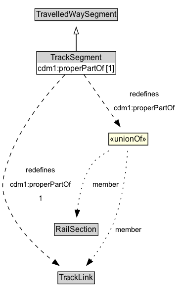

# TrackSegment

A TrackSegment is a type of TravelledWaySegment that represents a portion of a TrackLink with common physical characteristics.

**IRI**: `https://w3id.org/citydata/part3/v1/TrackSegment`

## Diagram

=== "SVG (interactive)"

    <!-- Generated by graphviz version 14.1.3 (20260303.0454)
     -->
    <!-- Pages: 1 -->
    <svg width="273pt" height="458pt"
     viewBox="0.00 0.00 273.00 458.00" xmlns="http://www.w3.org/2000/svg" xmlns:xlink="http://www.w3.org/1999/xlink">
    <g id="graph0" class="graph" transform="scale(1 1) rotate(0) translate(4 453.5)">
    <polygon fill="white" stroke="none" points="-4,4 -4,-453.5 269.32,-453.5 269.32,4 -4,4"/>
    <g id="clust3" class="cluster">
    <title>cluster_associated</title>
    </g>
    <!-- TravelledWaySegment -->
    <g id="node1" class="node">
    <title>TravelledWaySegment</title>
    <g id="a_node1"><a xlink:href="../TravelledWaySegment" xlink:title="&lt;TABLE&gt;">
    <polygon fill="lightgray" stroke="none" points="49.88,-423.38 49.88,-439.62 173.38,-439.62 173.38,-423.38 49.88,-423.38"/>
    <text xml:space="preserve" text-anchor="start" x="50.88" y="-427.38" font-family="Arial" font-size="12.00">TravelledWaySegment</text>
    <polygon fill="none" stroke="black" points="48.88,-422.38 48.88,-440.62 174.38,-440.62 174.38,-422.38 48.88,-422.38"/>
    </a>
    </g>
    </g>
    <!-- TrackSegment -->
    <g id="node2" class="node">
    <title>TrackSegment</title>
    <g id="a_node2"><a xlink:href="../TrackSegment" xlink:title="&lt;TABLE&gt;">
    <polygon fill="lightgray" stroke="none" points="52.5,-358.5 52.5,-374.75 170.75,-374.75 170.75,-358.5 52.5,-358.5"/>
    <text xml:space="preserve" text-anchor="start" x="73" y="-362.5" font-family="Arial" font-size="12.00">TrackSegment</text>
    <text xml:space="preserve" text-anchor="start" x="53.5" y="-346.25" font-family="Arial" font-size="12.00">cdm1:properPartOf [1]</text>
    <polygon fill="none" stroke="black" points="51.5,-341.25 51.5,-375.75 171.75,-375.75 171.75,-341.25 51.5,-341.25"/>
    </a>
    </g>
    </g>
    <!-- TrackSegment&#45;&gt;TravelledWaySegment -->
    <g id="edge1" class="edge">
    <title>TrackSegment&#45;&gt;TravelledWaySegment</title>
    <path fill="none" stroke="black" d="M111.63,-376.21C111.63,-383.97 111.63,-393.42 111.63,-402.24"/>
    <polygon fill="none" stroke="black" points="108.13,-402.16 111.63,-412.16 115.13,-402.16 108.13,-402.16"/>
    </g>
    <!-- Invis -->
    <!-- TrackSegment&#45;&gt;Invis -->
    <!-- TrackLink -->
    <g id="node5" class="node">
    <title>TrackLink</title>
    <g id="a_node5"><a xlink:href="../TrackLink" xlink:title="&lt;TABLE&gt;">
    <polygon fill="lightgray" stroke="none" points="84.75,-25.88 84.75,-42.12 138.5,-42.12 138.5,-25.88 84.75,-25.88"/>
    <text xml:space="preserve" text-anchor="start" x="85.75" y="-29.88" font-family="Arial" font-size="12.00">TrackLink</text>
    <polygon fill="none" stroke="black" points="83.75,-24.88 83.75,-43.12 139.5,-43.12 139.5,-24.88 83.75,-24.88"/>
    </a>
    </g>
    </g>
    <!-- TrackSegment&#45;&gt;TrackLink -->
    <g id="edge8" class="edge">
    <title>TrackSegment&#45;&gt;TrackLink</title>
    <path fill="none" stroke="black" stroke-dasharray="5,2" d="M94.44,-340.52C69.55,-314.58 24.54,-262.27 7.38,-207.5 -1.2,-180.15 -3.36,-169.58 7.38,-143 21.48,-108.08 52.89,-78.16 77.57,-58.73"/>
    <polygon fill="black" stroke="black" points="79.61,-61.57 85.44,-52.73 75.37,-56.01 79.61,-61.57"/>
    <polygon fill="white" stroke="none" points="7.38,-143 7.38,-207.5 107.63,-207.5 107.63,-143 7.38,-143"/>
    <text xml:space="preserve" text-anchor="start" x="35.38" y="-193" font-family="Arial" font-size="11.00">redefines</text>
    <text xml:space="preserve" text-anchor="start" x="11.38" y="-171.5" font-family="Arial" font-size="11.00">cdm1:properPartOf</text>
    <text xml:space="preserve" text-anchor="start" x="54.5" y="-150" font-family="Arial" font-size="11.00">1</text>
    </g>
    <!-- n07c1fe2cc8ba44aab7f111e85edd4de9b22 -->
    <g id="node6" class="node">
    <title>n07c1fe2cc8ba44aab7f111e85edd4de9b22</title>
    <polygon fill="lightyellow" stroke="none" points="160.88,-234.38 160.88,-252.62 220.38,-252.62 220.38,-234.38 160.88,-234.38"/>
    <text xml:space="preserve" text-anchor="start" x="162.88" y="-239.38" font-family="Arial" font-size="12.00">«unionOf»</text>
    <polygon fill="none" stroke="black" points="160.88,-234.38 160.88,-252.62 220.38,-252.62 220.38,-234.38 160.88,-234.38"/>
    </g>
    <!-- TrackSegment&#45;&gt;n07c1fe2cc8ba44aab7f111e85edd4de9b22 -->
    <g id="edge7" class="edge">
    <title>TrackSegment&#45;&gt;n07c1fe2cc8ba44aab7f111e85edd4de9b22</title>
    <path fill="none" stroke="black" stroke-dasharray="5,2" d="M123.28,-340.83C136.24,-322.3 157.31,-292.15 172.44,-270.51"/>
    <polygon fill="black" stroke="black" points="175.19,-272.68 178.05,-262.48 169.46,-268.67 175.19,-272.68"/>
    <polygon fill="white" stroke="none" points="165.07,-279.5 165.07,-322.5 265.32,-322.5 265.32,-279.5 165.07,-279.5"/>
    <text xml:space="preserve" text-anchor="start" x="193.07" y="-308" font-family="Arial" font-size="11.00">redefines</text>
    <text xml:space="preserve" text-anchor="start" x="169.07" y="-286.5" font-family="Arial" font-size="11.00">cdm1:properPartOf</text>
    </g>
    <!-- RailSection -->
    <g id="node4" class="node">
    <title>RailSection</title>
    <g id="a_node4"><a xlink:href="../RailSection" xlink:title="&lt;TABLE&gt;">
    <polygon fill="lightgray" stroke="none" points="79.5,-98.88 79.5,-115.12 143.75,-115.12 143.75,-98.88 79.5,-98.88"/>
    <text xml:space="preserve" text-anchor="start" x="80.5" y="-102.88" font-family="Arial" font-size="12.00">RailSection</text>
    <polygon fill="none" stroke="black" points="78.5,-97.88 78.5,-116.12 144.75,-116.12 144.75,-97.88 78.5,-97.88"/>
    </a>
    </g>
    </g>
    <!-- Invis&#45;&gt;RailSection -->
    <!-- RailSection&#45;&gt;TrackLink -->
    <!-- n07c1fe2cc8ba44aab7f111e85edd4de9b22&#45;&gt;RailSection -->
    <g id="edge5" class="edge">
    <title>n07c1fe2cc8ba44aab7f111e85edd4de9b22&#45;&gt;RailSection</title>
    <path fill="none" stroke="black" stroke-dasharray="1,5" d="M161.01,-225.84C150.49,-219.38 140.37,-212.39 136.88,-207.5 121.81,-186.44 115.71,-157.24 113.25,-135.91"/>
    <polygon fill="black" stroke="black" points="116.76,-135.83 112.35,-126.2 109.79,-136.48 116.76,-135.83"/>
    <text xml:space="preserve" text-anchor="middle" x="156.75" y="-171.55" font-family="Arial" font-size="11.00">member</text>
    </g>
    <!-- n07c1fe2cc8ba44aab7f111e85edd4de9b22&#45;&gt;TrackLink -->
    <g id="edge6" class="edge">
    <title>n07c1fe2cc8ba44aab7f111e85edd4de9b22&#45;&gt;TrackLink</title>
    <path fill="none" stroke="black" stroke-dasharray="1,5" d="M189.61,-225.68C188.1,-205.67 184.52,-171.4 176.63,-143 169.64,-117.87 166.85,-111.48 153.63,-89 147.88,-79.23 140.57,-69.23 133.68,-60.54"/>
    <polygon fill="black" stroke="black" points="136.44,-58.39 127.4,-52.87 131.02,-62.83 136.44,-58.39"/>
    <text xml:space="preserve" text-anchor="middle" x="190.95" y="-103.3" font-family="Arial" font-size="11.00">member</text>
    </g>
    </g>
    </svg>

=== "PNG"

    

## Formalization for TrackSegment

| Property | Constraint |
|----------|------------|
| [cdm1:properPartOf](https://w3id.org/citydata/part1/v1/properPartOf) | only [RailSection](RailSection.md) or [TrackLink](TrackLink.md) |
| [cdm1:properPartOf](https://w3id.org/citydata/part1/v1/properPartOf) | exactly 1 |
| [cdm1:properPartOf](https://w3id.org/citydata/part1/v1/properPartOf) | exactly 1 |
| subClassOf | [TravelledWaySegment](TravelledWaySegment.md) |

## Used by classes

| Class | Property |
|-------|----------|
| [Track Link (cdm1)](TrackLink.md) | [cdm1:hasProperPart](https://w3id.org/citydata/part1/v1/hasProperPart) |

## Other annotations

| Property | Value |
|----------|-------|
| [xsd:pattern](https://w3id.org/citydata/imported/xsd/pattern) | RailNetworkPattern |

