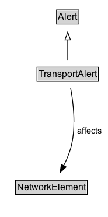

# TransportAlert

A TransportAlert is a type of alert that can be used to notify people of important transport information.

**IRI**: `https://w3id.org/citydata/part3/v1/TransportAlert`

## Diagram

=== "SVG (interactive)"

    <!-- Generated by graphviz version 14.1.3 (20260303.0454)
     -->
    <!-- Pages: 1 -->
    <svg width="138pt" height="279pt"
     viewBox="0.00 0.00 138.00 279.00" xmlns="http://www.w3.org/2000/svg" xmlns:xlink="http://www.w3.org/1999/xlink">
    <g id="graph0" class="graph" transform="scale(1 1) rotate(0) translate(4 275)">
    <polygon fill="white" stroke="none" points="-4,4 -4,-275 134.48,-275 134.48,4 -4,4"/>
    <g id="clust3" class="cluster">
    <title>cluster_associated</title>
    </g>
    <!-- Alert -->
    <g id="node1" class="node">
    <title>Alert</title>
    <g id="a_node1"><a xlink:href="../Alert" xlink:title="&lt;TABLE&gt;">
    <polygon fill="lightgray" stroke="none" points="69.62,-244.88 69.62,-261.12 96.38,-261.12 96.38,-244.88 69.62,-244.88"/>
    <text xml:space="preserve" text-anchor="start" x="70.62" y="-248.88" font-family="Arial" font-size="12.00">Alert</text>
    <polygon fill="none" stroke="black" points="68.62,-243.88 68.62,-262.12 97.38,-262.12 97.38,-243.88 68.62,-243.88"/>
    </a>
    </g>
    </g>
    <!-- TransportAlert -->
    <g id="node2" class="node">
    <title>TransportAlert</title>
    <g id="a_node2"><a xlink:href="../TransportAlert" xlink:title="&lt;TABLE&gt;">
    <polygon fill="lightgray" stroke="none" points="44.5,-171.88 44.5,-188.12 121.5,-188.12 121.5,-171.88 44.5,-171.88"/>
    <text xml:space="preserve" text-anchor="start" x="45.5" y="-175.88" font-family="Arial" font-size="12.00">TransportAlert</text>
    <polygon fill="none" stroke="black" points="43.5,-170.88 43.5,-189.12 122.5,-189.12 122.5,-170.88 43.5,-170.88"/>
    </a>
    </g>
    </g>
    <!-- TransportAlert&#45;&gt;Alert -->
    <g id="edge1" class="edge">
    <title>TransportAlert&#45;&gt;Alert</title>
    <path fill="none" stroke="black" d="M83,-197.71C83,-205.47 83,-214.92 83,-223.74"/>
    <polygon fill="none" stroke="black" points="79.5,-223.66 83,-233.66 86.5,-223.66 79.5,-223.66"/>
    </g>
    <!-- Invis -->
    <!-- TransportAlert&#45;&gt;Invis -->
    <!-- NetworkElement -->
    <g id="node4" class="node">
    <title>NetworkElement</title>
    <g id="a_node4"><a xlink:href="../NetworkElement" xlink:title="&lt;TABLE&gt;">
    <polygon fill="lightgray" stroke="none" points="16.75,-25.88 16.75,-42.12 107.25,-42.12 107.25,-25.88 16.75,-25.88"/>
    <text xml:space="preserve" text-anchor="start" x="17.75" y="-29.88" font-family="Arial" font-size="12.00">NetworkElement</text>
    <polygon fill="none" stroke="black" points="15.75,-24.88 15.75,-43.12 108.25,-43.12 108.25,-24.88 15.75,-24.88"/>
    </a>
    </g>
    </g>
    <!-- TransportAlert&#45;&gt;NetworkElement -->
    <g id="edge4" class="edge">
    <title>TransportAlert&#45;&gt;NetworkElement</title>
    <path fill="none" stroke="black" d="M86.69,-162.18C90.05,-143.92 93.71,-114.02 88,-89 85.88,-79.73 81.96,-70.19 77.8,-61.76"/>
    <polygon fill="black" stroke="black" points="80.99,-60.32 73.22,-53.12 74.81,-63.6 80.99,-60.32"/>
    <polygon fill="white" stroke="none" points="90.98,-96.25 90.98,-117.75 130.48,-117.75 130.48,-96.25 90.98,-96.25"/>
    <text xml:space="preserve" text-anchor="start" x="94.98" y="-103.25" font-family="Arial" font-size="11.00">affects</text>
    </g>
    <!-- Invis&#45;&gt;NetworkElement -->
    </g>
    </svg>

=== "PNG"

    

## Formalization for TransportAlert

| Property | Constraint |
|----------|------------|
| [affects](../properties/affects.md) | only [NetworkElement](NetworkElement.md) |
| [affects](../properties/affects.md) | only [NetworkElement](https://w3id.org/citydata/part3/v1/NetworkElement) |
| subClassOf | Alert |

## Other annotations

| Property | Value |
|----------|-------|
| [xsd:pattern](https://w3id.org/citydata/imported/xsd/pattern) | TransportAlertPattern |

