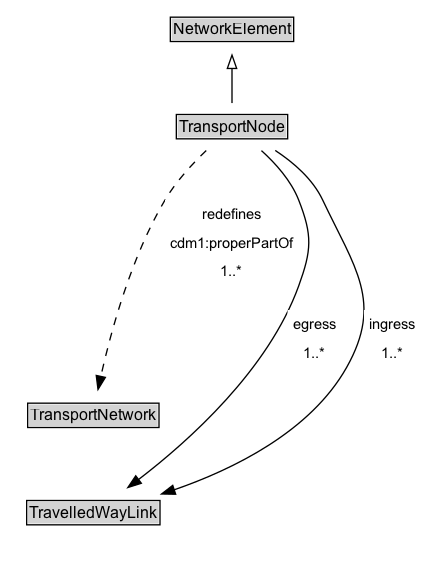

# TransportNode

A TransportNode is a NetworkElement that represents a node on the transport network that can be used to designate an end to a link or to join links.

**IRI**: `https://w3id.org/citydata/part3/v1/TransportNode`

## Diagram

=== "SVG (interactive)"

    <!-- Generated by graphviz version 14.1.3 (20260303.0454)
     -->
    <!-- Pages: 1 -->
    <svg width="319pt" height="423pt"
     viewBox="0.00 0.00 319.00 423.00" xmlns="http://www.w3.org/2000/svg" xmlns:xlink="http://www.w3.org/1999/xlink">
    <g id="graph0" class="graph" transform="scale(1 1) rotate(0) translate(4 418.5)">
    <polygon fill="white" stroke="none" points="-4,4 -4,-418.5 315.47,-418.5 315.47,4 -4,4"/>
    <g id="clust3" class="cluster">
    <title>cluster_associated</title>
    </g>
    <!-- NetworkElement -->
    <g id="node1" class="node">
    <title>NetworkElement</title>
    <g id="a_node1"><a xlink:href="../NetworkElement" xlink:title="&lt;TABLE&gt;">
    <polygon fill="lightgray" stroke="none" points="124.75,-388.38 124.75,-404.62 215.25,-404.62 215.25,-388.38 124.75,-388.38"/>
    <text xml:space="preserve" text-anchor="start" x="125.75" y="-392.38" font-family="Arial" font-size="12.00">NetworkElement</text>
    <polygon fill="none" stroke="black" points="123.75,-387.38 123.75,-405.62 216.25,-405.62 216.25,-387.38 123.75,-387.38"/>
    </a>
    </g>
    </g>
    <!-- TransportNode -->
    <g id="node2" class="node">
    <title>TransportNode</title>
    <g id="a_node2"><a xlink:href="../TransportNode" xlink:title="&lt;TABLE&gt;">
    <polygon fill="lightgray" stroke="none" points="129.25,-315.38 129.25,-331.62 210.75,-331.62 210.75,-315.38 129.25,-315.38"/>
    <text xml:space="preserve" text-anchor="start" x="130.25" y="-319.38" font-family="Arial" font-size="12.00">TransportNode</text>
    <polygon fill="none" stroke="black" points="128.25,-314.38 128.25,-332.62 211.75,-332.62 211.75,-314.38 128.25,-314.38"/>
    </a>
    </g>
    </g>
    <!-- TransportNode&#45;&gt;NetworkElement -->
    <g id="edge1" class="edge">
    <title>TransportNode&#45;&gt;NetworkElement</title>
    <path fill="none" stroke="black" d="M170,-341.21C170,-348.97 170,-358.42 170,-367.24"/>
    <polygon fill="none" stroke="black" points="166.5,-367.16 170,-377.16 173.5,-367.16 166.5,-367.16"/>
    </g>
    <!-- Invis -->
    <!-- TransportNode&#45;&gt;Invis -->
    <!-- TransportNetwork -->
    <g id="node4" class="node">
    <title>TransportNetwork</title>
    <g id="a_node4"><a xlink:href="../TransportNetwork" xlink:title="&lt;TABLE&gt;">
    <polygon fill="lightgray" stroke="none" points="17.75,-98.88 17.75,-115.12 114.25,-115.12 114.25,-98.88 17.75,-98.88"/>
    <text xml:space="preserve" text-anchor="start" x="18.75" y="-102.88" font-family="Arial" font-size="12.00">TransportNetwork</text>
    <polygon fill="none" stroke="black" points="16.75,-97.88 16.75,-116.12 115.25,-116.12 115.25,-97.88 16.75,-97.88"/>
    </a>
    </g>
    </g>
    <!-- TransportNode&#45;&gt;TransportNetwork -->
    <g id="edge7" class="edge">
    <title>TransportNode&#45;&gt;TransportNetwork</title>
    <path fill="none" stroke="black" stroke-dasharray="5,2" d="M150.66,-305.6C140.3,-295.67 127.99,-282.37 119.75,-268.5 94.34,-225.76 79.04,-169.39 71.58,-136.09"/>
    <polygon fill="black" stroke="black" points="75.03,-135.46 69.5,-126.41 68.18,-136.92 75.03,-135.46"/>
    <polygon fill="white" stroke="none" points="119.75,-204 119.75,-268.5 220,-268.5 220,-204 119.75,-204"/>
    <text xml:space="preserve" text-anchor="start" x="147.75" y="-254" font-family="Arial" font-size="11.00">redefines</text>
    <text xml:space="preserve" text-anchor="start" x="123.75" y="-232.5" font-family="Arial" font-size="11.00">cdm1:properPartOf</text>
    <text xml:space="preserve" text-anchor="start" x="161.62" y="-211" font-family="Arial" font-size="11.00">1..&#42;</text>
    </g>
    <!-- TravelledWayLink -->
    <g id="node5" class="node">
    <title>TravelledWayLink</title>
    <g id="a_node5"><a xlink:href="../TravelledWayLink" xlink:title="&lt;TABLE&gt;">
    <polygon fill="lightgray" stroke="none" points="17,-25.88 17,-42.12 115,-42.12 115,-25.88 17,-25.88"/>
    <text xml:space="preserve" text-anchor="start" x="18" y="-29.88" font-family="Arial" font-size="12.00">TravelledWayLink</text>
    <polygon fill="none" stroke="black" points="16,-24.88 16,-43.12 116,-43.12 116,-24.88 16,-24.88"/>
    </a>
    </g>
    </g>
    <!-- TransportNode&#45;&gt;TravelledWayLink -->
    <g id="edge5" class="edge">
    <title>TransportNode&#45;&gt;TravelledWayLink</title>
    <path fill="none" stroke="black" d="M192.08,-305.53C202.69,-295.96 214.31,-283.01 220,-268.5 230.46,-241.81 229.77,-230.95 220,-204 197.24,-141.22 137.88,-87.96 99.86,-58.83"/>
    <polygon fill="black" stroke="black" points="102,-56.06 91.9,-52.86 97.8,-61.66 102,-56.06"/>
    <polygon fill="white" stroke="none" points="211.66,-143 211.66,-186 251.91,-186 251.91,-143 211.66,-143"/>
    <text xml:space="preserve" text-anchor="start" x="215.66" y="-171.5" font-family="Arial" font-size="11.00">egress</text>
    <text xml:space="preserve" text-anchor="start" x="223.53" y="-150" font-family="Arial" font-size="11.00">1..&#42;</text>
    </g>
    <!-- TransportNode&#45;&gt;TravelledWayLink -->
    <g id="edge6" class="edge">
    <title>TransportNode&#45;&gt;TravelledWayLink</title>
    <path fill="none" stroke="black" d="M202.42,-305.67C216.12,-296.66 230.59,-284.17 238,-268.5 262.08,-217.56 283.64,-192.1 256,-143 228.92,-94.89 171.24,-66.58 126.5,-51.1"/>
    <polygon fill="black" stroke="black" points="127.75,-47.83 117.16,-48.01 125.55,-54.48 127.75,-47.83"/>
    <polygon fill="white" stroke="none" points="268.97,-143 268.97,-186 311.47,-186 311.47,-143 268.97,-143"/>
    <text xml:space="preserve" text-anchor="start" x="272.97" y="-171.5" font-family="Arial" font-size="11.00">ingress</text>
    <text xml:space="preserve" text-anchor="start" x="281.97" y="-150" font-family="Arial" font-size="11.00">1..&#42;</text>
    </g>
    <!-- Invis&#45;&gt;TransportNetwork -->
    <!-- TransportNetwork&#45;&gt;TravelledWayLink -->
    </g>
    </svg>

=== "PNG"

    

## Specializations of TransportNode

| Class | Description |
|-------|-------------|
| [Junction](Junction.md) | A Junction is a TransportNode that allows a traveller to connect from one TravelledWayLink to another. |
| [Route Point](RoutePoint.md) | A RoutePoint represents a point of interest along a PublicTransportRoute. |

## Formalization for TransportNode

| Property | Constraint |
|----------|------------|
| [cdm1:properPartOf](https://w3id.org/citydata/part1/v1/properPartOf) | only [TransportNetwork](TransportNetwork.md) |
| [cdm1:properPartOf](https://w3id.org/citydata/part1/v1/properPartOf) | min 1 |
| [cdm1:properPartOf](https://w3id.org/citydata/part1/v1/properPartOf) | min 1 [TransportNetwork](https://w3id.org/citydata/part3/v1/TransportNetwork) |
| [egress](../properties/egress.md) | only [TravelledWayLink](TravelledWayLink.md) |
| [egress](../properties/egress.md) | min 1 |
| [egress](../properties/egress.md) | min 1 [TravelledWayLink](https://w3id.org/citydata/part3/v1/TravelledWayLink) |
| [ingress](../properties/ingress.md) | only [TravelledWayLink](TravelledWayLink.md) |
| [ingress](../properties/ingress.md) | min 1 |
| [ingress](../properties/ingress.md) | min 1 [TravelledWayLink](https://w3id.org/citydata/part3/v1/TravelledWayLink) |
| subClassOf | [NetworkElement](NetworkElement.md) |

## Used by classes

| Class | Property |
|-------|----------|
| [Travelled Way Link](TravelledWayLink.md) | [from](../properties/from.md) |
| [Travelled Way Link](TravelledWayLink.md) | [to](../properties/to.md) |

## Other annotations

| Property | Value |
|----------|-------|
| [xsd:pattern](https://w3id.org/citydata/imported/xsd/pattern) | TransportNetworkPattern |

