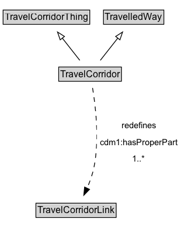

# TravelCorridor

A TravelCorridor is a type of TravelledWay that is made up of TravelCorridorLinks.

NOTE: The extent of a TravelCorridor is defined by the extent of the path that shares the designator assigned to the TravelCorridor.

## Diagram

=== "SVG (interactive)"

    <!-- Generated by graphviz version 14.1.3 (20260303.0454)
     -->
    <!-- Pages: 1 -->
    <svg width="236pt" height="308pt"
     viewBox="0.00 0.00 236.00 308.00" xmlns="http://www.w3.org/2000/svg" xmlns:xlink="http://www.w3.org/1999/xlink">
    <g id="graph0" class="graph" transform="scale(1 1) rotate(0) translate(4 303.5)">
    <polygon fill="white" stroke="none" points="-4,4 -4,-303.5 232.04,-303.5 232.04,4 -4,4"/>
    <g id="clust3" class="cluster">
    <title>cluster_associated</title>
    </g>
    <!-- TravelCorridorThing -->
    <g id="node1" class="node">
    <title>TravelCorridorThing</title>
    <g id="a_node1"><a xlink:href="../TravelCorridorThing" xlink:title="&lt;TABLE&gt;">
    <polygon fill="lightgray" stroke="none" points="1,-273.38 1,-289.62 110.25,-289.62 110.25,-273.38 1,-273.38"/>
    <text xml:space="preserve" text-anchor="start" x="2" y="-277.38" font-family="Arial" font-size="12.00">TravelCorridorThing</text>
    <polygon fill="none" stroke="black" points="0,-272.38 0,-290.62 111.25,-290.62 111.25,-272.38 0,-272.38"/>
    </a>
    </g>
    </g>
    <!-- TravelledWay -->
    <g id="node2" class="node">
    <title>TravelledWay</title>
    <g id="a_node2"><a xlink:href="../TravelledWay" xlink:title="&lt;TABLE&gt;">
    <polygon fill="lightgray" stroke="none" points="129.88,-273.38 129.88,-289.62 205.38,-289.62 205.38,-273.38 129.88,-273.38"/>
    <text xml:space="preserve" text-anchor="start" x="130.88" y="-277.38" font-family="Arial" font-size="12.00">TravelledWay</text>
    <polygon fill="none" stroke="black" points="128.88,-272.38 128.88,-290.62 206.38,-290.62 206.38,-272.38 128.88,-272.38"/>
    </a>
    </g>
    </g>
    <!-- TravelCorridor -->
    <g id="node3" class="node">
    <title>TravelCorridor</title>
    <g id="a_node3"><a xlink:href="../TravelCorridor" xlink:title="&lt;TABLE&gt;">
    <polygon fill="lightgray" stroke="none" points="72.38,-200.38 72.38,-216.62 150.88,-216.62 150.88,-200.38 72.38,-200.38"/>
    <text xml:space="preserve" text-anchor="start" x="73.38" y="-204.38" font-family="Arial" font-size="12.00">TravelCorridor</text>
    <polygon fill="none" stroke="black" points="71.38,-199.38 71.38,-217.62 151.88,-217.62 151.88,-199.38 71.38,-199.38"/>
    </a>
    </g>
    </g>
    <!-- TravelCorridor&#45;&gt;TravelCorridorThing -->
    <g id="edge1" class="edge">
    <title>TravelCorridor&#45;&gt;TravelCorridorThing</title>
    <path fill="none" stroke="black" d="M98.45,-226.21C91.7,-234.76 83.33,-245.37 75.79,-254.93"/>
    <polygon fill="none" stroke="black" points="73.28,-252.47 69.83,-262.49 78.77,-256.8 73.28,-252.47"/>
    </g>
    <!-- TravelCorridor&#45;&gt;TravelledWay -->
    <g id="edge2" class="edge">
    <title>TravelCorridor&#45;&gt;TravelledWay</title>
    <path fill="none" stroke="black" d="M124.8,-226.21C131.55,-234.76 139.92,-245.37 147.46,-254.93"/>
    <polygon fill="none" stroke="black" points="144.48,-256.8 153.42,-262.49 149.97,-252.47 144.48,-256.8"/>
    </g>
    <!-- Invis -->
    <!-- TravelCorridor&#45;&gt;Invis -->
    <!-- TravelCorridorLink -->
    <g id="node5" class="node">
    <title>TravelCorridorLink</title>
    <g id="a_node5"><a xlink:href="../TravelCorridorLink" xlink:title="&lt;TABLE&gt;">
    <polygon fill="lightgray" stroke="none" points="43.12,-25.88 43.12,-42.12 144.12,-42.12 144.12,-25.88 43.12,-25.88"/>
    <text xml:space="preserve" text-anchor="start" x="44.12" y="-29.88" font-family="Arial" font-size="12.00">TravelCorridorLink</text>
    <polygon fill="none" stroke="black" points="42.12,-24.88 42.12,-43.12 145.12,-43.12 145.12,-24.88 42.12,-24.88"/>
    </a>
    </g>
    </g>
    <!-- TravelCorridor&#45;&gt;TravelCorridorLink -->
    <g id="edge5" class="edge">
    <title>TravelCorridor&#45;&gt;TravelCorridorLink</title>
    <path fill="none" stroke="black" stroke-dasharray="5,2" d="M114.84,-190.81C118.73,-167.69 123.91,-124.71 116.62,-89 114.78,-79.98 111.37,-70.59 107.74,-62.23"/>
    <polygon fill="black" stroke="black" points="110.97,-60.89 103.57,-53.31 104.63,-63.85 110.97,-60.89"/>
    <polygon fill="white" stroke="none" points="120.29,-89 120.29,-153.5 228.04,-153.5 228.04,-89 120.29,-89"/>
    <text xml:space="preserve" text-anchor="start" x="152.04" y="-139" font-family="Arial" font-size="11.00">redefines</text>
    <text xml:space="preserve" text-anchor="start" x="124.29" y="-117.5" font-family="Arial" font-size="11.00">cdm1:hasProperPart</text>
    <text xml:space="preserve" text-anchor="start" x="165.92" y="-96" font-family="Arial" font-size="11.00">1..&#42;</text>
    </g>
    <!-- Invis&#45;&gt;TravelCorridorLink -->
    </g>
    </svg>

=== "PNG"

    

## Formalization for TravelCorridor

| Property | Constraint |
|----------|------------|
| [cdm1:hasProperPart](https://w3id.org/citydata/part1/v1/hasProperPart) | min 1 |
| [cdm1:hasProperPart](https://w3id.org/citydata/part1/v1/hasProperPart) | min 1 [TravelCorridorLink](https://w3id.org/citydata/part3/v1/TravelCorridorLink) |
| subClassOf | [TravelCorridorThing](https://w3id.org/citydata/part3/v1/TravelCorridorThing) |
| subClassOf | [TravelledWay](TravelledWay.md) |

