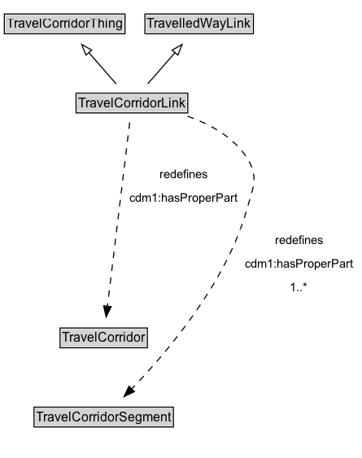

# TravelCorridorLink

A TravelCorridorLink is a type of TravelledWayLink that is made up of TravelCorridorSegments.

## Diagram

=== "SVG (interactive)"

    <!-- Generated by graphviz version 14.1.3 (20260303.0454)
     -->
    <!-- Pages: 1 -->
    <svg width="333pt" height="423pt"
     viewBox="0.00 0.00 333.00 423.00" xmlns="http://www.w3.org/2000/svg" xmlns:xlink="http://www.w3.org/1999/xlink">
    <g id="graph0" class="graph" transform="scale(1 1) rotate(0) translate(4 418.5)">
    <polygon fill="white" stroke="none" points="-4,4 -4,-418.5 329.42,-418.5 329.42,4 -4,4"/>
    <g id="clust3" class="cluster">
    <title>cluster_associated</title>
    </g>
    <!-- TravelCorridorThing -->
    <g id="node1" class="node">
    <title>TravelCorridorThing</title>
    <g id="a_node1"><a xlink:href="../TravelCorridorThing" xlink:title="&lt;TABLE&gt;">
    <polygon fill="lightgray" stroke="none" points="1,-388.38 1,-404.62 110.25,-404.62 110.25,-388.38 1,-388.38"/>
    <text xml:space="preserve" text-anchor="start" x="2" y="-392.38" font-family="Arial" font-size="12.00">TravelCorridorThing</text>
    <polygon fill="none" stroke="black" points="0,-387.38 0,-405.62 111.25,-405.62 111.25,-387.38 0,-387.38"/>
    </a>
    </g>
    </g>
    <!-- TravelledWayLink -->
    <g id="node2" class="node">
    <title>TravelledWayLink</title>
    <g id="a_node2"><a xlink:href="../TravelledWayLink" xlink:title="&lt;TABLE&gt;">
    <polygon fill="lightgray" stroke="none" points="130.62,-388.38 130.62,-404.62 228.62,-404.62 228.62,-388.38 130.62,-388.38"/>
    <text xml:space="preserve" text-anchor="start" x="131.62" y="-392.38" font-family="Arial" font-size="12.00">TravelledWayLink</text>
    <polygon fill="none" stroke="black" points="129.62,-387.38 129.62,-405.62 229.62,-405.62 229.62,-387.38 129.62,-387.38"/>
    </a>
    </g>
    </g>
    <!-- TravelCorridorLink -->
    <g id="node3" class="node">
    <title>TravelCorridorLink</title>
    <g id="a_node3"><a xlink:href="../TravelCorridorLink" xlink:title="&lt;TABLE&gt;">
    <polygon fill="lightgray" stroke="none" points="67.12,-315.38 67.12,-331.62 168.12,-331.62 168.12,-315.38 67.12,-315.38"/>
    <text xml:space="preserve" text-anchor="start" x="68.12" y="-319.38" font-family="Arial" font-size="12.00">TravelCorridorLink</text>
    <polygon fill="none" stroke="black" points="66.12,-314.38 66.12,-332.62 169.12,-332.62 169.12,-314.38 66.12,-314.38"/>
    </a>
    </g>
    </g>
    <!-- TravelCorridorLink&#45;&gt;TravelCorridorThing -->
    <g id="edge1" class="edge">
    <title>TravelCorridorLink&#45;&gt;TravelCorridorThing</title>
    <path fill="none" stroke="black" d="M103.04,-341.21C95.49,-349.85 86.11,-360.59 77.7,-370.22"/>
    <polygon fill="none" stroke="black" points="75.25,-367.7 71.31,-377.53 80.53,-372.3 75.25,-367.7"/>
    </g>
    <!-- TravelCorridorLink&#45;&gt;TravelledWayLink -->
    <g id="edge2" class="edge">
    <title>TravelCorridorLink&#45;&gt;TravelledWayLink</title>
    <path fill="none" stroke="black" d="M132.21,-341.21C139.76,-349.85 149.14,-360.59 157.55,-370.22"/>
    <polygon fill="none" stroke="black" points="154.72,-372.3 163.94,-377.53 160,-367.7 154.72,-372.3"/>
    </g>
    <!-- Invis -->
    <!-- TravelCorridorLink&#45;&gt;Invis -->
    <!-- TravelCorridor -->
    <g id="node5" class="node">
    <title>TravelCorridor</title>
    <g id="a_node5"><a xlink:href="../TravelCorridor" xlink:title="&lt;TABLE&gt;">
    <polygon fill="lightgray" stroke="none" points="52.38,-98.88 52.38,-115.12 130.88,-115.12 130.88,-98.88 52.38,-98.88"/>
    <text xml:space="preserve" text-anchor="start" x="53.38" y="-102.88" font-family="Arial" font-size="12.00">TravelCorridor</text>
    <polygon fill="none" stroke="black" points="51.38,-97.88 51.38,-116.12 131.88,-116.12 131.88,-97.88 51.38,-97.88"/>
    </a>
    </g>
    </g>
    <!-- TravelCorridorLink&#45;&gt;TravelCorridor -->
    <g id="edge7" class="edge">
    <title>TravelCorridorLink&#45;&gt;TravelCorridor</title>
    <path fill="none" stroke="black" stroke-dasharray="5,2" d="M115.58,-305.67C111.13,-268.94 100.51,-181.27 95.03,-136.05"/>
    <polygon fill="black" stroke="black" points="98.52,-135.76 93.84,-126.26 91.57,-136.6 98.52,-135.76"/>
    <polygon fill="white" stroke="none" points="111.55,-225.5 111.55,-268.5 219.3,-268.5 219.3,-225.5 111.55,-225.5"/>
    <text xml:space="preserve" text-anchor="start" x="143.3" y="-254" font-family="Arial" font-size="11.00">redefines</text>
    <text xml:space="preserve" text-anchor="start" x="115.55" y="-232.5" font-family="Arial" font-size="11.00">cdm1:hasProperPart</text>
    </g>
    <!-- TravelCorridorSegment -->
    <g id="node6" class="node">
    <title>TravelCorridorSegment</title>
    <g id="a_node6"><a xlink:href="../TravelCorridorSegment" xlink:title="&lt;TABLE&gt;">
    <polygon fill="lightgray" stroke="none" points="28.38,-25.88 28.38,-42.12 154.88,-42.12 154.88,-25.88 28.38,-25.88"/>
    <text xml:space="preserve" text-anchor="start" x="29.38" y="-29.88" font-family="Arial" font-size="12.00">TravelCorridorSegment</text>
    <polygon fill="none" stroke="black" points="27.38,-24.88 27.38,-43.12 155.88,-43.12 155.88,-24.88 27.38,-24.88"/>
    </a>
    </g>
    </g>
    <!-- TravelCorridorLink&#45;&gt;TravelCorridorSegment -->
    <g id="edge6" class="edge">
    <title>TravelCorridorLink&#45;&gt;TravelCorridorSegment</title>
    <path fill="none" stroke="black" stroke-dasharray="5,2" d="M168.91,-311.35C189.59,-304.06 211.41,-292.19 223.62,-273 234.96,-255.19 229.32,-245.83 223.62,-225.5 204.61,-157.64 149.82,-93.46 117.11,-59.69"/>
    <polygon fill="black" stroke="black" points="119.89,-57.52 110.37,-52.86 114.9,-62.43 119.89,-57.52"/>
    <polygon fill="white" stroke="none" points="217.67,-143 217.67,-207.5 325.42,-207.5 325.42,-143 217.67,-143"/>
    <text xml:space="preserve" text-anchor="start" x="249.42" y="-193" font-family="Arial" font-size="11.00">redefines</text>
    <text xml:space="preserve" text-anchor="start" x="221.67" y="-171.5" font-family="Arial" font-size="11.00">cdm1:hasProperPart</text>
    <text xml:space="preserve" text-anchor="start" x="263.29" y="-150" font-family="Arial" font-size="11.00">1..&#42;</text>
    </g>
    <!-- Invis&#45;&gt;TravelCorridor -->
    <!-- TravelCorridor&#45;&gt;TravelCorridorSegment -->
    </g>
    </svg>

=== "PNG"

    

## Formalization for TravelCorridorLink

| Property | Constraint |
|----------|------------|
| [cdm1:hasProperPart](https://w3id.org/citydata/part1/v1/hasProperPart) | min 1 |
| [cdm1:hasProperPart](https://w3id.org/citydata/part1/v1/hasProperPart) | min 1 [TravelCorridorSegment](https://w3id.org/citydata/part3/v1/TravelCorridorSegment) |
| subClassOf | [TravelCorridorThing](https://w3id.org/citydata/part3/v1/TravelCorridorThing) |
| subClassOf | [TravelledWayLink](TravelledWayLink.md) |

