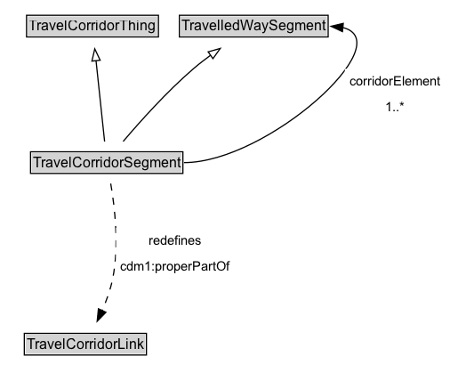

# TravelCorridorSegment

A TravelCorridorSegment is a type of TravelledWaySegment that logically groups multiple TravelledWaySegments together as being co-located or side-by-side.

**IRI**: `https://w3id.org/citydata/part3/v1/TravelCorridorSegment`

## Diagram

=== "SVG (interactive)"

    <!-- Generated by graphviz version 14.1.3 (20260303.0454)
     -->
    <!-- Pages: 1 -->
    <svg width="379pt" height="328pt"
     viewBox="0.00 0.00 379.00 328.00" xmlns="http://www.w3.org/2000/svg" xmlns:xlink="http://www.w3.org/1999/xlink">
    <g id="graph0" class="graph" transform="scale(1 1) rotate(0) translate(4 324)">
    <polygon fill="white" stroke="none" points="-4,4 -4,-324 375.35,-324 375.35,4 -4,4"/>
    <g id="clust3" class="cluster">
    <title>cluster_associated</title>
    </g>
    <!-- TravelCorridorThing -->
    <g id="node1" class="node">
    <title>TravelCorridorThing</title>
    <g id="a_node1"><a xlink:href="../TravelCorridorThing" xlink:title="&lt;TABLE&gt;">
    <polygon fill="lightgray" stroke="none" points="19.38,-293.88 19.38,-310.12 128.62,-310.12 128.62,-293.88 19.38,-293.88"/>
    <text xml:space="preserve" text-anchor="start" x="20.38" y="-297.88" font-family="Arial" font-size="12.00">TravelCorridorThing</text>
    <polygon fill="none" stroke="black" points="18.38,-292.88 18.38,-311.12 129.62,-311.12 129.62,-292.88 18.38,-292.88"/>
    </a>
    </g>
    </g>
    <!-- TravelledWaySegment -->
    <g id="node2" class="node">
    <title>TravelledWaySegment</title>
    <g id="a_node2"><a xlink:href="../TravelledWaySegment" xlink:title="&lt;TABLE&gt;">
    <polygon fill="lightgray" stroke="none" points="148.25,-293.88 148.25,-310.12 271.75,-310.12 271.75,-293.88 148.25,-293.88"/>
    <text xml:space="preserve" text-anchor="start" x="149.25" y="-297.88" font-family="Arial" font-size="12.00">TravelledWaySegment</text>
    <polygon fill="none" stroke="black" points="147.25,-292.88 147.25,-311.12 272.75,-311.12 272.75,-292.88 147.25,-292.88"/>
    </a>
    </g>
    </g>
    <!-- TravelCorridorSegment -->
    <g id="node3" class="node">
    <title>TravelCorridorSegment</title>
    <g id="a_node3"><a xlink:href="../TravelCorridorSegment" xlink:title="&lt;TABLE&gt;">
    <polygon fill="lightgray" stroke="none" points="22.75,-178.88 22.75,-195.12 149.25,-195.12 149.25,-178.88 22.75,-178.88"/>
    <text xml:space="preserve" text-anchor="start" x="23.75" y="-182.88" font-family="Arial" font-size="12.00">TravelCorridorSegment</text>
    <polygon fill="none" stroke="black" points="21.75,-177.88 21.75,-196.12 150.25,-196.12 150.25,-177.88 21.75,-177.88"/>
    </a>
    </g>
    </g>
    <!-- TravelCorridorSegment&#45;&gt;TravelCorridorThing -->
    <g id="edge1" class="edge">
    <title>TravelCorridorSegment&#45;&gt;TravelCorridorThing</title>
    <path fill="none" stroke="black" d="M84.22,-204.74C82.31,-222.71 79.25,-251.56 76.97,-273"/>
    <polygon fill="none" stroke="black" points="73.51,-272.51 75.93,-282.82 80.47,-273.25 73.51,-272.51"/>
    </g>
    <!-- TravelCorridorSegment&#45;&gt;TravelledWaySegment -->
    <g id="edge2" class="edge">
    <title>TravelCorridorSegment&#45;&gt;TravelledWaySegment</title>
    <path fill="none" stroke="black" d="M99.87,-204.83C113.89,-221.34 136.64,-246.78 159,-266 163.63,-269.98 168.72,-273.92 173.84,-277.64"/>
    <polygon fill="none" stroke="black" points="171.55,-280.31 181.75,-283.19 175.57,-274.58 171.55,-280.31"/>
    </g>
    <!-- TravelCorridorSegment&#45;&gt;TravelledWaySegment -->
    <g id="edge6" class="edge">
    <title>TravelCorridorSegment:e&#45;&gt;TravelledWaySegment:e</title>
    <path fill="none" stroke="black" d="M151.19,-187C221.49,-187 334.18,-288.92 284.84,-300.86"/>
    <polygon fill="black" stroke="black" points="284.79,-297.35 275.2,-301.85 285.5,-304.31 284.79,-297.35"/>
    <polygon fill="white" stroke="none" points="286.85,-223 286.85,-266 371.35,-266 371.35,-223 286.85,-223"/>
    <text xml:space="preserve" text-anchor="start" x="290.85" y="-251.5" font-family="Arial" font-size="11.00">corridorElement</text>
    <text xml:space="preserve" text-anchor="start" x="320.85" y="-230" font-family="Arial" font-size="11.00">1..&#42;</text>
    </g>
    <!-- Invis -->
    <!-- TravelCorridorSegment&#45;&gt;Invis -->
    <!-- TravelCorridorLink -->
    <g id="node5" class="node">
    <title>TravelCorridorLink</title>
    <g id="a_node5"><a xlink:href="../TravelCorridorLink" xlink:title="&lt;TABLE&gt;">
    <polygon fill="lightgray" stroke="none" points="17.5,-25.88 17.5,-42.12 118.5,-42.12 118.5,-25.88 17.5,-25.88"/>
    <text xml:space="preserve" text-anchor="start" x="18.5" y="-29.88" font-family="Arial" font-size="12.00">TravelCorridorLink</text>
    <polygon fill="none" stroke="black" points="16.5,-24.88 16.5,-43.12 119.5,-43.12 119.5,-24.88 16.5,-24.88"/>
    </a>
    </g>
    </g>
    <!-- TravelCorridorSegment&#45;&gt;TravelCorridorLink -->
    <g id="edge5" class="edge">
    <title>TravelCorridorSegment&#45;&gt;TravelCorridorLink</title>
    <path fill="none" stroke="black" stroke-dasharray="5,2" d="M89.37,-169.33C92.74,-149.86 96.66,-116.76 91,-89 89.16,-79.98 85.75,-70.59 82.11,-62.23"/>
    <polygon fill="black" stroke="black" points="85.35,-60.89 77.95,-53.31 79,-63.85 85.35,-60.89"/>
    <polygon fill="white" stroke="none" points="93.86,-89 93.86,-132 194.11,-132 194.11,-89 93.86,-89"/>
    <text xml:space="preserve" text-anchor="start" x="121.86" y="-117.5" font-family="Arial" font-size="11.00">redefines</text>
    <text xml:space="preserve" text-anchor="start" x="97.86" y="-96" font-family="Arial" font-size="11.00">cdm1:properPartOf</text>
    </g>
    <!-- Invis&#45;&gt;TravelCorridorLink -->
    </g>
    </svg>

=== "PNG"

    

## Formalization for TravelCorridorSegment

| Property | Constraint |
|----------|------------|
| [cdm1:properPartOf](https://w3id.org/citydata/part1/v1/properPartOf) | only [TravelCorridorLink](TravelCorridorLink.md) |
| [cdm1:properPartOf](https://w3id.org/citydata/part1/v1/properPartOf) | only [TravelCorridorLink](https://w3id.org/citydata/part3/v1/TravelCorridorLink) |
| [corridorElement](../properties/corridorElement.md) | min 1 |
| [corridorElement](../properties/corridorElement.md) | min 1 [TravelledWaySegment](https://w3id.org/citydata/part3/v1/TravelledWaySegment) |
| subClassOf | [TravelCorridorThing](../properties/TravelCorridorThing.md) |
| subClassOf | [TravelledWaySegment](TravelledWaySegment.md) |

## Used by classes

| Class | Property |
|-------|----------|
| [Travel Corridor Link (cdm1)](TravelCorridorLink.md) | [cdm1:hasProperPart](https://w3id.org/citydata/part1/v1/hasProperPart) |
| [Travelled Way Segment](TravelledWaySegment.md) | [travelCorridorSegment](../properties/travelCorridorSegment.md) |

