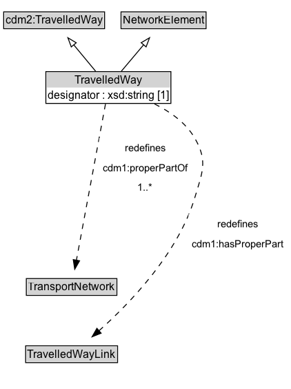

# TravelledWay

A TravelledWay is a type of NetworkElement and transinfras:TravelledWay that represents the curvilinear length of a transport route that is identified by a specific designator.

**IRI**: `https://w3id.org/citydata/part3/v1/TravelledWay`

## Diagram

=== "SVG (interactive)"

    <!-- Generated by graphviz version 14.1.3 (20260303.0454)
     -->
    <!-- Pages: 1 -->
    <svg width="317pt" height="423pt"
     viewBox="0.00 0.00 317.00 423.00" xmlns="http://www.w3.org/2000/svg" xmlns:xlink="http://www.w3.org/1999/xlink">
    <g id="graph0" class="graph" transform="scale(1 1) rotate(0) translate(4 418.5)">
    <polygon fill="white" stroke="none" points="-4,4 -4,-418.5 312.82,-418.5 312.82,4 -4,4"/>
    <g id="clust3" class="cluster">
    <title>cluster_associated</title>
    </g>
    <!-- cdm2_TravelledWay -->
    <g id="node1" class="node">
    <title>cdm2_TravelledWay</title>
    <g id="a_node1"><a xlink:href="https://w3id.org/citydata/part2/v1/TravelledWay" xlink:title="&lt;TABLE&gt;">
    <polygon fill="lightgray" stroke="none" points="1,-388.38 1,-404.62 108.75,-404.62 108.75,-388.38 1,-388.38"/>
    <text xml:space="preserve" text-anchor="start" x="2" y="-392.38" font-family="Arial" font-size="12.00">cdm2:TravelledWay</text>
    <polygon fill="none" stroke="black" points="0,-387.38 0,-405.62 109.75,-405.62 109.75,-387.38 0,-387.38"/>
    </a>
    </g>
    </g>
    <!-- NetworkElement -->
    <g id="node2" class="node">
    <title>NetworkElement</title>
    <g id="a_node2"><a xlink:href="../NetworkElement" xlink:title="&lt;TABLE&gt;">
    <polygon fill="lightgray" stroke="none" points="128.62,-388.38 128.62,-404.62 219.12,-404.62 219.12,-388.38 128.62,-388.38"/>
    <text xml:space="preserve" text-anchor="start" x="129.62" y="-392.38" font-family="Arial" font-size="12.00">NetworkElement</text>
    <polygon fill="none" stroke="black" points="127.62,-387.38 127.62,-405.62 220.12,-405.62 220.12,-387.38 127.62,-387.38"/>
    </a>
    </g>
    </g>
    <!-- TravelledWay -->
    <g id="node3" class="node">
    <title>TravelledWay</title>
    <g id="a_node3"><a xlink:href="../TravelledWay" xlink:title="&lt;TABLE&gt;">
    <polygon fill="lightgray" stroke="none" points="46.88,-323.5 46.88,-339.75 180.88,-339.75 180.88,-323.5 46.88,-323.5"/>
    <text xml:space="preserve" text-anchor="start" x="77.12" y="-327.5" font-family="Arial" font-size="12.00">TravelledWay</text>
    <text xml:space="preserve" text-anchor="start" x="47.88" y="-311.25" font-family="Arial" font-size="12.00">designator : xsd:string [1]</text>
    <polygon fill="none" stroke="black" points="45.88,-306.25 45.88,-340.75 181.88,-340.75 181.88,-306.25 45.88,-306.25"/>
    </a>
    </g>
    </g>
    <!-- TravelledWay&#45;&gt;cdm2_TravelledWay -->
    <g id="edge1" class="edge">
    <title>TravelledWay&#45;&gt;cdm2_TravelledWay</title>
    <path fill="none" stroke="black" d="M99.99,-341.21C92.88,-349.76 84.07,-360.37 76.12,-369.93"/>
    <polygon fill="none" stroke="black" points="73.52,-367.58 69.82,-377.51 78.91,-372.06 73.52,-367.58"/>
    </g>
    <!-- TravelledWay&#45;&gt;NetworkElement -->
    <g id="edge2" class="edge">
    <title>TravelledWay&#45;&gt;NetworkElement</title>
    <path fill="none" stroke="black" d="M127.99,-341.21C135.22,-349.76 144.19,-360.37 152.27,-369.93"/>
    <polygon fill="none" stroke="black" points="149.55,-372.14 158.68,-377.52 154.9,-367.62 149.55,-372.14"/>
    </g>
    <!-- Invis -->
    <!-- TravelledWay&#45;&gt;Invis -->
    <!-- TransportNetwork -->
    <g id="node5" class="node">
    <title>TransportNetwork</title>
    <g id="a_node5"><a xlink:href="../TransportNetwork" xlink:title="&lt;TABLE&gt;">
    <polygon fill="lightgray" stroke="none" points="25.62,-98.88 25.62,-115.12 122.12,-115.12 122.12,-98.88 25.62,-98.88"/>
    <text xml:space="preserve" text-anchor="start" x="26.62" y="-102.88" font-family="Arial" font-size="12.00">TransportNetwork</text>
    <polygon fill="none" stroke="black" points="24.62,-97.88 24.62,-116.12 123.12,-116.12 123.12,-97.88 24.62,-97.88"/>
    </a>
    </g>
    </g>
    <!-- TravelledWay&#45;&gt;TransportNetwork -->
    <g id="edge7" class="edge">
    <title>TravelledWay&#45;&gt;TransportNetwork</title>
    <path fill="none" stroke="black" stroke-dasharray="5,2" d="M110.74,-305.67C103.89,-268.94 87.54,-181.27 79.11,-136.05"/>
    <polygon fill="black" stroke="black" points="82.55,-135.43 77.28,-126.24 75.67,-136.71 82.55,-135.43"/>
    <polygon fill="white" stroke="none" points="103.8,-204 103.8,-268.5 204.05,-268.5 204.05,-204 103.8,-204"/>
    <text xml:space="preserve" text-anchor="start" x="131.8" y="-254" font-family="Arial" font-size="11.00">redefines</text>
    <text xml:space="preserve" text-anchor="start" x="107.8" y="-232.5" font-family="Arial" font-size="11.00">cdm1:properPartOf</text>
    <text xml:space="preserve" text-anchor="start" x="145.67" y="-211" font-family="Arial" font-size="11.00">1..&#42;</text>
    </g>
    <!-- TravelledWayLink -->
    <g id="node6" class="node">
    <title>TravelledWayLink</title>
    <g id="a_node6"><a xlink:href="../TravelledWayLink" xlink:title="&lt;TABLE&gt;">
    <polygon fill="lightgray" stroke="none" points="24.88,-25.88 24.88,-42.12 122.88,-42.12 122.88,-25.88 24.88,-25.88"/>
    <text xml:space="preserve" text-anchor="start" x="25.88" y="-29.88" font-family="Arial" font-size="12.00">TravelledWayLink</text>
    <polygon fill="none" stroke="black" points="23.88,-24.88 23.88,-43.12 123.88,-43.12 123.88,-24.88 23.88,-24.88"/>
    </a>
    </g>
    </g>
    <!-- TravelledWay&#45;&gt;TravelledWayLink -->
    <g id="edge6" class="edge">
    <title>TravelledWay&#45;&gt;TravelledWayLink</title>
    <path fill="none" stroke="black" stroke-dasharray="5,2" d="M164.06,-305.67C181.05,-297.3 198.16,-285.28 207.88,-268.5 222.24,-243.69 216.13,-231.45 207.88,-204 189.67,-143.43 137.15,-89.22 103.53,-59.34"/>
    <polygon fill="black" stroke="black" points="105.99,-56.84 96.15,-52.92 101.4,-62.12 105.99,-56.84"/>
    <polygon fill="white" stroke="none" points="201.07,-143 201.07,-186 308.82,-186 308.82,-143 201.07,-143"/>
    <text xml:space="preserve" text-anchor="start" x="232.82" y="-171.5" font-family="Arial" font-size="11.00">redefines</text>
    <text xml:space="preserve" text-anchor="start" x="205.07" y="-150" font-family="Arial" font-size="11.00">cdm1:hasProperPart</text>
    </g>
    <!-- Invis&#45;&gt;TransportNetwork -->
    <!-- TransportNetwork&#45;&gt;TravelledWayLink -->
    </g>
    </svg>

=== "PNG"

    

## Specializations of TravelledWay

| Class | Description |
|-------|-------------|
| [Footpath](Footpath.md) | A Footpath is a type of TravelledWay that is made up of FootpathLinks. |
| [Micromobility Path](MicromobilityPath.md) | A MicromobilityPath is a type of Road that is made up of MicromobilityPathLinks. |
| [Rail Corridor](RailCorridor.md) | A RailCorridor is a type of TravelledWay that is made up of TrackLinks. |
| [Road](Road.md) | A Road is a type of TravelledWay and cdm2:Road that is made up of RoadLinks. Roads form a proper part of RoadNetworks. |
| [Travel Corridor](TravelCorridor.md) | A TravelCorridor is a type of TravelledWay that is made up of TravelCorridorLinks. |

## Formalization for TravelledWay

| Property | Constraint |
|----------|------------|
| [cdm1:hasProperPart](https://w3id.org/citydata/part1/v1/hasProperPart) | only [TravelledWayLink](TravelledWayLink.md) |
| [cdm1:hasProperPart](https://w3id.org/citydata/part1/v1/hasProperPart) | only [TravelledWayLink](https://w3id.org/citydata/part3/v1/TravelledWayLink) |
| [cdm1:properPartOf](https://w3id.org/citydata/part1/v1/properPartOf) | only [TransportNetwork](TransportNetwork.md) |
| [cdm1:properPartOf](https://w3id.org/citydata/part1/v1/properPartOf) | min 1 |
| [cdm1:properPartOf](https://w3id.org/citydata/part1/v1/properPartOf) | min 1 [TransportNetwork](https://w3id.org/citydata/part3/v1/TransportNetwork) |
| [designator](../properties/designator.md) | only [xsd:string](https://w3id.org/citydata/imported/xsd/string) |
| [designator](../properties/designator.md) | exactly 1 |
| [designator](../properties/designator.md) | exactly 1 xsd:string |
| subClassOf | [cdm2:TravelledWay](https://w3id.org/citydata/part2/v1/TravelledWay) |
| subClassOf | [NetworkElement](NetworkElement.md) |

## Other annotations

| Property | Value |
|----------|-------|
| [xsd:pattern](https://w3id.org/citydata/imported/xsd/pattern) | TransportNetworkPattern |

