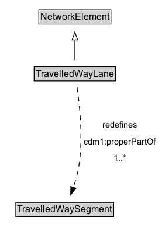

# TravelledWayLane

A TravelledWayLane is a NetworkElement that is a portion of TravelledWaySegment intended to accommodate a single line of moving material entities (e.g., vehicles) along its length.

**IRI**: `https://w3id.org/citydata/part3/v1/TravelledWayLane`

## Diagram

=== "SVG (interactive)"

    <!-- Generated by graphviz version 14.1.3 (20260303.0454)
     -->
    <!-- Pages: 1 -->
    <svg width="208pt" height="308pt"
     viewBox="0.00 0.00 208.00 308.00" xmlns="http://www.w3.org/2000/svg" xmlns:xlink="http://www.w3.org/1999/xlink">
    <g id="graph0" class="graph" transform="scale(1 1) rotate(0) translate(4 303.5)">
    <polygon fill="white" stroke="none" points="-4,4 -4,-303.5 204.03,-303.5 204.03,4 -4,4"/>
    <g id="clust3" class="cluster">
    <title>cluster_associated</title>
    </g>
    <!-- NetworkElement -->
    <g id="node1" class="node">
    <title>NetworkElement</title>
    <g id="a_node1"><a xlink:href="../NetworkElement" xlink:title="&lt;TABLE&gt;">
    <polygon fill="lightgray" stroke="none" points="46.75,-273.38 46.75,-289.62 137.25,-289.62 137.25,-273.38 46.75,-273.38"/>
    <text xml:space="preserve" text-anchor="start" x="47.75" y="-277.38" font-family="Arial" font-size="12.00">NetworkElement</text>
    <polygon fill="none" stroke="black" points="45.75,-272.38 45.75,-290.62 138.25,-290.62 138.25,-272.38 45.75,-272.38"/>
    </a>
    </g>
    </g>
    <!-- TravelledWayLane -->
    <g id="node2" class="node">
    <title>TravelledWayLane</title>
    <g id="a_node2"><a xlink:href="../TravelledWayLane" xlink:title="&lt;TABLE&gt;">
    <polygon fill="lightgray" stroke="none" points="40.75,-200.38 40.75,-216.62 143.25,-216.62 143.25,-200.38 40.75,-200.38"/>
    <text xml:space="preserve" text-anchor="start" x="41.75" y="-204.38" font-family="Arial" font-size="12.00">TravelledWayLane</text>
    <polygon fill="none" stroke="black" points="39.75,-199.38 39.75,-217.62 144.25,-217.62 144.25,-199.38 39.75,-199.38"/>
    </a>
    </g>
    </g>
    <!-- TravelledWayLane&#45;&gt;NetworkElement -->
    <g id="edge1" class="edge">
    <title>TravelledWayLane&#45;&gt;NetworkElement</title>
    <path fill="none" stroke="black" d="M92,-226.21C92,-233.97 92,-243.42 92,-252.24"/>
    <polygon fill="none" stroke="black" points="88.5,-252.16 92,-262.16 95.5,-252.16 88.5,-252.16"/>
    </g>
    <!-- Invis -->
    <!-- TravelledWayLane&#45;&gt;Invis -->
    <!-- TravelledWaySegment -->
    <g id="node4" class="node">
    <title>TravelledWaySegment</title>
    <g id="a_node4"><a xlink:href="../TravelledWaySegment" xlink:title="&lt;TABLE&gt;">
    <polygon fill="lightgray" stroke="none" points="17.25,-25.88 17.25,-42.12 140.75,-42.12 140.75,-25.88 17.25,-25.88"/>
    <text xml:space="preserve" text-anchor="start" x="18.25" y="-29.88" font-family="Arial" font-size="12.00">TravelledWaySegment</text>
    <polygon fill="none" stroke="black" points="16.25,-24.88 16.25,-43.12 141.75,-43.12 141.75,-24.88 16.25,-24.88"/>
    </a>
    </g>
    </g>
    <!-- TravelledWayLane&#45;&gt;TravelledWaySegment -->
    <g id="edge4" class="edge">
    <title>TravelledWayLane&#45;&gt;TravelledWaySegment</title>
    <path fill="none" stroke="black" stroke-dasharray="5,2" d="M94.8,-190.89C98.21,-167.85 102.84,-124.98 97,-89 95.56,-80.15 92.88,-70.79 90.02,-62.39"/>
    <polygon fill="black" stroke="black" points="93.35,-61.29 86.63,-53.09 86.77,-63.69 93.35,-61.29"/>
    <polygon fill="white" stroke="none" points="99.78,-89 99.78,-153.5 200.03,-153.5 200.03,-89 99.78,-89"/>
    <text xml:space="preserve" text-anchor="start" x="127.78" y="-139" font-family="Arial" font-size="11.00">redefines</text>
    <text xml:space="preserve" text-anchor="start" x="103.78" y="-117.5" font-family="Arial" font-size="11.00">cdm1:properPartOf</text>
    <text xml:space="preserve" text-anchor="start" x="141.66" y="-96" font-family="Arial" font-size="11.00">1..&#42;</text>
    </g>
    <!-- Invis&#45;&gt;TravelledWaySegment -->
    </g>
    </svg>

=== "PNG"

    

## Specializations of TravelledWayLane

| Class | Description |
|-------|-------------|
| [Footpath Lane](FootpathLane.md) | A FootpathLane is a type of TravelledWayLane that forms part of a FootpathSegment. |
| [Micromobility Lane](MicromobilityLane.md) | A MicromobilityLane is a type of RoadLane that forms part of a MicromobilityPathSegment. |
| [Road Lane](RoadLane.md) | A RoadLane is a type of TravelledWayLane that forms part of a RoadSegment. |

## Formalization for TravelledWayLane

| Property | Constraint |
|----------|------------|
| [cdm1:properPartOf](https://w3id.org/citydata/part1/v1/properPartOf) | only [TravelledWaySegment](TravelledWaySegment.md) |
| [cdm1:properPartOf](https://w3id.org/citydata/part1/v1/properPartOf) | min 1 |
| [cdm1:properPartOf](https://w3id.org/citydata/part1/v1/properPartOf) | min 1 [TravelledWaySegment](https://w3id.org/citydata/part3/v1/TravelledWaySegment) |
| subClassOf | [NetworkElement](NetworkElement.md) |

## Used by classes

| Class | Property |
|-------|----------|
| [Travelled Way Segment (cdm1)](TravelledWaySegment.md) | [cdm1:hasProperPart](https://w3id.org/citydata/part1/v1/hasProperPart) |

## Other annotations

| Property | Value |
|----------|-------|
| [xsd:pattern](https://w3id.org/citydata/imported/xsd/pattern) | TransportNetworkPattern |

