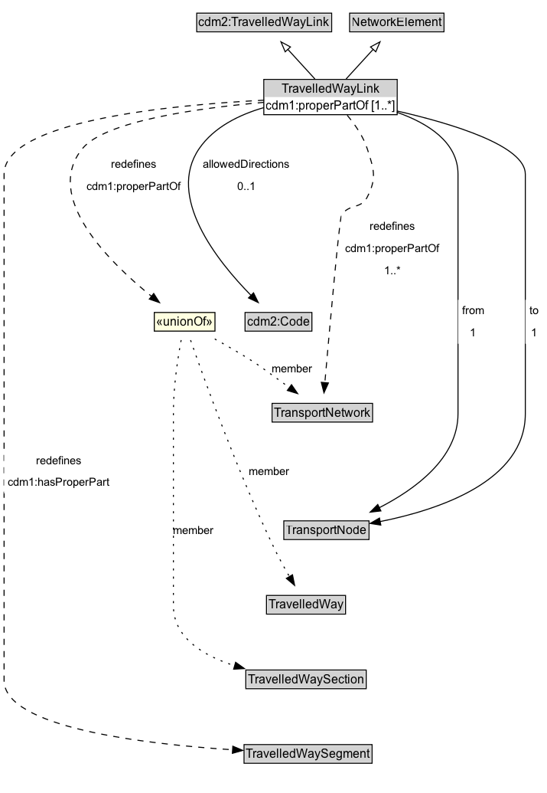

# TravelledWayLink

A TravelledWayLink is a type of NetworkElement and transinfras:TravelledWayLink. It represents a contiguous length of a TravelledWay between two TransportNodes of operational or managerial significance.

**IRI**: `https://w3id.org/citydata/part3/v1/TravelledWayLink`

## Diagram

=== "SVG (interactive)"

    <!-- Generated by graphviz version 14.1.3 (20260303.0454)
     -->
    <!-- Pages: 1 -->
    <svg width="536pt" height="776pt"
     viewBox="0.00 0.00 536.00 776.00" xmlns="http://www.w3.org/2000/svg" xmlns:xlink="http://www.w3.org/1999/xlink">
    <g id="graph0" class="graph" transform="scale(1 1) rotate(0) translate(4 772)">
    <polygon fill="white" stroke="none" points="-4,4 -4,-772 532,-772 532,4 -4,4"/>
    <g id="clust3" class="cluster">
    <title>cluster_associated</title>
    </g>
    <!-- cdm2_TravelledWayLink -->
    <g id="node1" class="node">
    <title>cdm2_TravelledWayLink</title>
    <g id="a_node1"><a xlink:href="https://w3id.org/citydata/part2/v1/TravelledWayLink" xlink:title="&lt;TABLE&gt;">
    <polygon fill="lightgray" stroke="none" points="189.88,-741.88 189.88,-758.12 320.12,-758.12 320.12,-741.88 189.88,-741.88"/>
    <text xml:space="preserve" text-anchor="start" x="190.88" y="-745.88" font-family="Arial" font-size="12.00">cdm2:TravelledWayLink</text>
    <polygon fill="none" stroke="black" points="188.88,-740.88 188.88,-759.12 321.12,-759.12 321.12,-740.88 188.88,-740.88"/>
    </a>
    </g>
    </g>
    <!-- NetworkElement -->
    <g id="node2" class="node">
    <title>NetworkElement</title>
    <g id="a_node2"><a xlink:href="../NetworkElement" xlink:title="&lt;TABLE&gt;">
    <polygon fill="lightgray" stroke="none" points="339.75,-741.88 339.75,-758.12 430.25,-758.12 430.25,-741.88 339.75,-741.88"/>
    <text xml:space="preserve" text-anchor="start" x="340.75" y="-745.88" font-family="Arial" font-size="12.00">NetworkElement</text>
    <polygon fill="none" stroke="black" points="338.75,-740.88 338.75,-759.12 431.25,-759.12 431.25,-740.88 338.75,-740.88"/>
    </a>
    </g>
    </g>
    <!-- TravelledWayLink -->
    <g id="node3" class="node">
    <title>TravelledWayLink</title>
    <g id="a_node3"><a xlink:href="../TravelledWayLink" xlink:title="&lt;TABLE&gt;">
    <polygon fill="lightgray" stroke="none" points="255.62,-677 255.62,-693.25 384.38,-693.25 384.38,-677 255.62,-677"/>
    <text xml:space="preserve" text-anchor="start" x="272" y="-681" font-family="Arial" font-size="12.00">TravelledWayLink</text>
    <text xml:space="preserve" text-anchor="start" x="256.62" y="-664.75" font-family="Arial" font-size="12.00">cdm1:properPartOf [1..&#42;]</text>
    <polygon fill="none" stroke="black" points="254.62,-659.75 254.62,-694.25 385.38,-694.25 385.38,-659.75 254.62,-659.75"/>
    </a>
    </g>
    </g>
    <!-- TravelledWayLink&#45;&gt;cdm2_TravelledWayLink -->
    <g id="edge1" class="edge">
    <title>TravelledWayLink&#45;&gt;cdm2_TravelledWayLink</title>
    <path fill="none" stroke="black" d="M304.71,-694.71C296.79,-703.35 286.96,-714.09 278.14,-723.72"/>
    <polygon fill="none" stroke="black" points="275.6,-721.32 271.43,-731.06 280.76,-726.05 275.6,-721.32"/>
    </g>
    <!-- TravelledWayLink&#45;&gt;NetworkElement -->
    <g id="edge2" class="edge">
    <title>TravelledWayLink&#45;&gt;NetworkElement</title>
    <path fill="none" stroke="black" d="M335.29,-694.71C343.21,-703.35 353.04,-714.09 361.86,-723.72"/>
    <polygon fill="none" stroke="black" points="359.24,-726.05 368.57,-731.06 364.4,-721.32 359.24,-726.05"/>
    </g>
    <!-- Invis -->
    <!-- TravelledWayLink&#45;&gt;Invis -->
    <!-- cdm2_Code -->
    <g id="node5" class="node">
    <title>cdm2_Code</title>
    <g id="a_node5"><a xlink:href="https://w3id.org/citydata/part2/v1/Code" xlink:title="&lt;TABLE&gt;">
    <polygon fill="lightgray" stroke="none" points="237.25,-448.88 237.25,-465.12 300.75,-465.12 300.75,-448.88 237.25,-448.88"/>
    <text xml:space="preserve" text-anchor="start" x="238.25" y="-452.88" font-family="Arial" font-size="12.00">cdm2:Code</text>
    <polygon fill="none" stroke="black" points="236.25,-447.88 236.25,-466.12 301.75,-466.12 301.75,-447.88 236.25,-447.88"/>
    </a>
    </g>
    </g>
    <!-- TravelledWayLink&#45;&gt;cdm2_Code -->
    <g id="edge10" class="edge">
    <title>TravelledWayLink&#45;&gt;cdm2_Code</title>
    <path fill="none" stroke="black" d="M254.67,-666.68C230.63,-659.73 205.76,-647.62 191.25,-626.5 158.96,-579.5 208.49,-516.94 242.13,-482.81"/>
    <polygon fill="black" stroke="black" points="244.54,-485.34 249.21,-475.83 239.63,-480.36 244.54,-485.34"/>
    <polygon fill="white" stroke="none" points="191.25,-579 191.25,-622 284,-622 284,-579 191.25,-579"/>
    <text xml:space="preserve" text-anchor="start" x="195.25" y="-607.5" font-family="Arial" font-size="11.00">allowedDirections</text>
    <text xml:space="preserve" text-anchor="start" x="228.62" y="-586" font-family="Arial" font-size="11.00">0..1</text>
    </g>
    <!-- TransportNetwork -->
    <g id="node6" class="node">
    <title>TransportNetwork</title>
    <g id="a_node6"><a xlink:href="../TransportNetwork" xlink:title="&lt;TABLE&gt;">
    <polygon fill="lightgray" stroke="none" points="263.75,-359.88 263.75,-376.12 360.25,-376.12 360.25,-359.88 263.75,-359.88"/>
    <text xml:space="preserve" text-anchor="start" x="264.75" y="-363.88" font-family="Arial" font-size="12.00">TransportNetwork</text>
    <polygon fill="none" stroke="black" points="262.75,-358.88 262.75,-377.12 361.25,-377.12 361.25,-358.88 262.75,-358.88"/>
    </a>
    </g>
    </g>
    <!-- TravelledWayLink&#45;&gt;TransportNetwork -->
    <g id="edge18" class="edge">
    <title>TravelledWayLink&#45;&gt;TransportNetwork</title>
    <path fill="none" stroke="black" stroke-dasharray="5,2" d="M336.35,-659.2C343.9,-650.26 352.06,-638.63 356,-626.5 362.53,-606.42 365.67,-597.77 356,-579 349.69,-566.75 337.65,-572.93 330.75,-561 328.72,-557.5 319.05,-449.67 314.45,-397.17"/>
    <polygon fill="black" stroke="black" points="317.96,-397.15 313.6,-387.49 310.99,-397.76 317.96,-397.15"/>
    <polygon fill="white" stroke="none" points="330.75,-496.5 330.75,-561 431,-561 431,-496.5 330.75,-496.5"/>
    <text xml:space="preserve" text-anchor="start" x="358.75" y="-546.5" font-family="Arial" font-size="11.00">redefines</text>
    <text xml:space="preserve" text-anchor="start" x="334.75" y="-525" font-family="Arial" font-size="11.00">cdm1:properPartOf</text>
    <text xml:space="preserve" text-anchor="start" x="372.62" y="-503.5" font-family="Arial" font-size="11.00">1..&#42;</text>
    </g>
    <!-- TransportNode -->
    <g id="node7" class="node">
    <title>TransportNode</title>
    <g id="a_node7"><a xlink:href="../TransportNode" xlink:title="&lt;TABLE&gt;">
    <polygon fill="lightgray" stroke="none" points="275.25,-244.88 275.25,-261.12 356.75,-261.12 356.75,-244.88 275.25,-244.88"/>
    <text xml:space="preserve" text-anchor="start" x="276.25" y="-248.88" font-family="Arial" font-size="12.00">TransportNode</text>
    <polygon fill="none" stroke="black" points="274.25,-243.88 274.25,-262.12 357.75,-262.12 357.75,-243.88 274.25,-243.88"/>
    </a>
    </g>
    </g>
    <!-- TravelledWayLink&#45;&gt;TransportNode -->
    <g id="edge11" class="edge">
    <title>TravelledWayLink&#45;&gt;TransportNode</title>
    <path fill="none" stroke="black" d="M385.06,-662.12C415.44,-651.43 445,-632.95 445,-601.5 445,-601.5 445,-601.5 445,-367 445,-323.73 403.42,-293.17 367.48,-274.83"/>
    <polygon fill="black" stroke="black" points="369.41,-271.88 358.89,-270.65 366.34,-278.18 369.41,-271.88"/>
    <polygon fill="white" stroke="none" points="445,-435.5 445,-478.5 474.75,-478.5 474.75,-435.5 445,-435.5"/>
    <text xml:space="preserve" text-anchor="start" x="449" y="-464" font-family="Arial" font-size="11.00">from</text>
    <text xml:space="preserve" text-anchor="start" x="456.88" y="-442.5" font-family="Arial" font-size="11.00">1</text>
    </g>
    <!-- TravelledWayLink&#45;&gt;TransportNode -->
    <g id="edge17" class="edge">
    <title>TravelledWayLink&#45;&gt;TransportNode</title>
    <path fill="none" stroke="black" d="M385.2,-663.36C440.53,-650.72 511,-629.17 511,-601.5 511,-601.5 511,-601.5 511,-367 511,-300.97 426.27,-272.89 368.51,-261.42"/>
    <polygon fill="black" stroke="black" points="369.31,-258.01 358.84,-259.62 368.03,-264.89 369.31,-258.01"/>
    <polygon fill="white" stroke="none" points="511,-435.5 511,-478.5 528,-478.5 528,-435.5 511,-435.5"/>
    <text xml:space="preserve" text-anchor="start" x="515" y="-464" font-family="Arial" font-size="11.00">to</text>
    <text xml:space="preserve" text-anchor="start" x="516.5" y="-442.5" font-family="Arial" font-size="11.00">1</text>
    </g>
    <!-- TravelledWaySegment -->
    <g id="node10" class="node">
    <title>TravelledWaySegment</title>
    <g id="a_node10"><a xlink:href="../TravelledWaySegment" xlink:title="&lt;TABLE&gt;">
    <polygon fill="lightgray" stroke="none" points="236.25,-25.88 236.25,-42.12 359.75,-42.12 359.75,-25.88 236.25,-25.88"/>
    <text xml:space="preserve" text-anchor="start" x="237.25" y="-29.88" font-family="Arial" font-size="12.00">TravelledWaySegment</text>
    <polygon fill="none" stroke="black" points="235.25,-24.88 235.25,-43.12 360.75,-43.12 360.75,-24.88 235.25,-24.88"/>
    </a>
    </g>
    </g>
    <!-- TravelledWayLink&#45;&gt;TravelledWaySegment -->
    <g id="edge12" class="edge">
    <title>TravelledWayLink&#45;&gt;TravelledWaySegment</title>
    <path fill="none" stroke="black" stroke-dasharray="5,2" d="M254.86,-673.92C161.29,-669.12 0,-653.34 0,-601.5 0,-601.5 0,-601.5 0,-106 0,-60.02 135.97,-43.76 224.22,-38.05"/>
    <polygon fill="black" stroke="black" points="224.25,-41.56 234.02,-37.45 223.82,-34.57 224.25,-41.56"/>
    <polygon fill="white" stroke="none" points="0,-289 0,-332 107.75,-332 107.75,-289 0,-289"/>
    <text xml:space="preserve" text-anchor="start" x="31.75" y="-317.5" font-family="Arial" font-size="11.00">redefines</text>
    <text xml:space="preserve" text-anchor="start" x="4" y="-296" font-family="Arial" font-size="11.00">cdm1:hasProperPart</text>
    </g>
    <!-- n1c091741e9be41418e759d48b25318c1b33 -->
    <g id="node11" class="node">
    <title>n1c091741e9be41418e759d48b25318c1b33</title>
    <polygon fill="lightyellow" stroke="none" points="147.25,-447.88 147.25,-466.12 206.75,-466.12 206.75,-447.88 147.25,-447.88"/>
    <text xml:space="preserve" text-anchor="start" x="149.25" y="-452.88" font-family="Arial" font-size="12.00">«unionOf»</text>
    <polygon fill="none" stroke="black" points="147.25,-447.88 147.25,-466.12 206.75,-466.12 206.75,-447.88 147.25,-447.88"/>
    </g>
    <!-- TravelledWayLink&#45;&gt;n1c091741e9be41418e759d48b25318c1b33 -->
    <g id="edge16" class="edge">
    <title>TravelledWayLink&#45;&gt;n1c091741e9be41418e759d48b25318c1b33</title>
    <path fill="none" stroke="black" stroke-dasharray="5,2" d="M254.63,-671.81C190.38,-666.17 98.84,-653.53 76.75,-626.5 38.23,-579.35 102.48,-515.82 144.7,-481.83"/>
    <polygon fill="black" stroke="black" points="146.7,-484.71 152.39,-475.77 142.37,-479.2 146.7,-484.71"/>
    <polygon fill="white" stroke="none" points="76.75,-579 76.75,-622 177,-622 177,-579 76.75,-579"/>
    <text xml:space="preserve" text-anchor="start" x="104.75" y="-607.5" font-family="Arial" font-size="11.00">redefines</text>
    <text xml:space="preserve" text-anchor="start" x="80.75" y="-586" font-family="Arial" font-size="11.00">cdm1:properPartOf</text>
    </g>
    <!-- Invis&#45;&gt;cdm2_Code -->
    <!-- cdm2_Code&#45;&gt;TransportNetwork -->
    <!-- TransportNetwork&#45;&gt;TransportNode -->
    <!-- TravelledWay -->
    <g id="node8" class="node">
    <title>TravelledWay</title>
    <g id="a_node8"><a xlink:href="../TravelledWay" xlink:title="&lt;TABLE&gt;">
    <polygon fill="lightgray" stroke="none" points="258.25,-171.88 258.25,-188.12 333.75,-188.12 333.75,-171.88 258.25,-171.88"/>
    <text xml:space="preserve" text-anchor="start" x="259.25" y="-175.88" font-family="Arial" font-size="12.00">TravelledWay</text>
    <polygon fill="none" stroke="black" points="257.25,-170.88 257.25,-189.12 334.75,-189.12 334.75,-170.88 257.25,-170.88"/>
    </a>
    </g>
    </g>
    <!-- TransportNode&#45;&gt;TravelledWay -->
    <!-- TravelledWaySection -->
    <g id="node9" class="node">
    <title>TravelledWaySection</title>
    <g id="a_node9"><a xlink:href="../TravelledWaySection" xlink:title="&lt;TABLE&gt;">
    <polygon fill="lightgray" stroke="none" points="238,-98.88 238,-115.12 354,-115.12 354,-98.88 238,-98.88"/>
    <text xml:space="preserve" text-anchor="start" x="239" y="-102.88" font-family="Arial" font-size="12.00">TravelledWaySection</text>
    <polygon fill="none" stroke="black" points="237,-97.88 237,-116.12 355,-116.12 355,-97.88 237,-97.88"/>
    </a>
    </g>
    </g>
    <!-- TravelledWay&#45;&gt;TravelledWaySection -->
    <!-- TravelledWaySection&#45;&gt;TravelledWaySegment -->
    <!-- n1c091741e9be41418e759d48b25318c1b33&#45;&gt;TransportNetwork -->
    <g id="edge13" class="edge">
    <title>n1c091741e9be41418e759d48b25318c1b33&#45;&gt;TransportNetwork</title>
    <path fill="none" stroke="black" stroke-dasharray="1,5" d="M206.54,-440.21C218.64,-433.51 232.67,-425.42 245,-417.5 248.76,-415.08 264.72,-403.54 280.12,-392.32"/>
    <polygon fill="black" stroke="black" points="281.79,-395.43 287.81,-386.71 277.66,-389.78 281.79,-395.43"/>
    <text xml:space="preserve" text-anchor="middle" x="282.76" y="-407.05" font-family="Arial" font-size="11.00">member</text>
    </g>
    <!-- n1c091741e9be41418e759d48b25318c1b33&#45;&gt;TravelledWay -->
    <g id="edge14" class="edge">
    <title>n1c091741e9be41418e759d48b25318c1b33&#45;&gt;TravelledWay</title>
    <path fill="none" stroke="black" stroke-dasharray="1,5" d="M182.83,-439.02C195.9,-401.5 229.25,-309 265,-235 269.41,-225.87 274.76,-216.17 279.75,-207.56"/>
    <polygon fill="black" stroke="black" points="282.74,-209.38 284.82,-198.99 276.72,-205.82 282.74,-209.38"/>
    <text xml:space="preserve" text-anchor="middle" x="260.05" y="-306.8" font-family="Arial" font-size="11.00">member</text>
    </g>
    <!-- n1c091741e9be41418e759d48b25318c1b33&#45;&gt;TravelledWaySection -->
    <g id="edge15" class="edge">
    <title>n1c091741e9be41418e759d48b25318c1b33&#45;&gt;TravelledWaySection</title>
    <path fill="none" stroke="black" stroke-dasharray="1,5" d="M173.58,-439.08C170.35,-421.6 166,-393.51 166,-369 166,-369 166,-369 166,-179 166,-147.71 195.36,-130.13 226.17,-120.29"/>
    <polygon fill="black" stroke="black" points="227,-123.69 235.63,-117.54 225.05,-116.97 227,-123.69"/>
    <text xml:space="preserve" text-anchor="middle" x="185.88" y="-249.3" font-family="Arial" font-size="11.00">member</text>
    </g>
    </g>
    </svg>

=== "PNG"

    

## Specializations of TravelledWayLink

| Class | Description |
|-------|-------------|
| [Footpath Link](FootpathLink.md) | A Footpath Link is a type of TravelledWayLink designed for pedestrians. |
| [Micromobility Link](MicromobilityLink.md) | A MicromobilityLink is a type of RoadLink designed for micromobility vehicles. |
| [Road Link](RoadLink.md) | A RoadLink is a type of TravelledWayLink and cdm2:RoadLink using a stabilized base designed for the movement of vehicles that conform to a specified set of requirements but may be used by others as well. |
| [Track Link](TrackLink.md) | Due to the nature of rail, each TrackLink consists of a single lane, but multiple TrackLinks can exist along the same RailCorridor. |
| [Travel Corridor Link](TravelCorridorLink.md) | A TravelCorridorLink is a type of TravelledWayLink that is made up of TravelCorridorSegments. |

## Formalization for TravelledWayLink

| Property | Constraint |
|----------|------------|
| [allowedDirections](../properties/allowedDirections.md) | only [cdm2:Code](https://w3id.org/citydata/part2/v1/Code) |
| [allowedDirections](../properties/allowedDirections.md) | max 1 |
| [allowedDirections](../properties/allowedDirections.md) | max 1 [cdm2:Code](https://w3id.org/citydata/part2/v1/Code) |
| [cdm1:hasProperPart](https://w3id.org/citydata/part1/v1/hasProperPart) | only [TravelledWaySegment](TravelledWaySegment.md) |
| [cdm1:hasProperPart](https://w3id.org/citydata/part1/v1/hasProperPart) | only [TravelledWaySegment](https://w3id.org/citydata/part3/v1/TravelledWaySegment) |
| [cdm1:properPartOf](https://w3id.org/citydata/part1/v1/properPartOf) | only [TransportNetwork](TransportNetwork.md) or [TravelledWaySection](TravelledWaySection.md) or [TravelledWay](TravelledWay.md) |
| [cdm1:properPartOf](https://w3id.org/citydata/part1/v1/properPartOf) | min 1 |
| [cdm1:properPartOf](https://w3id.org/citydata/part1/v1/properPartOf) | min 1 |
| [from](../properties/from.md) | only [TransportNode](TransportNode.md) |
| [from](../properties/from.md) | exactly 1 |
| [from](../properties/from.md) | exactly 1 [TransportNode](https://w3id.org/citydata/part3/v1/TransportNode) |
| [to](../properties/to.md) | only [TransportNode](TransportNode.md) |
| [to](../properties/to.md) | exactly 1 |
| [to](../properties/to.md) | exactly 1 [TransportNode](https://w3id.org/citydata/part3/v1/TransportNode) |
| subClassOf | [cdm2:TravelledWayLink](https://w3id.org/citydata/part2/v1/TravelledWayLink) |
| subClassOf | [NetworkElement](NetworkElement.md) |

## Used by classes

| Class | Property |
|-------|----------|
| [Transport Node](TransportNode.md) | [egress](../properties/egress.md) |
| [Transport Node](TransportNode.md) | [ingress](../properties/ingress.md) |
| [Travelled Way (cdm1)](TravelledWay.md) | [cdm1:hasProperPart](https://w3id.org/citydata/part1/v1/hasProperPart) |

## Other annotations

| Property | Value |
|----------|-------|
| [xsd:pattern](https://w3id.org/citydata/imported/xsd/pattern) | TransportNetworkPattern |

