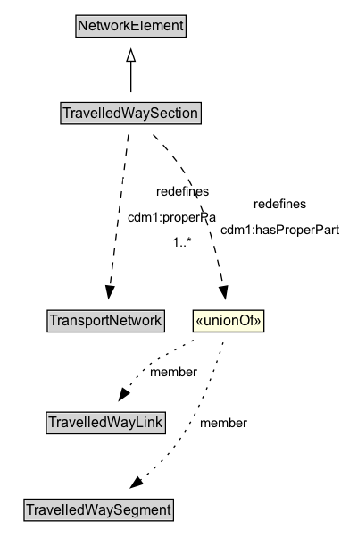

# TravelledWaySection

A TravelledWaySection is a type of NetworkElement that represents an aggregation of TravelledWayLinks and TravelledWaySegments that jointly represent a contiguous length of a path that shares the same management and operational strategies (within the scope of interest of the implementation).

## Diagram

=== "SVG (interactive)"

    <!-- Generated by graphviz version 14.1.3 (20260303.0454)
     -->
    <!-- Pages: 1 -->
    <svg width="294pt" height="466pt"
     viewBox="0.00 0.00 294.00 466.00" xmlns="http://www.w3.org/2000/svg" xmlns:xlink="http://www.w3.org/1999/xlink">
    <g id="graph0" class="graph" transform="scale(1 1) rotate(0) translate(4 462)">
    <polygon fill="white" stroke="none" points="-4,4 -4,-462 289.56,-462 289.56,4 -4,4"/>
    <g id="clust3" class="cluster">
    <title>cluster_associated</title>
    </g>
    <!-- NetworkElement -->
    <g id="node1" class="node">
    <title>NetworkElement</title>
    <g id="a_node1"><a xlink:href="../NetworkElement" xlink:title="&lt;TABLE&gt;">
    <polygon fill="lightgray" stroke="none" points="60.75,-431.88 60.75,-448.12 151.25,-448.12 151.25,-431.88 60.75,-431.88"/>
    <text xml:space="preserve" text-anchor="start" x="61.75" y="-435.88" font-family="Arial" font-size="12.00">NetworkElement</text>
    <polygon fill="none" stroke="black" points="59.75,-430.88 59.75,-449.12 152.25,-449.12 152.25,-430.88 59.75,-430.88"/>
    </a>
    </g>
    </g>
    <!-- TravelledWaySection -->
    <g id="node2" class="node">
    <title>TravelledWaySection</title>
    <g id="a_node2"><a xlink:href="../TravelledWaySection" xlink:title="&lt;TABLE&gt;">
    <polygon fill="lightgray" stroke="none" points="48,-358.88 48,-375.12 164,-375.12 164,-358.88 48,-358.88"/>
    <text xml:space="preserve" text-anchor="start" x="49" y="-362.88" font-family="Arial" font-size="12.00">TravelledWaySection</text>
    <polygon fill="none" stroke="black" points="47,-357.88 47,-376.12 165,-376.12 165,-357.88 47,-357.88"/>
    </a>
    </g>
    </g>
    <!-- TravelledWaySection&#45;&gt;NetworkElement -->
    <g id="edge1" class="edge">
    <title>TravelledWaySection&#45;&gt;NetworkElement</title>
    <path fill="none" stroke="black" d="M106,-384.71C106,-392.47 106,-401.92 106,-410.74"/>
    <polygon fill="none" stroke="black" points="102.5,-410.66 106,-420.66 109.5,-410.66 102.5,-410.66"/>
    </g>
    <!-- Invis -->
    <!-- TravelledWaySection&#45;&gt;Invis -->
    <!-- TransportNetwork -->
    <g id="node4" class="node">
    <title>TransportNetwork</title>
    <g id="a_node4"><a xlink:href="../TransportNetwork" xlink:title="&lt;TABLE&gt;">
    <polygon fill="lightgray" stroke="none" points="36.75,-184.38 36.75,-200.62 133.25,-200.62 133.25,-184.38 36.75,-184.38"/>
    <text xml:space="preserve" text-anchor="start" x="37.75" y="-188.38" font-family="Arial" font-size="12.00">TransportNetwork</text>
    <polygon fill="none" stroke="black" points="35.75,-183.38 35.75,-201.62 134.25,-201.62 134.25,-183.38 35.75,-183.38"/>
    </a>
    </g>
    </g>
    <!-- TravelledWaySection&#45;&gt;TransportNetwork -->
    <g id="edge6" class="edge">
    <title>TravelledWaySection&#45;&gt;TransportNetwork</title>
    <path fill="none" stroke="black" stroke-dasharray="5,2" d="M103.95,-349.15C100.34,-319.52 92.83,-257.82 88.42,-221.63"/>
    <polygon fill="black" stroke="black" points="91.93,-221.43 87.24,-211.92 84.98,-222.27 91.93,-221.43"/>
    <polygon fill="white" stroke="none" points="99.36,-247.5 99.36,-312 199.61,-312 199.61,-247.5 99.36,-247.5"/>
    <text xml:space="preserve" text-anchor="start" x="127.36" y="-297.5" font-family="Arial" font-size="11.00">redefines</text>
    <text xml:space="preserve" text-anchor="start" x="103.36" y="-276" font-family="Arial" font-size="11.00">cdm1:properPartOf</text>
    <text xml:space="preserve" text-anchor="start" x="141.23" y="-254.5" font-family="Arial" font-size="11.00">1..&#42;</text>
    </g>
    <!-- na67ff0c3f5e2479bb14d81c2edd99102b44 -->
    <g id="node7" class="node">
    <title>na67ff0c3f5e2479bb14d81c2edd99102b44</title>
    <polygon fill="lightyellow" stroke="none" points="158.25,-183.38 158.25,-201.62 217.75,-201.62 217.75,-183.38 158.25,-183.38"/>
    <text xml:space="preserve" text-anchor="start" x="160.25" y="-188.38" font-family="Arial" font-size="12.00">«unionOf»</text>
    <polygon fill="none" stroke="black" points="158.25,-183.38 158.25,-201.62 217.75,-201.62 217.75,-183.38 158.25,-183.38"/>
    </g>
    <!-- TravelledWaySection&#45;&gt;na67ff0c3f5e2479bb14d81c2edd99102b44 -->
    <g id="edge9" class="edge">
    <title>TravelledWaySection&#45;&gt;na67ff0c3f5e2479bb14d81c2edd99102b44</title>
    <path fill="none" stroke="black" stroke-dasharray="5,2" d="M124.67,-349.08C134.63,-339.14 146.38,-325.85 154,-312 169.87,-283.15 178.95,-246.19 183.66,-221.28"/>
    <polygon fill="black" stroke="black" points="187.08,-222.05 185.37,-211.59 180.18,-220.83 187.08,-222.05"/>
    <polygon fill="white" stroke="none" points="177.81,-258.25 177.81,-301.25 285.56,-301.25 285.56,-258.25 177.81,-258.25"/>
    <text xml:space="preserve" text-anchor="start" x="209.56" y="-286.75" font-family="Arial" font-size="11.00">redefines</text>
    <text xml:space="preserve" text-anchor="start" x="181.81" y="-265.25" font-family="Arial" font-size="11.00">cdm1:hasProperPart</text>
    </g>
    <!-- Invis&#45;&gt;TransportNetwork -->
    <!-- TravelledWayLink -->
    <g id="node5" class="node">
    <title>TravelledWayLink</title>
    <g id="a_node5"><a xlink:href="../TravelledWayLink" xlink:title="&lt;TABLE&gt;">
    <polygon fill="lightgray" stroke="none" points="36,-98.88 36,-115.12 134,-115.12 134,-98.88 36,-98.88"/>
    <text xml:space="preserve" text-anchor="start" x="37" y="-102.88" font-family="Arial" font-size="12.00">TravelledWayLink</text>
    <polygon fill="none" stroke="black" points="35,-97.88 35,-116.12 135,-116.12 135,-97.88 35,-97.88"/>
    </a>
    </g>
    </g>
    <!-- TransportNetwork&#45;&gt;TravelledWayLink -->
    <!-- TravelledWaySegment -->
    <g id="node6" class="node">
    <title>TravelledWaySegment</title>
    <g id="a_node6"><a xlink:href="../TravelledWaySegment" xlink:title="&lt;TABLE&gt;">
    <polygon fill="lightgray" stroke="none" points="17.25,-25.88 17.25,-42.12 140.75,-42.12 140.75,-25.88 17.25,-25.88"/>
    <text xml:space="preserve" text-anchor="start" x="18.25" y="-29.88" font-family="Arial" font-size="12.00">TravelledWaySegment</text>
    <polygon fill="none" stroke="black" points="16.25,-24.88 16.25,-43.12 141.75,-43.12 141.75,-24.88 16.25,-24.88"/>
    </a>
    </g>
    </g>
    <!-- TravelledWayLink&#45;&gt;TravelledWaySegment -->
    <!-- na67ff0c3f5e2479bb14d81c2edd99102b44&#45;&gt;TravelledWayLink -->
    <g id="edge7" class="edge">
    <title>na67ff0c3f5e2479bb14d81c2edd99102b44&#45;&gt;TravelledWayLink</title>
    <path fill="none" stroke="black" stroke-dasharray="1,5" d="M158.59,-176.57C142.62,-168.34 125.48,-159.24 122.25,-156.5 114.65,-150.06 107.61,-141.83 101.75,-133.98"/>
    <polygon fill="black" stroke="black" points="104.73,-132.12 96.1,-125.98 99.01,-136.16 104.73,-132.12"/>
    <text xml:space="preserve" text-anchor="middle" x="142.12" y="-146.05" font-family="Arial" font-size="11.00">member</text>
    </g>
    <!-- na67ff0c3f5e2479bb14d81c2edd99102b44&#45;&gt;TravelledWaySegment -->
    <g id="edge8" class="edge">
    <title>na67ff0c3f5e2479bb14d81c2edd99102b44&#45;&gt;TravelledWaySegment</title>
    <path fill="none" stroke="black" stroke-dasharray="1,5" d="M183.45,-174.63C177.09,-153.21 164.05,-115.84 144,-89 135.56,-77.71 124.3,-67.28 113.53,-58.67"/>
    <polygon fill="black" stroke="black" points="115.93,-56.1 105.86,-52.79 111.67,-61.65 115.93,-56.1"/>
    <text xml:space="preserve" text-anchor="middle" x="184.36" y="-103.3" font-family="Arial" font-size="11.00">member</text>
    </g>
    </g>
    </svg>

=== "PNG"

    

## Specializations of TravelledWaySection

| Class | Description |
|-------|-------------|
| [Footpath Section](FootpathSection.md) | A FootpathSection is a type of TravelledWaySection that groups FootpathLinks and FootpathSegments for a useful operational purpose. |
| [Micromobility Path Section](MicromobilityPathSection.md) | A MicromobilityPathSections is a type of RoadSection that groups MicromobilityLinks and MicromobilityPathSegments for a useful operational purpose (e.g., assigning a speed limit, designating areas of shared use). |
| [Rail Section](RailSection.md) | A RailSection is a type of TravelledWaySection that groups TrackLinks and TrackSegments for a useful operational purpose (e.g., assigning a speed limit, designating a traffic control scheme). |
| [Road Section](RoadSection.md) | A RoadSection is a type of TravelledWaySection that groups RoadLinks and RoadSegments for a useful operational purpose (e.g., assigning a speed limit, designating a traffic control scheme). |

## Formalization for TravelledWaySection

| Property | Constraint |
|----------|------------|
| [cdm1:properPartOf](https://w3id.org/citydata/part1/v1/properPartOf) | min 1 |
| [cdm1:properPartOf](https://w3id.org/citydata/part1/v1/properPartOf) | min 1 [TransportNetwork](https://w3id.org/citydata/part3/v1/TransportNetwork) |
| subClassOf | [NetworkElement](NetworkElement.md) |

## Other annotations

| Property | Value |
|----------|-------|
| [xsd:pattern](https://w3id.org/citydata/imported/xsd/pattern) | TransportNetworkPattern |

