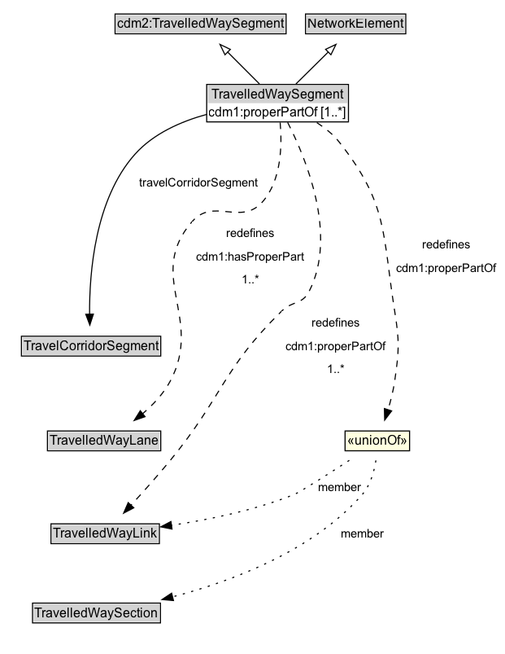

# TravelledWaySegment

A TravelledWaySegment is a type of a transinfras:TravelledWaySegment and NetworkElement that represents a contiguous length of a TravelledWayLink characterized by the same physical characteristics.

**IRI**: `https://w3id.org/citydata/part3/v1/TravelledWaySegment`

## Diagram

=== "SVG (interactive)"

    <!-- Generated by graphviz version 14.1.3 (20260303.0454)
     -->
    <!-- Pages: 1 -->
    <svg width="465pt" height="603pt"
     viewBox="0.00 0.00 465.00 603.00" xmlns="http://www.w3.org/2000/svg" xmlns:xlink="http://www.w3.org/1999/xlink">
    <g id="graph0" class="graph" transform="scale(1 1) rotate(0) translate(4 598.5)">
    <polygon fill="white" stroke="none" points="-4,4 -4,-598.5 461.45,-598.5 461.45,4 -4,4"/>
    <g id="clust3" class="cluster">
    <title>cluster_associated</title>
    </g>
    <!-- cdm2_TravelledWaySegment -->
    <g id="node1" class="node">
    <title>cdm2_TravelledWaySegment</title>
    <g id="a_node1"><a xlink:href="https://w3id.org/citydata/part2/v1/TravelledWaySegment" xlink:title="&lt;TABLE&gt;">
    <polygon fill="lightgray" stroke="none" points="103.12,-568.38 103.12,-584.62 258.88,-584.62 258.88,-568.38 103.12,-568.38"/>
    <text xml:space="preserve" text-anchor="start" x="104.12" y="-572.38" font-family="Arial" font-size="12.00">cdm2:TravelledWaySegment</text>
    <polygon fill="none" stroke="black" points="102.12,-567.38 102.12,-585.62 259.88,-585.62 259.88,-567.38 102.12,-567.38"/>
    </a>
    </g>
    </g>
    <!-- NetworkElement -->
    <g id="node2" class="node">
    <title>NetworkElement</title>
    <g id="a_node2"><a xlink:href="../NetworkElement" xlink:title="&lt;TABLE&gt;">
    <polygon fill="lightgray" stroke="none" points="278.75,-568.38 278.75,-584.62 369.25,-584.62 369.25,-568.38 278.75,-568.38"/>
    <text xml:space="preserve" text-anchor="start" x="279.75" y="-572.38" font-family="Arial" font-size="12.00">NetworkElement</text>
    <polygon fill="none" stroke="black" points="277.75,-567.38 277.75,-585.62 370.25,-585.62 370.25,-567.38 277.75,-567.38"/>
    </a>
    </g>
    </g>
    <!-- TravelledWaySegment -->
    <g id="node3" class="node">
    <title>TravelledWaySegment</title>
    <g id="a_node3"><a xlink:href="../TravelledWaySegment" xlink:title="&lt;TABLE&gt;">
    <polygon fill="lightgray" stroke="none" points="187.62,-503.5 187.62,-519.75 316.38,-519.75 316.38,-503.5 187.62,-503.5"/>
    <text xml:space="preserve" text-anchor="start" x="191.25" y="-507.5" font-family="Arial" font-size="12.00">TravelledWaySegment</text>
    <text xml:space="preserve" text-anchor="start" x="188.62" y="-491.25" font-family="Arial" font-size="12.00">cdm1:properPartOf [1..&#42;]</text>
    <polygon fill="none" stroke="black" points="186.62,-486.25 186.62,-520.75 317.38,-520.75 317.38,-486.25 186.62,-486.25"/>
    </a>
    </g>
    </g>
    <!-- TravelledWaySegment&#45;&gt;cdm2_TravelledWaySegment -->
    <g id="edge1" class="edge">
    <title>TravelledWaySegment&#45;&gt;cdm2_TravelledWaySegment</title>
    <path fill="none" stroke="black" d="M235.29,-521.21C226.47,-530.03 215.47,-541.03 205.69,-550.81"/>
    <polygon fill="none" stroke="black" points="203.49,-548.06 198.9,-557.6 208.44,-553.01 203.49,-548.06"/>
    </g>
    <!-- TravelledWaySegment&#45;&gt;NetworkElement -->
    <g id="edge2" class="edge">
    <title>TravelledWaySegment&#45;&gt;NetworkElement</title>
    <path fill="none" stroke="black" d="M268.94,-521.21C277.89,-530.03 289.04,-541.03 298.97,-550.81"/>
    <polygon fill="none" stroke="black" points="296.28,-553.08 305.86,-557.61 301.2,-548.1 296.28,-553.08"/>
    </g>
    <!-- Invis -->
    <!-- TravelledWaySegment&#45;&gt;Invis -->
    <!-- TravelCorridorSegment -->
    <g id="node5" class="node">
    <title>TravelCorridorSegment</title>
    <g id="a_node5"><a xlink:href="../TravelCorridorSegment" xlink:title="&lt;TABLE&gt;">
    <polygon fill="lightgray" stroke="none" points="16.75,-271.62 16.75,-287.88 143.25,-287.88 143.25,-271.62 16.75,-271.62"/>
    <text xml:space="preserve" text-anchor="start" x="17.75" y="-275.62" font-family="Arial" font-size="12.00">TravelCorridorSegment</text>
    <polygon fill="none" stroke="black" points="15.75,-270.62 15.75,-288.88 144.25,-288.88 144.25,-270.62 15.75,-270.62"/>
    </a>
    </g>
    </g>
    <!-- TravelledWaySegment&#45;&gt;TravelCorridorSegment -->
    <g id="edge12" class="edge">
    <title>TravelledWaySegment&#45;&gt;TravelCorridorSegment</title>
    <path fill="none" stroke="black" d="M186.74,-493.21C162.85,-486.66 137.52,-475.51 120.5,-456.5 83.55,-415.25 78.33,-347.11 78.63,-308.93"/>
    <polygon fill="black" stroke="black" points="82.12,-309.24 78.85,-299.17 75.12,-309.08 82.12,-309.24"/>
    <polygon fill="white" stroke="none" points="120.5,-419.75 120.5,-441.25 238,-441.25 238,-419.75 120.5,-419.75"/>
    <text xml:space="preserve" text-anchor="start" x="124.5" y="-426.75" font-family="Arial" font-size="11.00">travelCorridorSegment</text>
    </g>
    <!-- TravelledWayLane -->
    <g id="node6" class="node">
    <title>TravelledWayLane</title>
    <g id="a_node6"><a xlink:href="../TravelledWayLane" xlink:title="&lt;TABLE&gt;">
    <polygon fill="lightgray" stroke="none" points="40.75,-184.38 40.75,-200.62 143.25,-200.62 143.25,-184.38 40.75,-184.38"/>
    <text xml:space="preserve" text-anchor="start" x="41.75" y="-188.38" font-family="Arial" font-size="12.00">TravelledWayLane</text>
    <polygon fill="none" stroke="black" points="39.75,-183.38 39.75,-201.62 144.25,-201.62 144.25,-183.38 39.75,-183.38"/>
    </a>
    </g>
    </g>
    <!-- TravelledWaySegment&#45;&gt;TravelledWayLane -->
    <g id="edge8" class="edge">
    <title>TravelledWaySegment&#45;&gt;TravelledWayLane</title>
    <path fill="none" stroke="black" stroke-dasharray="5,2" d="M254.37,-485.65C256.18,-465.68 255.87,-432.59 238,-412.5 218.15,-390.18 192.91,-416.99 173.25,-394.5 129.85,-344.84 184.13,-305.64 153,-247.5 146.87,-236.04 137.28,-225.86 127.51,-217.5"/>
    <polygon fill="black" stroke="black" points="129.75,-214.81 119.76,-211.3 125.38,-220.28 129.75,-214.81"/>
    <polygon fill="white" stroke="none" points="173.25,-330 173.25,-394.5 281,-394.5 281,-330 173.25,-330"/>
    <text xml:space="preserve" text-anchor="start" x="205" y="-380" font-family="Arial" font-size="11.00">redefines</text>
    <text xml:space="preserve" text-anchor="start" x="177.25" y="-358.5" font-family="Arial" font-size="11.00">cdm1:hasProperPart</text>
    <text xml:space="preserve" text-anchor="start" x="218.88" y="-337" font-family="Arial" font-size="11.00">1..&#42;</text>
    </g>
    <!-- TravelledWayLink -->
    <g id="node7" class="node">
    <title>TravelledWayLink</title>
    <g id="a_node7"><a xlink:href="../TravelledWayLink" xlink:title="&lt;TABLE&gt;">
    <polygon fill="lightgray" stroke="none" points="44,-98.88 44,-115.12 142,-115.12 142,-98.88 44,-98.88"/>
    <text xml:space="preserve" text-anchor="start" x="45" y="-102.88" font-family="Arial" font-size="12.00">TravelledWayLink</text>
    <polygon fill="none" stroke="black" points="43,-97.88 43,-116.12 143,-116.12 143,-97.88 43,-97.88"/>
    </a>
    </g>
    </g>
    <!-- TravelledWaySegment&#45;&gt;TravelledWayLink -->
    <g id="edge13" class="edge">
    <title>TravelledWaySegment&#45;&gt;TravelledWayLink</title>
    <path fill="none" stroke="black" stroke-dasharray="5,2" d="M261.28,-485.77C277.73,-453.69 307.84,-382.1 281,-330 274.69,-317.75 265.6,-321.64 255.75,-312 201.2,-258.66 201.44,-233.44 153,-174.5 141.48,-160.48 128,-145.43 116.73,-133.19"/>
    <polygon fill="black" stroke="black" points="119.38,-130.9 110.01,-125.95 114.25,-135.66 119.38,-130.9"/>
    <polygon fill="white" stroke="none" points="255.75,-247.5 255.75,-312 356,-312 356,-247.5 255.75,-247.5"/>
    <text xml:space="preserve" text-anchor="start" x="283.75" y="-297.5" font-family="Arial" font-size="11.00">redefines</text>
    <text xml:space="preserve" text-anchor="start" x="259.75" y="-276" font-family="Arial" font-size="11.00">cdm1:properPartOf</text>
    <text xml:space="preserve" text-anchor="start" x="297.62" y="-254.5" font-family="Arial" font-size="11.00">1..&#42;</text>
    </g>
    <!-- n1c091741e9be41418e759d48b25318c1b50 -->
    <g id="node9" class="node">
    <title>n1c091741e9be41418e759d48b25318c1b50</title>
    <polygon fill="lightyellow" stroke="none" points="314.25,-183.38 314.25,-201.62 373.75,-201.62 373.75,-183.38 314.25,-183.38"/>
    <text xml:space="preserve" text-anchor="start" x="316.25" y="-188.38" font-family="Arial" font-size="12.00">«unionOf»</text>
    <polygon fill="none" stroke="black" points="314.25,-183.38 314.25,-201.62 373.75,-201.62 373.75,-183.38 314.25,-183.38"/>
    </g>
    <!-- TravelledWaySegment&#45;&gt;n1c091741e9be41418e759d48b25318c1b50 -->
    <g id="edge11" class="edge">
    <title>TravelledWaySegment&#45;&gt;n1c091741e9be41418e759d48b25318c1b50</title>
    <path fill="none" stroke="black" stroke-dasharray="5,2" d="M288.21,-485.58C295.9,-480.63 303.39,-474.61 309,-467.5 354.08,-410.42 348.52,-383.82 360,-312 364.52,-283.69 364.11,-275.87 360,-247.5 358.73,-238.72 356.35,-229.38 353.8,-220.98"/>
    <polygon fill="black" stroke="black" points="357.2,-220.12 350.79,-211.68 350.54,-222.28 357.2,-220.12"/>
    <polygon fill="white" stroke="none" points="357.2,-340.75 357.2,-383.75 457.45,-383.75 457.45,-340.75 357.2,-340.75"/>
    <text xml:space="preserve" text-anchor="start" x="385.2" y="-369.25" font-family="Arial" font-size="11.00">redefines</text>
    <text xml:space="preserve" text-anchor="start" x="361.2" y="-347.75" font-family="Arial" font-size="11.00">cdm1:properPartOf</text>
    </g>
    <!-- Invis&#45;&gt;TravelCorridorSegment -->
    <!-- TravelCorridorSegment&#45;&gt;TravelledWayLane -->
    <!-- TravelledWayLane&#45;&gt;TravelledWayLink -->
    <!-- TravelledWaySection -->
    <g id="node8" class="node">
    <title>TravelledWaySection</title>
    <g id="a_node8"><a xlink:href="../TravelledWaySection" xlink:title="&lt;TABLE&gt;">
    <polygon fill="lightgray" stroke="none" points="27,-25.88 27,-42.12 143,-42.12 143,-25.88 27,-25.88"/>
    <text xml:space="preserve" text-anchor="start" x="28" y="-29.88" font-family="Arial" font-size="12.00">TravelledWaySection</text>
    <polygon fill="none" stroke="black" points="26,-24.88 26,-43.12 144,-43.12 144,-24.88 26,-24.88"/>
    </a>
    </g>
    </g>
    <!-- TravelledWayLink&#45;&gt;TravelledWaySection -->
    <!-- n1c091741e9be41418e759d48b25318c1b50&#45;&gt;TravelledWayLink -->
    <g id="edge9" class="edge">
    <title>n1c091741e9be41418e759d48b25318c1b50&#45;&gt;TravelledWayLink</title>
    <path fill="none" stroke="black" stroke-dasharray="1,5" d="M318.16,-174.57C297.99,-161.47 272.5,-145.2 267,-143 230.88,-128.56 188.08,-119.85 153.96,-114.73"/>
    <polygon fill="black" stroke="black" points="154.64,-111.29 144.25,-113.35 153.65,-118.22 154.64,-111.29"/>
    <text xml:space="preserve" text-anchor="middle" x="309.65" y="-146.05" font-family="Arial" font-size="11.00">member</text>
    </g>
    <!-- n1c091741e9be41418e759d48b25318c1b50&#45;&gt;TravelledWaySection -->
    <g id="edge10" class="edge">
    <title>n1c091741e9be41418e759d48b25318c1b50&#45;&gt;TravelledWaySection</title>
    <path fill="none" stroke="black" stroke-dasharray="1,5" d="M342.69,-174.52C341.1,-164.33 337.61,-151.71 330,-143 284.78,-91.27 210.1,-63.27 155.05,-48.84"/>
    <polygon fill="black" stroke="black" points="155.99,-45.47 145.44,-46.42 154.28,-52.26 155.99,-45.47"/>
    <text xml:space="preserve" text-anchor="middle" x="330.12" y="-103.3" font-family="Arial" font-size="11.00">member</text>
    </g>
    </g>
    </svg>

=== "PNG"

    

## Specializations of TravelledWaySegment

| Class | Description |
|-------|-------------|
| [Footpath Segment](FootpathSegment.md) | A FootpathSegment can be defined to be a part of a FootpathSection, especially when the FootpathSection does not span an entire FootpathLink. |
| [Micromobility Path Segment](MicromobilityPathSegment.md) | A MicromobilityPathSegment can be defined to be a part of a MicromobilityPathSection, especially when the MicromobilityPathSection does not span an entire MicromobilityLink. |
| [Road Segment](RoadSegment.md) | A RoadSegment can be defined to be a part of a RoadSection, for example, when the RoadSection does not span an entire RoadLink. |
| [Track Segment](TrackSegment.md) | A TrackSegment is a type of TravelledWaySegment that represents a portion of a TrackLink with common physical characteristics. |
| [Travel Corridor Segment](TravelCorridorSegment.md) | A TravelCorridorSegment is a type of TravelledWaySegment that logically groups multiple TravelledWaySegments together as being co-located or side-by-side. |

## Formalization for TravelledWaySegment

| Property | Constraint |
|----------|------------|
| [cdm1:hasProperPart](https://w3id.org/citydata/part1/v1/hasProperPart) | only [TravelledWayLane](TravelledWayLane.md) |
| [cdm1:hasProperPart](https://w3id.org/citydata/part1/v1/hasProperPart) | min 1 |
| [cdm1:hasProperPart](https://w3id.org/citydata/part1/v1/hasProperPart) | min 1 [TravelledWayLane](https://w3id.org/citydata/part3/v1/TravelledWayLane) |
| [cdm1:properPartOf](https://w3id.org/citydata/part1/v1/properPartOf) | only [TravelledWayLink](TravelledWayLink.md) or [TravelledWaySection](TravelledWaySection.md) |
| [cdm1:properPartOf](https://w3id.org/citydata/part1/v1/properPartOf) | min 1 |
| [cdm1:properPartOf](https://w3id.org/citydata/part1/v1/properPartOf) | min 1 |
| [travelCorridorSegment](../properties/travelCorridorSegment.md) | only [TravelCorridorSegment](TravelCorridorSegment.md) |
| [travelCorridorSegment](../properties/travelCorridorSegment.md) | only [TravelCorridorSegment](https://w3id.org/citydata/part3/v1/TravelCorridorSegment) |
| subClassOf | [cdm2:TravelledWaySegment](https://w3id.org/citydata/part2/v1/TravelledWaySegment) |
| subClassOf | [NetworkElement](NetworkElement.md) |

## Used by classes

| Class | Property |
|-------|----------|
| [Travelled Way Lane (cdm1)](TravelledWayLane.md) | [cdm1:properPartOf](https://w3id.org/citydata/part1/v1/properPartOf) |
| [Travelled Way Link (cdm1)](TravelledWayLink.md) | [cdm1:hasProperPart](https://w3id.org/citydata/part1/v1/hasProperPart) |

## Other annotations

| Property | Value |
|----------|-------|
| [xsd:pattern](https://w3id.org/citydata/imported/xsd/pattern) | TransportNetworkPattern |

