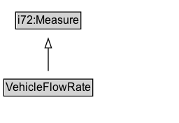

# VehicleFlowRate

A flow rate measured in vehicles per unit time.

## Diagram

=== "SVG (interactive)"

    <!-- Generated by graphviz version 14.1.3 (20260303.0454)
     -->
    <!-- Pages: 1 -->
    <svg width="192pt" height="132pt"
     viewBox="0.00 0.00 192.00 132.00" xmlns="http://www.w3.org/2000/svg" xmlns:xlink="http://www.w3.org/1999/xlink">
    <g id="graph0" class="graph" transform="scale(1 1) rotate(0) translate(4 128)">
    <polygon fill="white" stroke="none" points="-4,4 -4,-128 187.75,-128 187.75,4 -4,4"/>
    <g id="clust3" class="cluster">
    <title>cluster_associated</title>
    </g>
    <!-- i72_Measure -->
    <g id="node1" class="node">
    <title>i72_Measure</title>
    <g id="a_node1"><a xlink:href="https://w3id.org/citydata/21972/v1/Measure" xlink:title="&lt;TABLE&gt;">
    <polygon fill="lightgray" stroke="none" points="13.75,-97.88 13.75,-114.12 81.75,-114.12 81.75,-97.88 13.75,-97.88"/>
    <text xml:space="preserve" text-anchor="start" x="14.75" y="-101.88" font-family="Arial" font-size="12.00">i72:Measure</text>
    <polygon fill="none" stroke="black" points="12.75,-96.88 12.75,-115.12 82.75,-115.12 82.75,-96.88 12.75,-96.88"/>
    </a>
    </g>
    </g>
    <!-- VehicleFlowRate -->
    <g id="node2" class="node">
    <title>VehicleFlowRate</title>
    <g id="a_node2"><a xlink:href="../VehicleFlowRate" xlink:title="&lt;TABLE&gt;">
    <polygon fill="lightgray" stroke="none" points="1,-25.88 1,-42.12 94.5,-42.12 94.5,-25.88 1,-25.88"/>
    <text xml:space="preserve" text-anchor="start" x="2" y="-29.88" font-family="Arial" font-size="12.00">VehicleFlowRate</text>
    <polygon fill="none" stroke="black" points="0,-24.88 0,-43.12 95.5,-43.12 95.5,-24.88 0,-24.88"/>
    </a>
    </g>
    </g>
    <!-- VehicleFlowRate&#45;&gt;i72_Measure -->
    <g id="edge1" class="edge">
    <title>VehicleFlowRate&#45;&gt;i72_Measure</title>
    <path fill="none" stroke="black" d="M47.75,-51.79C47.75,-59.25 47.75,-68.24 47.75,-76.69"/>
    <polygon fill="none" stroke="black" points="44.25,-76.54 47.75,-86.54 51.25,-76.54 44.25,-76.54"/>
    </g>
    <!-- Invis -->
    </g>
    </svg>

=== "PNG"

    

## Formalization for VehicleFlowRate

| Property | Constraint |
|----------|------------|
| subClassOf | [i72:Measure](https://w3id.org/citydata/21972/v1/Measure) |

